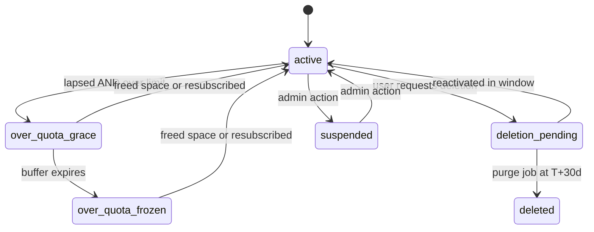

# Account, asset, and subscription lifecycle redesign

All DB changes are destructive edits to [server/migrations/0001_init.sql](server/migrations/0001_init.sql) (single re-applied baseline, no existing data). Six sequenced phases; each is independently landable.

## Governing principles

1. **One derived account state**, computed in one place and consumed everywhere. No scattered booleans.
2. **Ownership vs. authorship.** FKs on the ownership/accounting axis cascade. FKs on the authorship/attribution axis are nullable with `ON DELETE SET NULL` — that satisfies "a hard `DELETE FROM users` is never blocked" while application logic never actually hard-deletes, so the scrubbed tombstone preserves attribution in practice. The UI must render "Deleted user" for both a null author and an author whose `deleted_at` is set.
3. **Freeze, never auto-delete** on billing events. Only explicit user action destroys content.
4. **Blob deletion is a durable queue fed by triggers**, not inline handler code. Row-level `AFTER DELETE` triggers fire on FK cascades, which is how the existing `account_file_storage` accounting already stays correct through workspace deletes.



- `active`: normal.
- `over_quota_grace`: no create/upload/clone; materials shrink-only; existing content readable.
- `over_quota_frozen`: same as grace, indefinite. Nothing is deleted.
- `deletion_pending`: all writes rejected, sessions revoked, reactivation offered at login.
- `suspended`: all writes rejected. No trigger logic yet — column and gate only.
- `deleted`: tombstone; auth rejected.

---

## Phase 1 — Identity and lifecycle state

**Schema (`users`)**: add `deletion_requested_at`, `deleted_at`, `purge_after`, `suspended_at`, `suspended_reason`. Drop `clerk_id` (always written as `$1,$1` alongside `id` at [server/internal/store/users.go](server/internal/store/users.go):58 and read nowhere). Drop the `oauth_connections` table entirely — already dead code per the comment at users.go:243, and retaining provider tokens for deleted accounts is a liability. Add `CREATE UNIQUE INDEX ON users(lower(email)) WHERE deleted_at IS NULL` (email is currently non-unique and invite resolution looks users up by email).

**New store function** `AccountAccess(ctx, userID) (AccountState, error)` in a new `server/internal/store/account_state.go`, folding lifecycle columns + subscription + storage usage into the state enum above. Single source of truth.

**Fix the resurrection bug**: `UpsertUserFromClerk` ([users.go](server/internal/store/users.go):58) currently repopulates `name`/`email`/`avatar_url` via `ON CONFLICT DO UPDATE` on every authenticated request, so a scrubbed row is un-scrubbed the moment the user logs in. Add `WHERE users.deleted_at IS NULL` to the update clause.

**Gate in middleware**: [server/internal/auth/middleware.go](server/internal/auth/middleware.go):186 — after upsert, reject `deleted`/`suspended` and return machine-readable codes (`account_deleted`, `account_suspended`, `account_deletion_pending`) so the frontend can render reactivate/suspended screens. Also refuse to mint collaboration tokens in [huma_collaboration.go](server/internal/httpapi/huma_collaboration.go):116 for non-writable states.

**Session revocation**: add a Clerk Admin API call to revoke all sessions for a user, used on deletion request and suspension. Without it an existing JWT stays valid.

## Phase 2 — FK and cascade rewrite

Ownership axis → `ON DELETE CASCADE`: `workspaces.user_id`, `files.user_id` (trigger-derived from workspace owner, so it *is* the owner axis), `materials.owner_user_id`, `tags.user_id`, `labels`, `events`, `tasks`, `canvases`, `notifications`, `workspace_members`, `user_storage*`. These currently have no delete action and block `DELETE FROM users`.

Authorship axis → nullable + `ON DELETE SET NULL`:
- `materials.user_id` → rename to `created_by`, nullable. Today it holds `creatorID` ([queries.go](server/internal/store/queries.go):850) while `owner_user_id` holds the workspace owner. Cascading it would let a collaborator's account deletion destroy content out of someone else's workspace and silently drop that owner's storage counter.
- `material_comments.user_id`, `material_discussions.created_by` — currently `CASCADE`, which deletes threads out of other people's documents.
- `files` gains a `created_by` column for uploader attribution.

New FKs where none exist:
- `attempts`: add `user_id ... ON DELETE CASCADE`; replace `quiz_id` with `material_id ... ON DELETE SET NULL`. Not cascade — `attempts.questions` is a deliberate submit-time snapshot with denormalized `quiz_name`/`workspace_name` precisely so history outlives the quiz.
- `mistakes`: `user_id ... CASCADE`, add `material_id ... SET NULL`.
- `conversations.user_id`: add FK `CASCADE` (the schema comment at line 472 claims it carries ownership but there is no constraint).

**De-polymorphize `entity_tags`**: replace `(kind, entity_id)` with nullable `workspace_id` / `material_id` FKs plus `CHECK (num_nonnulls(...) = 1)` and partial unique indexes. Its rows dangle on every workspace and material delete today — a pre-existing bug that cascade cannot fix while the reference is polymorphic. Verify whether `kind='card'` tags are actually in use first (card IDs live in Plate JSON; only `card_stats` has a row).

**No orphan-tag GC.** The comment at migration line 234 states the catalog deliberately outlives the entities referencing it so per-tag metadata survives edits. GC contradicts that for a few hundred bytes per user.

**Chapter/workspace consistency** (Postgres 16): add `UNIQUE (id, workspace_id)` to `chapters`, then on `files`, `materials`, `upload_sessions`:

```sql
FOREIGN KEY (chapter_id, workspace_id)
  REFERENCES chapters(id, workspace_id) ON DELETE SET NULL (chapter_id)
```

The column-list form of `SET NULL` is what makes this work without violating `workspace_id NOT NULL`.

Also convert `events.label_ids text[]` to an `event_labels` join table so label deletion doesn't strand IDs.

## Phase 3 — Blob layer, deletion outbox, upload unification

**New `blobs` table**: `id`, `object_path UNIQUE`, `size_bytes`, `content_type`, `etag`, `created_at`. `files` and `editor_assets` both reference it. This replaces the string-scan refcount in `DeleteFileWithOrphanedBlobs` and closes the editor-asset leak — `CloneWorkspace` ([share.go](server/internal/store/share.go):748) deliberately shares asset object paths across clones with no refcount at all, so clone-then-delete leaks today.

**New `pending_blob_deletions` table** (`object_path`, `not_before`, `attempts`, `last_error`), written by `AFTER DELETE ... FOR EACH ROW` triggers on `files`, `editor_assets`, and `upload_sessions`. Because row-level AFTER DELETE fires on cascades, this fixes blob cleanup for workspace deletes, material deletes, and user purges without touching a single delete handler — `DeleteWorkspace` is currently a bare `DELETE FROM workspaces` ([queries.go](server/internal/store/queries.go):424) that orphans every object in the workspace while the logical counter drops to zero.

For upload sessions, enqueue both `object_path` and `final_path` with `not_before = now() + presign_ttl`, so a PUT that lands after the row is gone still gets collected. That is the in-flight-upload race.

**Reaper worker** in `server/cmd/api/`, alongside the existing minute-ticker sweeper at [server/cmd/api/main.go](server/cmd/api/main.go):259. Needs `DeleteObjects` (batch, 1000 keys) and `ListObjectsV2` added to the `blob.Store` interface at [server/internal/blob/blob.go](server/internal/blob/blob.go):27 — both are missing.

**Merge `editor_asset_uploads` into `upload_sessions`** with a target discriminator. The two are ~90% identical columns sharing one `account_upload_reservation` trigger and two near-duplicate sweepers. Keep `files` and `editor_assets` as separate logical tables — their columns and query patterns genuinely diverge, and a wide discriminator table risks editor assets leaking into the file tree or RAG ingest scope. Also delete the orphaned `cleanupExpiredUploads` / `cleanupExpiredEditorAssetUploads` functions in [uploads.go](server/internal/httpapi/uploads.go):185 and [editor_assets.go](server/internal/httpapi/editor_assets.go):313.

**LightRAG teardown**: add a workspace-delete endpoint to the pipeline (only `POST /workspace/clone` exists at `pipeline/pipeline/retrieve/service.py`:226). Enqueue it from the workspace delete path — today the per-workspace `lightrag_*` rows and AGE graph are orphaned forever.

**Bucket hygiene**: B2 lifecycle rule expiring the `incoming/` and `editor-assets/incoming/` prefixes after 1 day (zero code, removes most of the sweep's job), and confirm the bucket keeps only the last version so hide-markers stop billing. Normalize the three coexisting source key shapes (`sources/blob_…` from presign vs. bare `blob_…` from the legacy multipart and import paths).

**Monthly listing sweep**, report-only first: page the bucket 1000 keys at a time, one `SELECT ... WHERE object_path = ANY($1)` against `blobs` per page, only consider keys older than 48h.

## Phase 4 — Workspace ownership transfer

Prerequisite for account deletion. [todo-lifecycle](todo-lifecycle) §4 correctly notes the denormalized owner columns are only safe because transfer doesn't exist.

- `POST /api/workspaces/{id}/transfer` — owner-only, target must be an existing non-deleted member.
- One transaction: rewrite `files.user_id`, `materials.owner_user_id`, `upload_sessions.user_id`, `editor_assets.user_id`; swap `workspace_members` roles; move bytes between both `user_storage` rows; gate against the recipient's quota.
- Existing triggers (`set_file_storage_owner` etc.) derive owner from workspace on insert/workspace-change only, so the rewrite must be explicit.
- Account deletion blocks until every co-owned workspace is transferred or explicitly destroyed.
- Test guard that fails if a new owner-column writer appears without touching the accounting path.

## Phase 5 — Real subscription model

**New `user_subscriptions` table** keyed by `stripe_subscription_id`: `user_id`, `status`, `price_id`, `plan_tier`, `current_period_end`, `cancel_at_period_end`, `canceled_at`, `ended_at`, `stripe_event_created`, `updated_at`. `users.plan_tier` stays as the denormalized fast read for `gateStorageTx` but is derived from this table.

Fixes three live bugs in [server/internal/httpapi/webhooks.go](server/internal/httpapi/webhooks.go):157:
- `UpdateSubscriptionByCustomerID` blindly overwrites; Stripe does not guarantee event ordering, so a stale `customer.subscription.updated` can resurrect old state. Guard on `stripe_event_created`.
- `checkout.session.completed` only links the customer ID and never sets the tier, leaving a window where a paying user is on free limits.
- Nothing persists period end, so "expired" is currently uncomputable and `renewalAt` in the API is permanently null.

Add `invoice.payment_failed` handling for real `past_due` (today `subscription_status` is written but never read for enforcement anywhere). Deletion preconditions check Stripe live via the existing `billing.ListActiveSubscription`, not the DB column, and treat `cancel_at_period_end = true` as satisfying the "cancel first" requirement.

## Phase 6 — Degraded modes, notifications, purge

**Enforcement** of `AccountAccess` in three places:
- Go API: the seven `gateStorageTx`/`reserveStorageTx` call sites plus every mutation handler.
- Collaboration server: carry state in the 5-minute JWT claim minted at [huma_collaboration.go](server/internal/httpapi/huma_collaboration.go):116 and read at [collaboration/src/server.ts](collaboration/src/server.ts):386. Shrink-only reuses `recoversMaterialLimits` in [collaboration/src/limits.ts](collaboration/src/limits.ts):75 — an over-quota room is treated as if the document were over-limit, which is close to a no-op change.
- Pipeline: refuse ingest for non-active accounts.

**Buffer schedule** (jobs off `current_period_end`): notify at lapse, T-7, T-3; transition to `over_quota_frozen` at T+14. Nothing is deleted. The warning copy should mention that `PruneMaterialRevisions` already re-applies tier retention daily, so a pro→free drop silently loses revisions 8-30 — existing behaviour, but it is data loss on a billing event.

**`purge_user` job**: at `purge_after`, cascade rows, let the Phase 3 triggers enqueue blobs, tear down LightRAG tenants, delete the Clerk user, then scrub the tombstone (`name → ''`, `email → NULL`, `avatar_url → NULL`, `class_label → NULL`). Keep `stripe_customer_id` — never delete the Stripe customer, invoice history depends on it. Delete pending `email_outbox` rows for the user.

**New email templates + notifications** for: deletion requested, deletion cancelled, purge complete, subscription lapsed / over quota, T-7, T-3, frozen, ownership transferred. Each follows the 9-step pipeline: copy keys in [messages/en.json](messages/en.json) + [messages/zh.json](messages/zh.json), component in `emails/`, registration in [scripts/build-emails.ts](scripts/build-emails.ts), `pnpm email:build`, commit generated `.gohtml`/`.txt`/`copy_gen.go`. Add matching `notification_prefs` categories — `notificationEmailEnabled` ([notifications.go](server/internal/store/notifications.go):298) only knows `workspace_invite` and `membership`, and lifecycle mail should arguably be non-optional.

Consider extracting a single `NotifyTx` helper. The `CreateNotificationTx` + `EnqueueEmailTx` pairing is currently hand-duplicated at three call sites in [collaboration.go](server/internal/store/collaboration.go) and this phase adds eight more.

**Frontend**: account settings danger zone, deletion confirmation naming which workspaces will be destroyed vs. need transfer, reactivation screen, suspended screen, frozen-state banner with storage breakdown, transfer dialog.

## Phase 7 — Whose account state does each gate read?

Phase 6 enforced `AccountAccess` everywhere but never settled *which* account it should resolve. In a multi-user workspace there are two candidates — the actor making the request and the user being charged — and the code had picked inconsistently, gate by gate. The review in [todo-permissions](todo-permissions) catalogued the results. No schema change was needed: `materials.owner_user_id` is already `NOT NULL` and indexed.

### The rule

**Workspace role decides whether you may write at all. The storage owner's account state decides which direction the content may move.**

The actor's own storage state is irrelevant inside a workspace they do not pay for, and their lifecycle state is already handled upstream: `AccountSessionAllowed` refuses a session to `suspended`, `deletion_pending` and `deleted` users, so those never reach a handler. That leaves the two over-quota states, which are purely about bytes, and bytes always land on `owner_user_id`.

This was already true of creation and only needed to be stated: `gateStorageTx` resolves the owner's `AccountAccess` before checking the counter, so every creation path enforces owner lifecycle plus owner quota. The two handlers that additionally checked the actor — the legacy multipart upload and generation — were the outliers, not the norm.

### What changed

**Collaboration write direction.** `createMaterialCollaborationToken` resolved `AccountAccess(actor)`. It now resolves `MaterialOwnerAccess(materialID)`, a new function in [account_state.go](server/internal/store/account_state.go). The old check was wrong in both directions: an over-quota editor got shrink-only inside a healthy owner's room, and an active editor got full write in an over-quota owner's room and could push them further over. Since the token is the collaboration server's only source of truth and the projection endpoint applies no state check of its own, the whole chain was keyed on the wrong user.

Keying on the owner also makes shrink-only a property of the room rather than of each connection. Previously two connections in one room could disagree, and the writing one would grow a document the shrinking one was trying to rescue.

**Actor create-gates removed.** `addSource` no longer checks the actor at all; the owner gate in `gateStorageTx` was always the real one. `generate` now calls the `generationCreditsAllowed` stub in [generation_credits.go](server/internal/httpapi/generation_credits.go). Generation charges two users — inference to the actor, the produced material to the owner — and only the second exists today. Using the actor's *storage* state as a proxy for their right to spend conflated two budgets. See [todo-llm-credits](todo-llm-credits). `accountCreateAllowed` is deleted; it had no other callers.

**Size-neutral metadata moved to `requireAccountMutate`.** `requireAccountEdit` demands `AccountActive`, so an over-quota owner could not rename or re-file their own material, contradicting the grace semantics defined above ("no create/upload/clone; materials shrink-only; existing content readable"). Renaming is part of how such an account finds what to delete. Moved: `updateMaterial` (except privacy), `updateWorkspace`, `updateEvent`, `updateTask`, and `transferWorkspace` — the last because handing a workspace away is a recovery path, and the recipient is separately gated in `TransferWorkspace`.

**Exposure changes stay strict.** `updateWorkspaceSharing` and the `privacy` field of `updateMaterial` keep `requireAccountEdit`. Publishing puts content on Explore where each clone is charged to the cloner, so it is not size-neutral in effect even though it moves no bytes for the publisher. `updateMaterial` therefore picks its gate from the patch.

**The owner's state is now visible to members.** Keying the gates on the owner made them correct and silent: a healthy editor's uploads and generation started failing inside an over-quota owner's workspace with nothing on screen connecting the refusal to an account that is not theirs, and the global `AccountStatusBanner` reads the *viewer's* status so it stays blank. `apimodel.Workspace` gained `storageOwnerState` and `storageOwnerName`, resolved from `workspaces.user_id` by `api.workspaceOwnerStates` (deduplicated per distinct owner, since most rows in a list share one), and [StorageOwnerBanner.tsx](src/features/workspace/StorageOwnerBanner.tsx) renders above the centre pane in `WorkspaceOpen` naming whoever is out of space.

`storageOwnerState` is a pointer and is omitted for Explore listings, where the only action is a clone charged to the cloner: the author's billing state is irrelevant there and publishing it would leak who has stopped paying. Absent means "not applicable", not "healthy".

### Adjacent bugs fixed in the same pass

- `CreateDeckWithCards` resolved the workspace with `WHERE id=$1 AND user_id=$2`, making flashcards the only material kind a workspace editor could not create in someone else's workspace. It also missed rather than denied, returning raw `pgx.ErrNoRows` — a distinct sentinel from `store.ErrNotFound` — which neither `fail` nor `hErr` matches, so it surfaced as a 500. The predicate is gone, the miss maps to `ErrNotFound`, and `createDeck` now does the `AssertWorkspaceEditor` check it had been delegating to the predicate.
- Generated mindmaps, diagrams and quizzes never passed `CreatedBy`, so `CreateMaterial`'s fallback recorded the workspace owner as the author of work an editor had done. Flashcards was the only generation path threading the actor through, which is why it was also the only one hitting the ownership predicate above.
- `ListDecks` set `IsOwner = true` on every row including decks reached through membership, offering members affordances the API then refuses.

### Deferred

The collaboration token's `access: "shrink"` still has no frontend handling, so a member editing an over-quota owner's note now sees the banner but their growing edit is still rejected silently.

Room access is fixed at `onAuthenticate` and Hocuspocus never re-authenticates, so a socket opened while the owner was active keeps full write after the owner crosses into over-quota. The five-minute token TTL only bounds *new* connections. Freeze is derived state — `SweepOverQuotaNotices` only sends mail — so there is no transition event to evict from yet. Recorded in [todo-llm-credits](todo-llm-credits) with the shape of the fix.