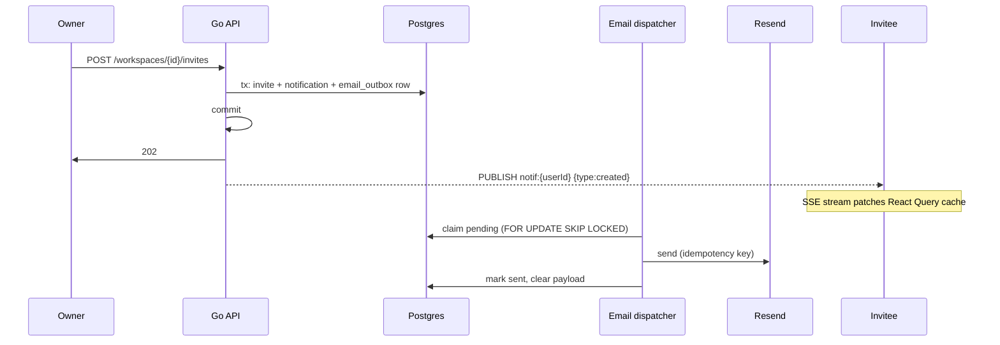

## Decisions

- **Postgres stays the source of truth** for notifications. It already holds read state, history, and the invite linkage; the gap is per-item read tracking and a push channel, not the storage engine.
- **Polling is removed.** New `GET /api/notifications/stream` mirrors [server/internal/httpapi/sse.go](server/internal/httpapi/sse.go) but subscribes to a per-user Redis channel `notif:{userID}`.
- **Clerk and Resend stay separate.** Clerk owns identity mail (verification, magic link, password reset); Resend owns product mail. They only share a sending domain so DKIM/SPF is configured once. No Clerk custom-SMTP wiring.
- **Invites remain existing-users-only.** `CreateWorkspaceInvite` keeps its silent no-op for unknown emails; email is purely a second delivery channel for an invite that already resolved to a `users` row.
- **React Email authored, Go rendered.** A build script prerenders each template to a committed `.gohtml` + `.txt` with Go template placeholders, so the runtime has no Node dependency.
- **The Postgres outbox is the email job queue.** An external broker is unnecessary at this scale and would not replace the transactional outbox. Strengthen leases, cancellation, leadership, and rate limiting first.
- **The baseline schema may change destructively.** There is no existing server or data to migrate.

## Problems being fixed along the way

- Opening the bell calls `POST /notifications/read`, which marks **every** row read (`MarkNotificationsRead` in [server/internal/store/queries.go](server/internal/store/queries.go)). Replaced with per-item read plus an explicit "mark all read" action.
- `workspace_invites` stores only `token_hash`, but the notification row stores the **plaintext token** in `href` ([server/internal/store/collaboration.go](server/internal/store/collaboration.go) lines 121-128), so the hashing protects nothing. In-app notifications will link by invite id (session-gated, no token needed since `invited_user_id` is known); the plaintext token exists only inside the email.
- `add_notification` in [pipeline/pipeline/store/db.py](pipeline/pipeline/store/db.py) omits `user_id`, so ingest-complete rows are invisible to everyone. Fixed by looking up the source owner; `user_id` becomes `NOT NULL` so this can't regress silently.
- Notification prose is stored pre-rendered in English, defeating paraglide. Replaced with `kind` + `data jsonb`.

## Flow



## 1. Schema (destructive edit to [server/migrations/0001_init.sql](server/migrations/0001_init.sql))

Rewrite `notifications`:

```sql
CREATE TABLE notifications (
  id                  text PRIMARY KEY,
  user_id             text NOT NULL REFERENCES users(id) ON DELETE CASCADE,
  kind                text NOT NULL,
  data                jsonb NOT NULL DEFAULT '{}'::jsonb,
  href                text,
  workspace_id        text REFERENCES workspaces(id) ON DELETE CASCADE,
  workspace_invite_id text REFERENCES workspace_invites(id) ON DELETE CASCADE,
  at                  timestamptz NOT NULL DEFAULT now(),
  read_at             timestamptz
);
CREATE INDEX notifications_user_at_idx ON notifications(user_id, at DESC);
CREATE INDEX notifications_user_unread_idx ON notifications(user_id) WHERE read_at IS NULL;
```

`title`/`body` and the `read` boolean are gone. Keep the existing partial unique index on `workspace_invite_id`.

Add `email_outbox` (transactional outbox — a network call inside `CreateWorkspaceInvite`'s tx would either send mail for a rolled-back invite or fail the invite when Resend is down):

```sql
CREATE TABLE email_outbox (
  id text PRIMARY KEY,
  user_id text REFERENCES users(id) ON DELETE SET NULL,
  to_email text NOT NULL,
  template text NOT NULL,
  locale text NOT NULL DEFAULT 'en',
  payload jsonb NOT NULL,
  idempotency_key text UNIQUE,
  status text NOT NULL DEFAULT 'pending',
  attempts int NOT NULL DEFAULT 0,
  next_attempt_at timestamptz NOT NULL DEFAULT now(),
  provider_message_id text,
  last_error text,
  created_at timestamptz NOT NULL DEFAULT now(),
  sent_at timestamptz
);
CREATE INDEX email_outbox_claim_idx ON email_outbox(next_attempt_at) WHERE status = 'pending';
```

Add `notification_prefs` (`user_id` PK, `email_workspace_invite`, `email_membership`, both default true). Billing/subscription mail stays mandatory — do not add a toggle that will be ignored.

Add `users.locale text NOT NULL DEFAULT 'en'` so emails can be rendered in the user's language server-side. Update the seed block (lines ~1045) to the new columns.

## 2. Go mail package (new `server/internal/mail/`)

- `mail.go` — `Sender` interface, `Message{To, Subject, HTML, Text, Headers, IdempotencyKey}`.
- `resend.go` — `github.com/resend/resend-go/v3` (`client.Emails.SendWithContext`).
- `log.go` — stdout sender for dev/e2e.
- `templates.go` — `go:embed templates/*`, one `Render(template, locale, data)`.

Selection mirrors `openBlobStore` in [server/cmd/api/main.go](server/cmd/api/main.go): `EMAIL_BACKEND=resend|log`, defaulting to Resend only when `RESEND_API_KEY` is set. Docker must not force `log` when the variable is absent. Resend requires `EMAIL_FROM` and a strong unsubscribe secret and remains forbidden under `APP_ENV=e2e`.

New env: `RESEND_API_KEY`, `EMAIL_FROM`, `EMAIL_REPLY_TO`, `EMAIL_BACKEND`, `EMAIL_UNSUBSCRIBE_SECRET`. `APP_URL` already exists for link building. Document in [server/.env.example](server/.env.example) and [deploy/.env.example](deploy/.env.example).

## 3. Templates (React Email, prerendered)

- Add `react-email` + `@react-email/components` as devDeps; templates in `emails/` (`layout.tsx`, `workspace-invite.tsx`, `workspace-role-changed.tsx`, `workspace-member-removed.tsx`).
- `scripts/build-emails.ts` renders each template per locale, passing `{{.FieldName}}` strings as props, and writes `server/internal/mail/templates/{name}.{locale}.gohtml` plus a `.txt` from `render(..., { plainText: true })`. Output is committed.
- Scripts: `email:dev` (`email dev`), `email:build`. CI runs `pnpm email:build && git diff --exit-code` to catch stale output.
- Constraint to respect: prerendering supports substitution only, not loops or conditionals. Fine for these three emails; a future digest email would need runtime rendering.

## 4. Notification + email service (Go)

New `server/internal/store/notifications.go` (extracted from `queries.go`):
`Notifications(ctx, userID, limit, before)`, `UnreadNotificationCount`, `MarkNotificationRead(ctx, userID, id)`, `MarkAllNotificationsRead`, `CreateNotificationTx(ctx, tx, params)`, `NotificationPrefs`, `SetNotificationPrefs`.

New `server/internal/store/email_outbox.go`: enqueue, claim small batches with `FOR UPDATE SKIP LOCKED` plus a unique lease token, revalidate status/cancellation immediately before send, and require the lease for completion updates. Stale claims at six attempts become terminal and clear their payload; lower attempts use exponential backoff capped at one hour.

Wire the three events, each writing notification + outbox row in one tx and returning the created notifications so the HTTP layer can publish after commit:

- `CreateWorkspaceInvite` in [server/internal/store/collaboration.go](server/internal/store/collaboration.go) — signature becomes `(Notification, bool, error)`; `href` becomes `/workspace-invites/{inviteID}`; the outbox payload carries the plaintext token for the email link.
- `SetWorkspaceMemberRole` and the member-removal path — join the recipient explicitly, treat unchanged roles as no-ops, use stable event idempotency keys, and notify the recipient. Removal mail opens `/workspaces`, never the inaccessible removed workspace.

`AcceptWorkspaceInvite` also accepts an exact `inv_<hex>` reference (session-gated and recipient-bound); otherwise it hashes the value as a raw token. If ID lookup misses, fall back to token lookup so valid Base64URL tokens are never misclassified.

Dispatcher goroutine in [server/cmd/api/main.go](server/cmd/api/main.go): use a Postgres advisory lock so only one API replica dispatches, claim small batches, pace below Resend's account-wide 10 requests/second limit, honor `Retry-After`, and release unprocessed leases on shutdown.

## 5. API surface

Huma routes in [server/internal/httpapi/huma_account.go](server/internal/httpapi/huma_account.go):

- `GET /api/notifications?limit=&before=` — paginated with an opaque `(at,id)` cursor, returns `{id, kind, data, href, at, readAt?}`
- `GET /api/notifications/unread-count`
- `POST /api/notifications/{id}/read`
- `POST /api/notifications/read` (mark all, kept)
- `GET|PATCH /api/notification-prefs`

Non-Huma routes on chi in [server/internal/httpapi/server.go](server/internal/httpapi/server.go) (next to `/api/workspaces/{id}/ingest-events`):

- `GET /api/notifications/stream` in a new `sse_notifications.go`, subscribing `notif:{userID}` with bounded stream lifetime and connection limits. Envelope: `{type: 'created'|'read'|'removed', notification?, ids?}` so mark-read syncs across tabs and invite-accept removes the row live.
- `GET|POST /api/email/unsubscribe?token=` — GET renders confirmation without mutation; POST atomically disables only the signed category. Require a strong `EMAIL_UNSUBSCRIBE_SECRET` with Resend and emit `List-Unsubscribe` / `List-Unsubscribe-Post`.

Regenerate with `pnpm gen:api:msw`. The SSE route is chi-only so it won't appear in [openapi.yaml](openapi.yaml) — its event types are hand-written.

## 6. Frontend

- New `src/api/notificationStream.ts` — authenticated fetch + shared SSE parser, reconnect backoff, and an on-open callback that reconciles list/count caches after Pub/Sub gaps.
- [src/api/hooks.ts](src/api/hooks.ts) — add stream/unread/per-item-read/prefs hooks, notification-specific focus refetch, and degraded polling only while SSE is disconnected. Handle same-ID read-to-unread events and expose paged notification loading.
- [src/components/app/TopInsetBar.tsx](src/components/app/TopInsetBar.tsx) — `NotificationsBell` (lines 171-256): count badge from the unread-count query, mark-read per item on click, explicit "mark all read" button, mount the stream hook here.
- New `src/components/app/NotificationItem.tsx` — maps structured kinds/data and role labels to paraglide messages; ingest notifications must not carry rendered English prose.
- [src/routes/Settings.tsx](src/routes/Settings.tsx) — disable email controls until loaded and serialize/optimistically coordinate writes; persist locale with rollback on failure. Give the bell and switches localized accessible names.
- Update [src/mocks/db.ts](src/mocks/db.ts) and [src/mocks/handlers.ts](src/mocks/handlers.ts) for the new shape and endpoints; `USE_MSW` skips the stream as `useIngestProgress` already does.

## 7. Tests

- Go with real Postgres in CI: role/removal transactions, lease ownership, cancellation, stale recovery, leadership/rate limiting, retries/idempotency, preference suppression, atomic unsubscribe, and read scoping.
- Frontend: SSE framing/reconnect reconciliation and every cache transition. Playwright asserts an `inv_` in-app reference with no plaintext token and verifies the raw-token email link from the log backend.
- CI: run `email:build` and fail on generated-template diffs.
- Run `pnpm run fmt`, `pnpm run fix`, `pnpm run check`.

## Explicit non-goals

- Inviting users who have no account (no signup-claim flow).
- Resend inbound/bounce webhooks. Worth a follow-up: hard-bounce suppression protects sending-domain reputation, but it needs a `users.email_status` column and `POST /webhooks/resend`.
- Digest/batched emails, in-app toast delivery, push notifications.