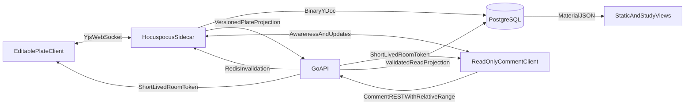

# Remove Suggestions and Make Yjs Authoritative

## Target architecture

- The Y.Doc is authoritative for material **content** after lazy initialization; Go/PostgreSQL remain authoritative for material metadata, permissions, comments, and threads.
- `materials.content` becomes a versioned Plate JSON read projection. It must never independently overwrite an initialized Y.Doc.
- Room membership is **not** “everyone who opens the material”:
  - **Viewers / static / study:** do **not** join Yjs. They render the checkpointed `materials.content` Plate JSON (eventual consistency; may lag live editors by the projection debounce). No collab token, no WebSocket, no awareness. This keeps capacity low and removes any edit surface.
  - **Commenters:** **do** join the room so they see live content + cursors while commenting. They get a `comment` token; Hocuspocus sets `connection.readOnly = true` so inbound document updates are rejected even from a hacked client. UI also mounts Plate read-only before connect and hides mutating commands.
  - **Editors:** join with a `write` token; only they may submit Yjs document updates.
- Defense in depth against edits by non-editors: (1) Go never mints write/comment tokens for viewers; (2) Hocuspocus rejects unauthenticated / wrong-room / expired tokens and forces `readOnly` for `comment`; (3) Plate `readOnly` + no mutating toolbar/slash for comment mode; (4) comment REST still ACL-checked in Go. Do not rely on UI alone.
- Pin the Plate-compatible browser provider to `@hocuspocus/provider` 3.4.x, but run the sidecar on Hocuspocus server/extensions 4.x for reliable store retries, shutdown flushing, and multi-instance load ordering; lock every sidecar package to the same 4.x release and verify v3-provider/v4-server wire compatibility in integration tests. Do not add IndexedDB/offline persistence initially.

## 1. Remove suggestions from every contract
- Simplify [`server/migrations/0001_init.sql`](server/migrations/0001_init.sql) as a clean reset: remove `material_suggestions`, pending-suggestion flags, suggestion discussion kinds, suggestion revision events/metadata, and related indexes/checks. Keep discussions/comments only.
- Delete suggestion APIs and store logic from [`server/internal/httpapi/huma_collaboration.go`](server/internal/httpapi/huma_collaboration.go), [`server/internal/store/revision_collaboration.go`](server/internal/store/revision_collaboration.go), [`server/internal/materialdoc/suggestions.go`](server/internal/materialdoc/suggestions.go), models/enums, share responses, and tests. Simplify discussion deletion to comments-only behavior.
- Remove `@platejs/suggestion`, suggestion plugins/renderers/scanners, draft state, bulk review UI, pending badges, and static suggestion rendering. Main cleanup points are [`src/features/notes/Collaboration.tsx`](src/features/notes/Collaboration.tsx), [`src/features/notes/collaborationPlugins.ts`](src/features/notes/collaborationPlugins.ts), [`src/features/notes/suggestions.ts`](src/features/notes/suggestions.ts), [`src/features/materials/MaterialPreview.tsx`](src/features/materials/MaterialPreview.tsx), and [`src/features/materials/CenterContentHeader.tsx`](src/features/materials/CenterContentHeader.tsx).
- Regenerate OpenAPI/Orval outputs and remove stale generated suggestion models. Make material validation reject `suggestion` and `suggestion_*` properties so obsolete clients cannot reintroduce them.

## 2. Add the collaboration service and durable Y.Doc storage
- Add a pnpm workspace package such as `collaboration/` with Hocuspocus server/extensions 4.x, Yjs, PostgreSQL, Redis, health checks, graceful shutdown, bounded WebSocket/auth queues, payload limits, metrics, and a Dockerfile.
- Add `material_yjs_documents` keyed by material ID with the unchanged encoded Yjs state (`bytea`), room/schema version, monotonic stored version, projected version/status, and timestamps. Store and fetch the exact binary state; never reconstruct it from JSON after initialization. Under a PostgreSQL row/advisory lock, merge the stored state with the instance state before replacing the row so concurrent sidecar instances cannot lose updates.
- Use rooms like `material:{id}:schema:1`. Lazy-bootstrap a missing room server-side from the normalized `materials.content`; clients call Plate Yjs `init` without supplying competing initial values.
- Persist with bounded debounce/max-debounce and keep failed stores in memory for retry. After a successful binary store, convert the `content` shared `Y.XmlText` with the exact Slate-Yjs version used by Plate and submit `{materialId, yjsVersion, content}` to an authenticated internal Go checkpoint endpoint. Retry any row whose `projected_version < stored_version`.
- Treat Plate/Hocuspocus “synced” as in-memory server convergence only. For a durable `Saved` state, have the client write a unique checkpoint marker to a reserved Yjs map; after PostgreSQL commits a state containing that marker, broadcast the marker ID and durable version back to the room.
- Add the Hocuspocus Redis extension for multi-instance document/awareness convergence and subscribe to Go comment-invalidations for stateless room broadcasts.

## 3. Centralize authorization and projection in Go
- Add a Go collaboration-token endpoint that reuses `MaterialEffectiveRole`, emits a short-lived signed token containing exact room, user, schema version, and `write` or `comment` access, and never grants a Yjs connection to viewers. Hocuspocus verifies the signature, origin, expiry, and room claim, then enforces read-only access for commenters with the v4 `connection.readOnly` hook API. Refresh tokens on reconnect and actively evict/downgrade connections after ACL changes.
- Add an internal service-authenticated projection endpoint/store method. It must validate the Plate envelope with `materialdoc`, row-lock the material, ignore stale Yjs versions, update `materials.content`, increment the material revision, upsert the daily revision, reconcile flashcard stats, and mark the Yjs version projected.
- Remove public content autosave from material PATCH while retaining title/scope/privacy metadata updates. Split generic `UpdateMaterial` so code cannot accidentally write `materials.content` around Yjs.
- Route all existing server-side content writers—including quiz updates and flashcard create/update/delete paths in [`server/internal/store/queries.go`](server/internal/store/queries.go)—through an internal collaboration-service command API. Commands load the current Y.Doc and apply validated, stable-ID-based headless Slate transforms; avoid whole-document replacement and reject stale command preconditions.
- On material deletion or role revocation, publish eviction/reconnect events; short token TTLs bound stale access. Return `503` for content mutations when the authority service is unavailable instead of falling back to SQL writes.

## 4. Bind Plate to Yjs and introduce comment mode
- Replace `MaterialMode = 'view' | 'edit' | 'suggestion'` in [`src/features/materials/modePolicy.ts`](src/features/materials/modePolicy.ts) with `view | edit | comment`: editors default to editable Plate, commenters default to read-only Plate, and viewers use static view.
- In [`src/features/notes/NoteEditorCore.tsx`](src/features/notes/NoteEditorCore.tsx), configure `YjsPlugin` with `@hocuspocus/provider` 3.4.x, remote cursors and the authenticated user identity; use `skipInitialization: true`, initialize with the canonical room ID and no client seed (`value: null`) after mount/token readiness, and fully destroy the stable provider/editor on cleanup. Use Yjs-aware undo/redo and set `PlateContent` read-only before connecting in comment mode.
- Delete the five-second REST autosave, local revision refs, `replaceEditorDocument`, draft unload warnings, and suggestion status. Replace them with connecting/server-synced/checkpoint-persisted/offline/error states driven by the explicit checkpoint receipt above; never label provider `_isSynced` as “Saved”.
- Ensure every local insert/paste/custom-block transform assigns stable element IDs before entering Yjs. Audit normalizers for deterministic, idempotent remote behavior and ensure runtime state, signed URLs, upload placeholders, and UI state never become persisted node properties.

## 5. Keep comments relational but make anchors collaboration-safe
- Reduce [`src/features/notes/Collaboration.tsx`](src/features/notes/Collaboration.tsx) to comments/threads, preferably renaming it to a comments-focused module. Tighten discussion list access to users with comment or edit capability.
- Replace Slate path anchors with encoded Yjs relative ranges (`slateRangeToRelativeRange` / `relativeRangeToSlateRange`) plus the stable block ID, root/schema lineage, and quoted-text fallback. Store the two encoded relative positions as PostgreSQL `bytea` values (base64 only on the JSON wire), validate strict size/version bounds in Go, and keep unresolved/deleted anchors available as orphan/block-level threads.
- Stop applying comment marks with `editor.tf.setNodes`. Resolve relative ranges against the live Y.Doc and render them through a local Plate decoration plugin, so comments never generate Yjs updates.
- Publish comment/thread mutations through Redis; Hocuspocus broadcasts a stateless room event and clients invalidate the discussion query so other collaborators see changes immediately.
- Refactor [`src/features/notes/NoteToolbar.tsx`](src/features/notes/NoteToolbar.tsx), [`src/features/notes/SlashInput.tsx`](src/features/notes/SlashInput.tsx), and [`src/features/notes/editorCommands.ts`](src/features/notes/editorCommands.ts): keep Comment in its toolbar group and More commands, add a reusable `mod+k` palette, hide all document-mutating commands for commenters, and keep typed slash commands editor-only.

## 6. Make every AI preview local until accepted
- Remove `applyAISuggestions`, `applyTableCellSuggestion`, suggestion finalization, and all persisted/inline AI suggestion marks from [`src/features/notes/ai/aiPlugins.ts`](src/features/notes/ai/aiPlugins.ts).
- Buffer generated edits, inserts, and table changes in local plugin/React state and show a text diff in [`src/features/notes/ai/AiMenu.tsx`](src/features/notes/ai/AiMenu.tsx). Track the target with a Yjs relative range or stable node ID while streaming.
- Reject drops local preview state without touching Yjs. Accept re-resolves the target and applies one plain, history-batched Yjs transaction; if concurrent edits invalidate the target, require retry instead of overwriting. Keep copilot ghost text local and create AI comments through the relative-anchor REST path.

## 7. Deploy, verify, and document
- Add collaboration/Redis wiring and secrets to [`deploy/docker-compose.yml`](deploy/docker-compose.yml), [`deploy/docker-compose.e2e.yml`](deploy/docker-compose.e2e.yml), env examples, Vite’s public collaboration URL, and health/dependency checks.
- Add unit/integration coverage for token claims/read-only enforcement, bootstrap without duplicate content, binary restart recovery, monotonic projection checkpoints, custom block convergence, stable IDs, relative comment anchors, realtime thread invalidation, and server-origin quiz/card commands.
- Add multi-context Playwright tests proving: two editors converge and see cursors; a commenter sees live updates and can comment but cannot submit Yjs mutations even with a raw client; viewers cannot connect; AI previews are invisible remotely until accepted; static/study views receive the checkpointed projection; and reconnect/restart preserves content.
- Run frontend typecheck/tests, Go tests, collaboration-service tests, editor E2E, and sharing/access E2E. Update [`openwiki/frontend/plate-editor.md`](openwiki/frontend/plate-editor.md) and backend/deployment docs with the authority, persistence, permission, comment-anchor, projection-lag, and recovery boundaries.

## 8. Capacity and operational guardrails
Capacity is driven by the number and size of concurrently loaded Y.Docs, connected editors/commenters, update and awareness frequency, and initial synchronization size. Do not encode unverified per-room memory estimates or a universal per-process ceiling; measure this app's Plate documents and custom blocks with load tests.

- Start with one collaboration-service replica. Track active rooms, authenticated connections, encoded Y.Doc size, store/projection latency and failures, event-loop lag, process RSS, WebSocket disconnects, and Redis/Postgres latency.
- Keep Hocuspocus's bounded pre-authentication queues, set a WebSocket `maxPayload`, authenticate before document access, and unload documents after the last connection and pending store complete.
- Keep the default debounced persistence with a maximum debounce so active rooms are stored regularly; alert when stored and projected Yjs versions diverge.
- Do not add an arbitrary per-room occupancy limit at launch. Viewers never connect, while editor/commenter access is ACL-controlled. Add a measured limit later only if load tests or real usage establish one; in a multi-instance deployment, any room-wide limit would need distributed accounting rather than a per-process counter.
- Scale horizontally when measurements require it. Hocuspocus Redis synchronizes document updates and awareness across replicas for availability, but every connected replica handles those messages; use document-based routing/sharding when the goal is reducing CPU or network fan-out.
- Keep Yjs garbage collection enabled and monitor encoded document growth. Treat document compaction or rebasing as a separately tested maintenance operation, not an automatic launch-time task.