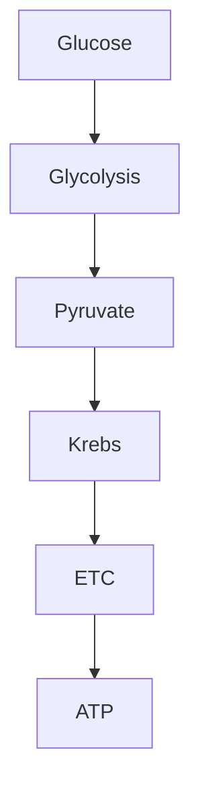

# Editor feature matrix

- [Editor feature matrix](#editor-feature-matrix)
  - [Headings](#headings)
    - [Heading 3](#heading-3)
      - [Heading 4](#heading-4)
        - [Heading 5](#heading-5)
          - [Heading 6](#heading-6)
  - [Text marks & styles](#text-marks-styles)
  - [Alignment](#alignment)
  - [Lists](#lists)
  - [Quote & divider](#quote-divider)
  - [Callout variants](#callout-variants)
  - [Code block](#code-block)
  - [Table](#table)
  - [Columns](#columns)
  - [Block equation](#block-equation)
  - [YouTube embed](#youtube-embed)
  - [Mermaid diagram](#mermaid-diagram)
  - [Quiz block](#quiz-block)
  - [Flashcards block](#flashcards-block)

This note intentionally exercises every Plate feature except uploaded media nodes (img / audio / file).

## Headings

### Heading 3

#### Heading 4

##### Heading 5

###### Heading 6

## Text marks & styles

plain · **bold** · *italic* · <u>underline</u> · ~~strike~~ · `inline code` · `Ctrl`+`B` · <mark>highlight</mark> · H<sub>2</sub>O · E=mc<sup>2</sup>

colored · tinted · larger · serif sample

Inline link: [OpenStax Biology](https://openstax.org/details/books/biology-2e) · mention @Kate Malone · inline math $\Delta G = \Delta H - T\Delta S$.

## Alignment

Left-aligned paragraph (default).

Center-aligned paragraph.

Right-aligned paragraph.

Justify-aligned paragraph: membranes separate compartments so gradients can do work across the bilayer.

## Lists

- Bulleted item — organelles

- Bulleted item — membranes

1. Numbered step — isolate the variable

1. Numbered step — apply the model

- [x] Todo checked — skim the matrix

- [ ] Todo open — try each toolbar control

## Quote & divider

> “Nothing in biology makes sense except in the light of evolution.” — Theodosius Dobzhansky

---

## Callout variants

> **Info**
>
> Info callout — background reading is linked above.

> **Success**
>
> Success callout — you covered every non-media block.

> **Warning**
>
> Warning callout — osmolarity units trip people up.

> **Danger**
>
> Danger callout — do not confuse lysis with crenation.

## Code block

```python
def atp_yield(glucose_mol: float) -> float:
    """Rough aerobic yield (~30-32 ATP / glucose)."""
    return glucose_mol * 30
```

## Table

| Process | Location | ATP net |
| --- | --- | --- |
| Glycolysis | Cytosol | 2 |
| Krebs cycle | Mitochondrial matrix | 2 |
| ETC / oxidative phosphorylation | Inner membrane | ~28 |

## Columns

**Column 1**

**Two-column left** — structure.

**Column 2**

**Two-column right** — function.

**Column 1**

Prokaryote

**Column 2**

Eukaryote animal

**Column 3**

Eukaryote plant

**Column 1**

Wide column: endosymbiotic origin of mitochondria.

**Column 2**

Narrow: DNA circular.

## Block equation

$$
\mathrm{C_6H_{12}O_6} + 6\,\mathrm{O_2} \rightarrow 6\,\mathrm{CO_2} + 6\,\mathrm{H_2O} + \text{ATP}
$$

## YouTube embed

[YouTube video](https://www.youtube.com/watch?v=URUJD5NEXC8)

## Mermaid diagram

Respiration overview



## Quiz block

### Question 1

Where does glycolysis occur? (1 mark)

A. Cytosol
B. Nucleus
C. Golgi lumen

### Question 2

Which organelles contain their own DNA? (multi) (1 mark)

- [ ] Mitochondria
- [ ] Lysosomes
- [ ] Chloroplasts

### Question 3

Ribosomes are present in both prokaryotes and eukaryotes. (1 mark)

A. True
B. False

### Question 4

The main short-term energy carrier is ____. (1 mark)


Answer: ______________________________

### Quiz answer key

**1. A. Cytosol**

Marking scheme (1 mark):
- Glycolysis occurs in the cytosol of the cell.

Worked solution: Glycolysis occurs in the cytosol of the cell.

**2. A. Mitochondria; C. Chloroplasts**

Marking scheme (1 mark):
- Both mitochondria and chloroplasts have their own DNA.

Worked solution: Both mitochondria and chloroplasts have their own DNA.

**3. True**

Marking scheme (1 mark):
- True — ribosomes are not membrane-bound.

Worked solution: True — ribosomes are not membrane-bound.

**4. ATP / adenosine triphosphate**

Marking scheme (1 mark):
- ATP is the cell’s short-term energy currency.

Worked solution: ATP is the cell’s short-term energy currency.

## Flashcards block

### Card 1

**Front:** What does ATP stand for?

**Back:** Adenosine triphosphate — cellular energy currency

### Card 2

**Front:** Define osmosis

**Back:** Diffusion of water across a semi-permeable membrane

End of matrix. Media uploads (`img` / `audio` / `file`) are omitted on purpose.

