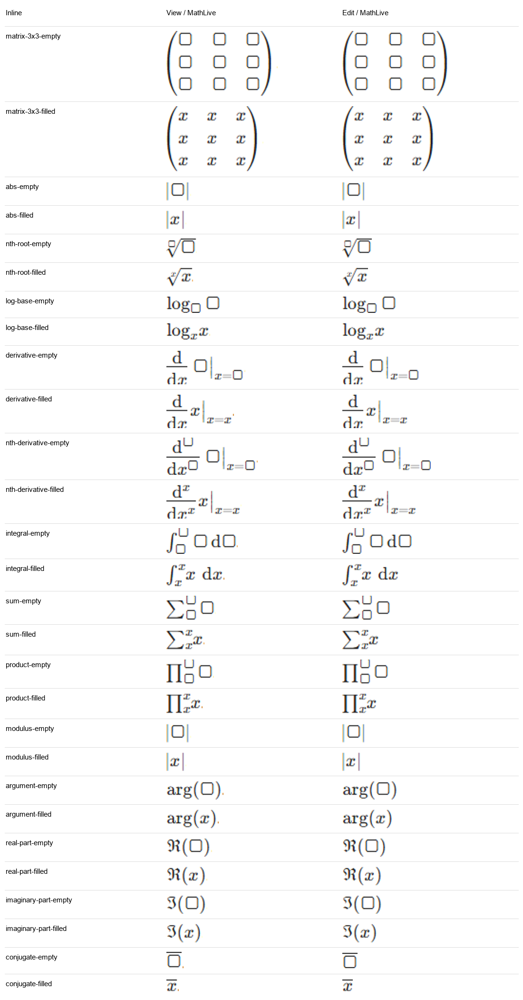
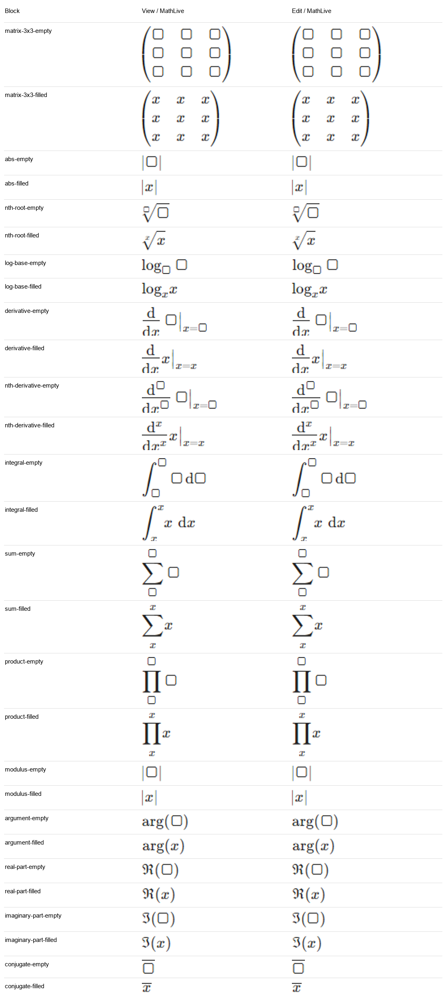

# MathLive view/edit verification

2026-09-28. Follow-up to the original KaTeX/MathLive audit.

The app now uses read-only MathLive fields for previews in notes, question/quiz views and question editors. Preview controls and interaction are disabled, while a spoken-math label remains accessible. Editing continues to use MathLive. No API or stored LaTeX changes are required. Document export still uses its existing KaTeX renderer.

All 13 Insert templates and 25 matrix sizes were checked with empty and filled slots in inline and block modes, totaling 152 cases. Every case passed matching text/font checks, formula dimensions and per-glyph/bar positions/sizes within 0.1 CSS pixel, valid rendering, and commit/reopen checks. These assertions cover conjugate/fraction/root strokes as well as glyphs and placeholders; they exclude intentional editing controls and selection/caret decoration.

- Inline: 76 cases. Maximum width difference 0.0000px; maximum height difference 0.0000px.
- Block: 76 cases. Maximum width difference 0.0000px; maximum height difference 0.0000px.

The question-dialog test also checks a formula containing a conjugate, second derivative and plain-text ATP through edit, preview and reopen. Existing keyboard, text-boundary arrow, caret, menu-reopen and layout tests pass.

These are the menu templates and filled-x examples, not an exhaustive proof for arbitrary handwritten LaTeX or arbitrary nesting. Original screenshot pairs and JSON for all 152 cases are saved in the inline/block folders. The sheets show every Insert template and a representative 3x3 matrix, cropped independently and enlarged 2x. Crops use the math line bounds, so tall glyphs may be cut at the edge; the geometry assertions compare the full glyph bounds.

