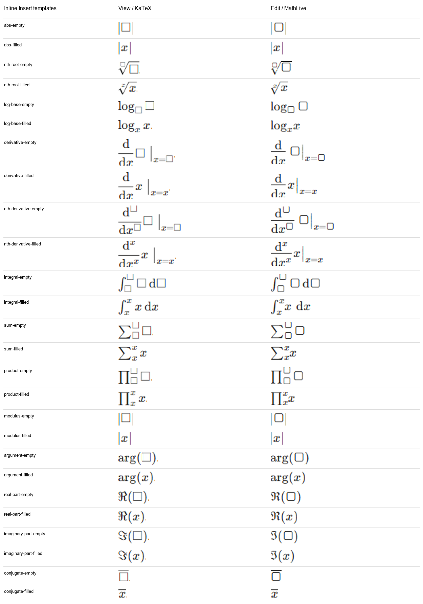
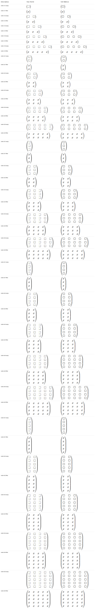
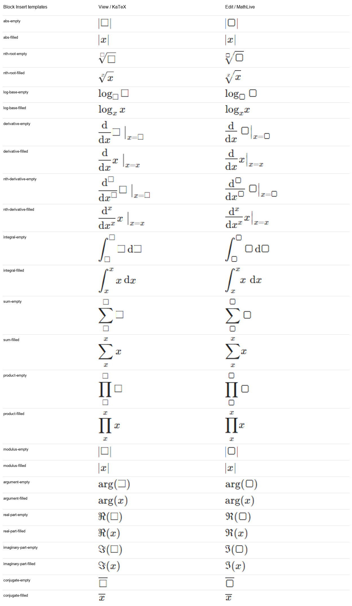
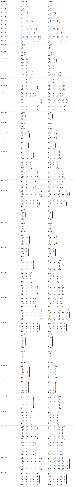

# Formula view/edit audit

Follow-up: [MathLive in both modes, verification results](mathlive/report.md). This document records the original comparison before that change.

2026-09-28. Installed MathLive editing versus the existing KaTeX preview.

## Coverage

- All 13 Insert commands and every matrix picker size from 1x1 through 5x5.
- Empty placeholders and filled `x` content, in both inline and block modes: 152 cases.
- All 152 cases render, commit and reopen with the same LaTeX, without uncaught errors or visible unknown commands. Passing these functional checks does not establish visual parity.
- Every case has a view/edit screenshot pair and a geometry record. The sheets below show every pair.
- Widths measure the formula content, excluding editor controls, outer padding and the full-width display container. Raw JSON heights describe different containers and should not be compared.
- Scope is the exposed Insert/Insert Matrix menu. Arbitrary handwritten LaTeX and nested combinations are not exhaustive-tested.

## Findings

- Empty slots use square KaTeX glyphs versus rounded MathLive placeholders, with different sizes and spacing. The preview explicitly maps `\placeholder` to `\square`.
- Derivatives differ in fraction spacing and evaluation-bar/subscript placement. Filled derivatives also change width.
- Empty conjugates change the placeholder geometry under the bar. Filled single-x conjugates retain the same width; stroke appearance varies between captures, including subpixel antialiasing.
- Roots, integrals, sums and products have visible differences in vertical spacing and limit placement.
- Real and imaginary parts use different glyph shapes and widths.
- Matrix placeholder width differences accumulate across columns; filled matrix widths are much closer.

## Width differences

- Inline: 35/76 cases differ by more than 1 CSS pixel; largest absolute difference 5.36px.
- Block: 34/76 cases differ by more than 1 CSS pixel; largest absolute difference 5.36px.

Positive means viewing is wider than editing. A zero width difference does not imply identical glyphs, strokes or vertical placement.

| Template | Inline empty | Inline filled | Block empty | Block filled |
|---|---:|---:|---:|---:|
| matrix-1x1 | -0.94px | +0.00px | -0.94px | +0.00px |
| matrix-1x2 | -1.89px | -0.02px | -1.89px | -0.02px |
| matrix-1x3 | -2.84px | -0.03px | -2.84px | -0.03px |
| matrix-1x4 | -3.80px | -0.05px | -3.80px | -0.05px |
| matrix-1x5 | -4.75px | -0.06px | -4.75px | -0.06px |
| matrix-2x1 | -0.94px | +0.00px | -0.94px | +0.00px |
| matrix-2x2 | -1.89px | -0.02px | -1.89px | -0.02px |
| matrix-2x3 | -2.84px | -0.03px | -2.84px | -0.03px |
| matrix-2x4 | -3.80px | -0.05px | -3.80px | -0.05px |
| matrix-2x5 | -4.75px | -0.06px | -4.75px | -0.06px |
| matrix-3x1 | -0.97px | -0.03px | -0.97px | -0.03px |
| matrix-3x2 | -1.92px | -0.05px | -1.92px | -0.05px |
| matrix-3x3 | -2.88px | -0.06px | -2.88px | -0.06px |
| matrix-3x4 | -3.83px | -0.08px | -3.83px | -0.08px |
| matrix-3x5 | -4.78px | -0.09px | -4.78px | -0.09px |
| matrix-4x1 | -0.97px | -0.03px | -0.97px | -0.03px |
| matrix-4x2 | -1.92px | -0.05px | -1.92px | -0.05px |
| matrix-4x3 | -2.88px | -0.06px | -2.88px | -0.06px |
| matrix-4x4 | -3.83px | -0.08px | -3.83px | -0.08px |
| matrix-4x5 | -4.78px | -0.09px | -4.78px | -0.09px |
| matrix-5x1 | -0.97px | -0.03px | -0.97px | -0.03px |
| matrix-5x2 | -1.92px | -0.05px | -1.92px | -0.05px |
| matrix-5x3 | -2.88px | -0.06px | -2.88px | -0.06px |
| matrix-5x4 | -3.83px | -0.08px | -3.83px | -0.08px |
| matrix-5x5 | -4.78px | -0.09px | -4.78px | -0.09px |
| abs | -0.94px | +0.00px | -0.94px | +0.00px |
| nth-root | -1.52px | -0.02px | -4.75px | -3.25px |
| log-base | -2.19px | +3.48px | -2.19px | +3.48px |
| derivative | -0.31px | +5.36px | -0.31px | +5.36px |
| nth-derivative | -1.77px | +5.36px | -1.77px | +5.36px |
| integral | -2.55px | +0.78px | -2.55px | +0.78px |
| sum | -1.50px | +4.17px | -1.00px | +3.22px |
| product | -1.50px | +4.17px | -1.00px | +3.22px |
| modulus | -0.94px | +0.00px | -0.94px | +0.00px |
| argument | -0.66px | +0.28px | -0.66px | +0.28px |
| real-part | -2.34px | -1.41px | -2.34px | -1.41px |
| imaginary-part | +2.33px | +3.27px | +2.33px | +3.27px |
| conjugate | -0.94px | +0.00px | -0.94px | +0.00px |

## Captures

Cropped to the painted content, enlarged 2x, with the purple editing outline omitted. Each column is cropped independently; use these for shape/spacing comparisons, not page-position measurements. Original captures and JSON remain in the mode folders. Inline captures use the inline element height, which can crop the outermost pixels of tall limits; block captures show those elements in full. A neighboring punctuation pixel can appear at the edge of inline crops.

## Recommendation

Use the same rendering engine for viewing and editing to address this class of mismatch. Retaining KaTeX means maintaining compatibility adjustments for individual glyphs, placeholders and layout rules. The prior recorded decision chose KaTeX for static question views; this audit leaves that behavior unchanged.
