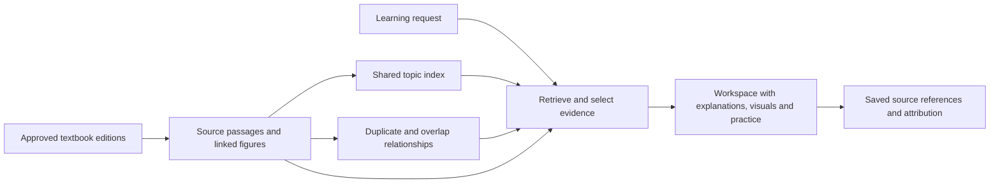

# A topic-centered knowledge base for Capy

Research date: 2026-09-15. Design proposal, not an adopted decision or implementation. This extends the [source acquisition and licensing strategy](2026-09-15-external-knowledge-strategy.md). Online research covered official project documentation and primary papers; these systems have not been benchmarked on Capy's textbook corpus. Two GPT-5.6 Sol researchers at high reasoning contributed deduplication and educational reuse research.

## Recommendation

Organize the shared textbook corpus around topics, while retaining the source explanations and their figures. A topic should have one stable identity and several useful, attributable explanations. A generated workspace chooses a coherent subset for a particular learning goal.

There are three different operations:

1. Topic resolution: recognize when different labels refer to the same concept.
2. Duplicate detection: recognize copied content or closely overlapping explanations.
3. Curation: choose the explanations, figures, examples, and activities that work together for this request.

Doing the first does not solve the second or third. Two passages about the same topic may serve different learners, use different assumptions, or cover complementary details. The useful result is a workspace without unnecessary repetition, backed by a library that retains those differences.

## Relevant precedents

| Project | Verified behavior | What to borrow and where it stops |
| --- | --- | --- |
| [Microsoft GraphRAG](https://microsoft.github.io/graphrag/index/default_dataflow/) | Extracts entities and relationships, groups the graph into communities, and generates community reports. Its [output model](https://microsoft.github.io/graphrag/index/outputs/) retains source documents, raw text units, and links from extracted entities/relationships to those units. | Summaries and cross-document organization can sit above retained evidence. Graph communities are structural clusters, not automatically educational topics or prerequisite sequences. Full graph extraction adds work that Capy would need to justify. |
| [RAPTOR, ICLR 2024](https://arxiv.org/html/2401.18059v1) | Keeps original chunks as leaves and recursively clusters and summarizes them. Retrieval can select both original chunks and summaries. Soft clustering permits a chunk to contribute to multiple groups. | Useful precedent for topic overviews plus detailed evidence. Clusters need not respect book order. This is a retrieval method evaluated on question answering, not an established textbook deduplication or curriculum system. Summaries can omit or introduce details. |
| [Stanford STORM / Co-STORM](https://github.com/stanford-oval/storm) | STORM researches a topic, develops an outline, and writes a cited article. Co-STORM adds user participation and a changing mind map. The project supports retrieval from supplied documents as well as search engines. | Closest interaction precedent for “curate a workspace explaining X.” The authors describe the output as useful for pre-writing and requiring editing before publication. It does not establish a definitive shared claim set or solve image rights. |
| [LibreTexts Remixer](https://chem.libretexts.org/Courses/Remixer_University/Construction_Guide_for_LibreTexts_2e/07:_Remixing/7.02:_Copy-Transcluded_and_Copy-Forked_Remixes) | Learning collections can reference a source page through transclusion, which reflects changes to the source, or fork its HTML into an independently editable page. | Reuse source objects in many assemblies. Capy should pin source revisions for saved workspaces, then offer updates deliberately. Page reuse alone does not reconcile incompatible explanations. |
| [Rice Connexions](https://news2.rice.edu/2009/04/23/online-knowledge-base-surpasses-10000-modules-launches-consortium-plans-enterprise-version/) | Historical educational platform built around reusable learning modules assembled into collections. The [CNX archive repository](https://github.com/openstax/cnx-archive) describes published books and pages exposed through a read-only API. | A longstanding precedent for one learning object participating in many collections. It is historical evidence for modular reuse, not a recommendation to depend on CNX as a current service. |
| [SemDeDup](https://arxiv.org/abs/2303.09540) and [NeMo Curator](https://docs.nvidia.com/nemo/curator/curate-text/process-data/deduplication/semdedup) | Use embeddings, clustering, and within-cluster similarity to identify semantic redundancy and prune training data. | Borrow candidate reduction. Their training-data results do not prove that similarly embedded textbook explanations are factually equivalent or interchangeable for teaching. |
| [Maximal Marginal Relevance, MMR](https://aclanthology.org/X98-1025/) | Reranks retrieved candidates by balancing query relevance against similarity to already selected candidates. | A comparatively small addition for reducing repeated results. It does not establish correctness, completeness, teaching order, or coherence. |

These are precedents for different parts of the proposal. None of the reviewed systems establishes a ready-made pipeline that turns arbitrary open textbooks into a complete, licensed, scientifically checked teaching library.

## Proposed structure

These are logical records and relationships, not a requirement for a separate database or service per layer.

| Layer | Stored information | Purpose |
| --- | --- | --- |
| Source editions | Book identity, publisher/author, edition, original URL, approved source file, rights evidence, version/hash | Reproduce citations and inspect original context or credits. |
| Passages and figures | Text, section hierarchy, page/anchor, neighboring context, figure links, captions, content identity, applicable rights | Searchable evidence with its original teaching context. |
| Topic catalog | Stable topic ID, labels/aliases, scope, broader/related topics, passage and figure memberships | Find relevant material across books without making the book the user-facing unit. |
| Curated outputs | Request/learner scope, selected evidence and figures, generated explanations/activities, citations, source revisions | Produce a coherent workspace and optionally reuse a reviewed selection later. |

The topic index is a way into the evidence. It should not be the only retrieval path: a new or misclassified passage must remain reachable through ordinary text/vector search.

### Topic identity and granularity

Start with subject headings, tables of contents, and a reviewed set of topic names for the pilot subject. Give topics stable IDs, aliases, short scope notes, and optional broader/related links. A passage may belong to multiple topics. Topics may have more than one broader topic.

[W3C SKOS](https://www.w3.org/TR/skos-primer/) provides a useful established model for this: concept identities, preferred and alternate labels, scope notes, and broader/narrower/related relationships. We can borrow that structure in ordinary relational tables without implementing RDF infrastructure. An optional [Wikidata item ID](https://www.wikidata.org/wiki/Help:Items) can link a topic to external multilingual identity, where the scopes match.

An LLM can suggest topic assignments from a bounded list of existing candidates. It should propose a new topic only when those candidates do not fit. Keep uncertain assignments unresolved rather than forcing a wrong category. Topic merges should redirect old IDs and retain their history so saved references still resolve.

Do not equate a label match with topic identity, or an association with a prerequisite. Broad concepts and their narrower subtopics should remain distinct. Teaching order depends on what the learner already knows and what the requested workspace aims to explain.

### Preserve source context before creating small retrieval chunks

Keep chapter/section structure and links between an explanation, its figure, and a worked example. Small chunks help search; the selected material often needs its parent section or neighboring paragraphs to remain understandable.

Deduplicate source paragraphs or sections before adding overlapping retrieval windows where practical. Otherwise a chunker's overlap can look like duplication between books. Text normalization should be conservative: changing whitespace is different from stripping mathematical signs, units, or subscripts.

A figure is a separately reusable object linked to its original occurrences and explanations. Keep original captions and credits, page/region or asset identity, language, and available rendition. One physical image may appear in several books and belong to several topics. Its occurrences can still carry different explanatory context and credit information.

## Deduplication policy to evaluate

| Situation | Proposed action | Why |
| --- | --- | --- |
| Same source edition imported again | Reuse existing approved source/index records. | Avoid repeated parsing and embedding. |
| Identical text or identical image bytes | Share stored payloads where appropriate; retain every occurrence and source relationship. Share embeddings only when the complete embedding input is identical. | Same content need not imply the same page, surrounding context, or rights evidence. |
| Near-copy paragraph, changed OCR, revised figure rendition | Mark a candidate duplicate/variant relationship; verify meaningful changes before treating it as interchangeable. | A small numerical or label change can be the point of a revision. |
| Same explanation in different wording | Group as overlapping alternatives; select an appropriate representative for the current request. | Reduce repetition while retaining language, level, and stylistic choices. |
| Same topic, different example, scope, mechanism, or level | Retain as complementary or alternative material. | This is useful coverage. |
| Apparently conflicting material | Retain distinct sources and flag the difference for contextual checking. | Combining conflicting statements does not resolve them. |

Exact content sharing does not authorize choosing arbitrary attribution from the group. Trace the selected content to a source occurrence with established rights. Several books copying one original also do not count as several independent sources confirming a claim.

### Where an LLM helps

Use inexpensive hashes first. For near-copy discovery, consider text shingles and MinHash; for semantic candidates, use the existing embedding index to find a small neighborhood of related passages. A strict single-topic filter can miss duplicates, so consider overlapping topic memberships and a wider candidate search when needed.

For ambiguous candidates, an LLM can distinguish paraphrase, partial overlap, complementary explanation, possible conflict, and unrelated material. Ask for evidence spans and important differences in scope, assumptions, notation, numeric values, and instructional purpose. Preserve uncertainty. Those labels are model judgments, not proofs.

Avoid comparing every pair with an LLM. Start with selection-time judgment on the retrieved pool. Add offline comparisons for frequently reused topics or substantial repeated-source families if measurement justifies them. Semantic similarity is not safely transitive: A overlapping B and B overlapping C does not establish that A and C are duplicates.

For figures, visual similarity alone is insufficient. Compare labels, axes, units, arrows, caption, and linked explanation before treating two diagrams as interchangeable. Exact hashes are useful immediately; broad vision-based semantic deduplication is an optional later experiment.

## How a workspace would be assembled

For the illustrative request “explain mitosis for a first-year student, with diagrams and a short self-check”:

1. Resolve the subject and requested depth. Plan the necessary explanation sections and activities from the user's goal.
2. Search the shared topic index and source passages for each section. Include the linked figures and enough original context to interpret them.
3. Filter for approved reuse, suitable language, learner level, and extraction quality. Group copies so repeated appearances do not crowd out useful alternatives.
4. Select coverage: an introductory explanation, a process diagram, a useful example or comparison, and source-supported practice material where available. The precise selection depends on the request, rather than a fixed template for every topic.
5. Prefer internally coherent explanation-and-figure combinations. Material from another book can supplement them if terminology, assumptions, and detail match. Preserve notation within a worked example.
6. Generate the workspace with passage-level citations and asset attribution. Check repeated claims, missing prerequisite explanations, unexplained notation, unsupported additions, and figure/text mismatches against the selected sources.
7. Save the exact selection and source revisions. A later correction can identify affected outputs without silently rewriting a user's saved workspace.

For example, books A and B may supply competing introductory explanations, while book C supplies a more detailed account. The introductory workspace might use A with a compatible figure from B. An advanced request can retrieve C. Keeping C is useful even if all three are tagged with the same topic.

MMR can help reduce repetition among candidate explanations within a planned section. Apply relevance and scope requirements first: a visually different diagram is not automatically a better choice, and diversity should not reward irrelevant material.

## Should there be ready-to-use topic material?

Yes, as a derived, versioned selection or explanation. A reviewed topic entry can contain a concise overview, a few recommended passages, recommended figures, source links, and explicit coverage limits. Generate these for popular topics or curated pilot material, instead of pre-writing every possible lesson.

There may be multiple entries for a topic when audience, language, scope, or pedagogical approach differ. Reuse the evidence selection when it fits; produce the activities and explanation appropriate to the user's request. Keep links to exact supporting passages so changes can invalidate only affected derived material.

| Approach | Advantages | Costs and limits |
| --- | --- | --- |
| Store all passages and run ordinary retrieval | Fastest initial implementation; originals and alternatives survive. | Repeated books can crowd the results; little reusable topic organization. |
| Replace each topic with a single LLM-merged explanation | Compact serving index; consistent prose; potentially fewer generation tokens per request. | Can lose exceptions, examples, provenance, and alternative teaching styles; requires synthesis and correction work; difficult to update safely. If originals are retained for auditing, total storage may increase despite a smaller serving index. |
| Retain passages, add topic mappings and duplicate groups, curate per request | Supports cross-book workspaces, traceable evidence, flexible depth, and retrieval diversity. | Requires topic maintenance and careful selection; more records than a single summary; coherence still needs checking. |
| Add reviewed topic entries above that library | Faster reuse and more consistent frequent-topic outputs. | Entries can become stale and need source dependency tracking; they cannot anticipate every learning goal. |

The recommended starting point is the third approach, with a small number of reviewed entries where useful. This preserves the user's desired unified knowledge layer while making correction and personalization practical.

### Licensing after synthesis

Source and asset rights remain attached throughout this process. A collected set of independently attributed materials and an adaptation combining their expression can have different obligations. Creative Commons explains that collection licensing does not replace the licenses on included works, and adaptations require checking the applicable terms. Do not assume LLM paraphrasing eliminates those obligations. Preserve the source set for each generated section and handle compatible reuse and export attribution explicitly. [Creative Commons FAQ](https://creativecommons.org/faq/#combining-and-adapting-cc-material)

## Fit with current Capy and a bounded experiment

Capy already uses Postgres/pgvector hybrid search, per-workspace canonical content, source geometry, and parser-provided figure captions. Its [current architecture](../../../openwiki/agentic-retrieval.md) does not have a shared public textbook topic index or durable reusable figure/rights library. Existing parsed-content identity preserves geometry, so a text hash cannot replace the current identity without breaking citation bounds.

The [recorded retrieval decision](../../../human/agentic-retrieval.md) removed LLM concept extraction and the graph-like concept footer after the earlier experiment did not demonstrate a useful improvement. This proposal concerns a separately evaluated shared corpus. It does not authorize restoring that extraction pipeline, adding a graph database, or changing private-workspace retrieval. Figure caption generation also remains outside the proposed baseline: use original captions and inspect selected figures at question time.

Suggested pilot, not a measured result or adopted scope:

- Select 3–5 approved books with overlapping coverage in one subject and around 20 representative topic requests.
- Include exact copies, paraphrases, complementary explanations, different learner levels, and similar-looking figures with meaningful label changes.
- Compare (A) ordinary hybrid retrieval with duplicate-aware diverse selection, (B) A plus topic mappings and coherent section/figure selection, and (C) B plus generated topic summaries.
- Use the same source corpus and comparable retrieval/generation budgets. Have human review assess factual support, essential coverage, unnecessary repetition, level/notation consistency, figure fit, and attribution. Record parse/index cost, query cost/latency, and the work needed after replacing one edition.
- Evaluate erroneous merges explicitly. A reduction in chunk count is not success if useful qualifications or examples disappear.

Start with source structure, exact identity checks, existing hybrid search, and a small reviewed topic catalog in ordinary tables. Add broad LLM topic assignment, semantic relationship persistence, recursive summaries, or graph retrieval only when the pilot identifies a specific failure they solve. No new pipeline, textbook ingestion, or benchmark execution was performed in this research.
