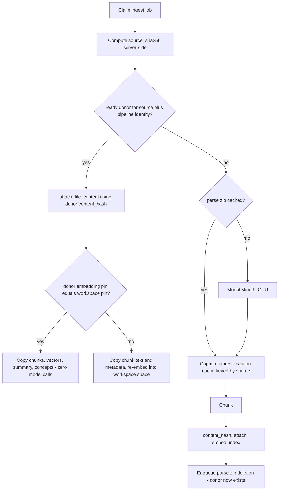

****---
name: Job reliability and global source cache
overview: Add retry/timeout/lease handling to the Postgres job queue, fix the rollup's silent-blank-summary bug, then add a server-computed source sha256 so a repeat upload of the same document reuses an existing ingest by copying its rag_* rows instead of re-parsing. Parse zips become cold-start only and are dropped on success; captions are re-keyed to the source and kept under a TTL.
todos:
  - id: jobs-schema
    content: Add not_before and lease_expires_at to the jobs table in 0001_init.sql and update claim_job to honour them
    status: completed
  - id: error-taxonomy
    content: Introduce RetryableError/TerminalError in the pipeline and a per-job-type policy dict (max attempts, backoff, timeout)
    status: completed
  - id: rollup-fixes
    content: "Fix rollup: leave failed chapters dirty instead of writing blank summaries, skip workspace rebuild on partial failure, supersede-on-fold, owner notification on terminal failure"
    status: completed
  - id: ingest-retry
    content: Auto-retry ingest on the exception path, keeping file status processing until the budget is exhausted
    status: completed
  - id: timeouts-lease
    content: Add provider-call timeouts, per-type job wall-clock timeout, bound the content-claim wait loop, and add heartbeat plus stale-lease reaper
    status: completed
  - id: source-sha
    content: Add files.source_sha256 computed server-side by the worker; investigate B2 x-amz-checksum-sha256 to avoid the extra GET
    status: completed
  - id: donor-lookup
    content: Add source_sha256 and pipeline_identity to rag_contents with a ready-only partial index, and the donor lookup in the worker
    status: completed
  - id: donor-copy
    content: Port the CloneWorkspace row-copy into the ingest path, with the embedding-pin gate deciding copy-vectors vs re-embed
    status: completed
  - id: caption-rekey
    content: Re-key captions by source_sha256 and detach them from files.caption_blob_path refcounting
    status: completed
  - id: zip-drop
    content: Drop the parse zip after a successful ingest via blob_enqueue_deletion with a grace period, keeping it on terminal failure
    status: completed
  - id: caption-gc
    content: Implement the TTL-since-last-use caption GC plus an orphan sweep, routed through blob_enqueue_deletion
    status: completed
  - id: docs-tests
    content: Update openwiki pages (including the stale indexed_text line) and add the new tests to test-catalog.md
    status: completed
isProject: false
---

# Job reliability and global source cache

## Decisions locked

- Reuse happens by **copying `rag_*` rows from an existing ingest**, keyed on pre-parse source identity. Artifacts are not the reuse mechanism; they only serve the cold start where no donor exists.
- Dedup is global in the sense that the donor may live in **any** workspace, but each workspace still gets its own `rag_contents` / `rag_chunks` / `rag_concepts` rows. `hybrid_search`'s `workspace_id` predicate remains the isolation boundary and no two vector spaces can mix.
- The parse zip is **dropped after a successful ingest** (a donor now exists) and kept after a terminal failure (no donor was created).
- Captions are **kept**, re-keyed to the source, on a TTL since last use. They exist to serve the two no-donor cases: switching `fast` to `accurate`, and delete-then-re-upload.
- Accepted tradeoff: delete-and-re-upload with identical parse params re-parses on GPU.
- Retry policy is **per job type in code**; the `jobs` row carries only state.
- The source hash is **computed server-side from the bytes**. A client-asserted hash would let anyone claim the hash of a document they do not have and receive its cached chunk text.

## Phase 1 - job queue reliability

Schema in [server/migrations/0001_init.sql](server/migrations/0001_init.sql) (no data exists, so edit `0001_init.sql` directly rather than adding a migration). Add to `jobs`: `not_before timestamptz`, `lease_expires_at timestamptz`. `attempts` already exists. Nothing else goes on the row.

- `claim_job` in [pipeline/pipeline/store/db.py](pipeline/pipeline/store/db.py) gains `AND (not_before IS NULL OR not_before <= now())` and sets `lease_expires_at`. Model the backoff on the existing blob queue, which already does this shape in [server/internal/store/blobs.go](server/internal/store/blobs.go).
- Error taxonomy in the pipeline: `RetryableError` / `TerminalError`, unknown defaults to retryable since the budget bounds it. The worker already separates these - terminal conditions call `_finish_fail` and `return`, everything unexpected raises - so the exception path becomes the retry path with no restructuring.
- Budget: 3 attempts total, exponential backoff written into `not_before`.
- Per-type policy dict in the worker: max attempts, backoff base, wall-clock timeout.

### Rollup fixes

In `rollup_summaries` ([pipeline/pipeline/retrieval/indexing.py](pipeline/pipeline/retrieval/indexing.py)), a failed chapter call currently writes an empty summary and clears `dirty`, which permanently blanks that chapter's prose:

```python
            except Exception:
                log.warning("chapter rollup failed", exc_info=True)
        await store.set_chapter_summary(chapter["chapter_id"], summary)
```

- On chapter failure: leave the chapter `dirty`, write nothing, continue to the next chapter.
- If any chapter failed, skip the workspace rebuild (it would summarize over a blank) and leave the workspace dirty.
- Raise a retryable error so the job retries. Because the job only processes the dirty set, the retry naturally covers just the failed chapters - no per-chapter job type needed.
- Requeue collides with `jobs_pending_rollup_idx`, which allows one pending rollup per workspace. If a pending sibling already exists, mark this job superseded and let the sibling do the work.
- On terminal failure: leave chapters dirty (self-heals on the next mutation), `obs.capture_error`, and notify the **workspace owner** via the existing `add_notification` / `publish_notification` path, since rollup has no actor.

### Ingest retry

Auto-retry on the exception path. Retries are near-free by construction: the parse artifact is cached by fingerprint so `record_gpu_millis` never fires twice, captions are cached, `index_file` is idempotent, and `abandon_content` releases the claim.

- Keep `files.status='processing'` across retries; only publish `failed` when the budget is exhausted, or the user watches it fail and silently recover.
- A retry whose `file_id` no longer exists is terminal, not a crash loop.

### Timeouts and dead workers

- No provider call in [pipeline/pipeline/retrieval/models.py](pipeline/pipeline/retrieval/models.py) sets a timeout today. Add per-call timeouts. The Modal call is already bounded by `MODAL_PARSE_TIMEOUT` (900s).
- Job-level wall-clock timeout per type as the backstop, set above the sum of the bounded sub-steps. A timeout counts as one failed attempt.
- The content-claim loop in `_process_ingest_job` is unbounded: `while not created and not ready: sleep(poll_interval)`. If the creator is SIGKILLed, `abandon_content` never runs and every waiter spins forever. Bound the wait, and steal a `processing` claim in `rag_contents` older than a threshold.
- Heartbeat `locked_at` while a job runs; a reaper reclaims `status='running' AND lease_expires_at < now()` into the retry-or-fail path. Note `asyncio.wait_for` is cooperative - a thread blocked in a sync DB call is abandoned, not killed.

## Phase 2 - source identity and reuse by row copy



### Source identity

- Add `files.source_sha256`. Computed by the worker, which streams the blob from B2 and hashes it. This adds one B2 GET per PDF ingest, since today the worker never downloads the source (Modal streams it between presigned URLs). That cost is far below a GPU parse and is recovered immediately on a donor hit. **Research item:** if B2's S3 API honours `x-amz-checksum-sha256` on the presigned PUT, the browser can supply it, B2 verifies it server-side, and we read it back - eliminating the extra GET. Fall back to worker-side hashing.

### Donor lookup

- Add `source_sha256` and `pipeline_identity` to `rag_contents`, with a partial index on `(source_sha256, pipeline_identity) WHERE status='ready'`.
- `pipeline_identity` covers everything that feeds chunk text: `parse_method`, `route`, `parser_version`, `caption_version`, `chunker_version`. A donor produced under any different value is not interchangeable.
- Because the donor row carries `content_hash`, it is known **before** parsing, so the existing creator/waiter protocol in `attach_file_content` is reused unchanged: call it with the donor's hash, then copy rows only if this workspace `created` the row. If the workspace already has that content ready, the file is aliased and there is nothing to copy. The race between two workers with no donor is the path that exists today.

### The copy

Same SQL shape as `CloneWorkspace` ([server/internal/store/share.go](server/internal/store/share.go) lines 975-1055), including the deterministic `'rc_' || substr(md5($3 || c.id), 1, 12)` chunk id derivation that lets the vector copy pair each vector with its passage.

- Gate on the embedding pin. `rag_contents` already stores `embedding_model_key` / `embedding_model_version` / `embedding_dim` alongside `workspaces.embedding_*` precisely so a disagreement is detectable.
  - Pins match: copy `rag_chunks`, the `rag_chunk_vectors_<dim>` rows, `rag_content_summaries`, `rag_concepts` and `rag_concept_mentions`. Zero model calls.
  - Pins differ: copy chunk text, `section_path`, pages, `regions` and `search`, then re-embed into the target workspace's space. Still skips parse, captioning and chunking.
- Decide where it lives. The worker owns the ingest transaction, so porting the statements into [pipeline/pipeline/retrieval/store.py](pipeline/pipeline/retrieval/store.py) is the natural home, at the cost of a second copy of this SQL. There is precedent for mirroring across the two languages (`vectorTables` in [server/internal/store/queries.go](server/internal/store/queries.go) mirrors `_VECTOR_TABLES` in the pipeline) - if we mirror, both sides need the cross-reference comment.
- The donor's workspace may be deleted concurrently. Take the donor row `FOR SHARE` inside the copy transaction, and treat a vanished donor as a cache miss that falls through to parsing rather than an error.

### Artifacts become cold-start only

- Parse zip: keyed by `(source_sha256, parse_method, route, parser_version)` in [pipeline/pipeline/parse/modal_parser.py](pipeline/pipeline/parse/modal_parser.py), and **deleted after a successful ingest** through `blob_enqueue_deletion` with a short grace period rather than inline, because a concurrent worker may be mid-download. Kept after a terminal failure, so the manual retry stays cheap.
- Captions: re-keyed to `captions/{source_sha256}/{caption_version}.json` in [pipeline/pipeline/parse/figures.py](pipeline/pipeline/parse/figures.py). The current `sha256(blob_path + NUL + etag)` key cannot survive a re-upload, because a re-upload gets a new `blob_path`.
- **Detach both from file-row refcounting**: drop `parsed_blob_path` / `caption_blob_path` from the `account_blob_refs` trigger arguments in [server/migrations/0001_init.sql](server/migrations/0001_init.sql), and from the clone copy in `share.go`. Otherwise deleting a file reaps the very caption entry the re-upload is meant to reuse.
- A small `artifact_cache` table (`key`, `kind`, `source_sha256`, `size_bytes`, `created_at`, `last_used_at`) replaces that ownership.
- Artifacts are **not** charged to anyone's quota today (`account_file_storage` counts `files.size_bytes` only) and that stays true.

## Phase 3 - caption GC

- Periodic sweep deletes `artifact_cache` rows where `last_used_at < now() - ttl(kind)` and no in-flight job references that `source_sha256`, routing removal through the existing `blob_enqueue_deletion` outbox rather than calling B2 directly.
- Every cache hit updates `last_used_at` in the same transaction that reads it.
- The same sweep covers zips whose post-success deletion was missed (worker died between success and enqueue), so a short TTL on the zip kind doubles as the orphan reaper.
- Follow the `usage_workers.go` tick pattern; note the existing caveat that those run per-replica and need a leader lock before scaling out.

## Risks worth holding onto

- Because the hash is computed from bytes the user actually uploaded, a user can only ever reuse a donor for a document they already possess. Do not relax this to a client-supplied hash - that would let anyone claim the hash of a document they do not have and receive its chunk text.
- Copying a donor means user B gets chunks, a summary and concepts produced and paid for by user A's ingest, and B is billed nothing. That is the intended trade, but it should be a written decision rather than an emergent one.
- Cross-user timing: a repeat upload now finishes much faster than a first upload, which reveals that the exact file exists somewhere in the system. Acceptable for this product, but it is a real side channel and should be a deliberate note.
- A parser, caption or chunker version bump invalidates every donor at once and re-parses the corpus on GPU. Captions surviving means that pays GPU but not vision. This is the direct cost of dropping zips on success, and it is the accepted trade.
- A corrupt cached zip affects every later cold start for that document. Keep the existing recovery in `parse_to_bundle` (discard and re-request, only for a cached artifact).

## Docs and tests

- [openwiki/agentic-retrieval.md](openwiki/agentic-retrieval.md): rewrite the ingest job table, caching section, and summary-tree section; fix the stale line claiming `indexed_text` includes the file name, which contradicts both the `rag_chunks` schema comment and `content_hash` being name-independent.
- [openwiki/observability-metering.md](openwiki/observability-metering.md): close the retry/timeout items in section 8.
- [openwiki/deployment-runbook.md](openwiki/deployment-runbook.md): B2 lifecycle expectations now that GC owns artifact deletion.
- [openwiki/test-catalog.md](openwiki/test-catalog.md): per the repo rule, add entries for the new tests - claim honours `not_before`, budget exhaustion is terminal, lease reclaim, rollup leaves a failed chapter dirty and does not blank it, rollup supersede-on-fold, a second upload of identical bytes copies the donor without a model call, a donor with a mismatched embedding pin re-embeds instead of copying vectors, captions survive file deletion and are hit by a re-upload, and GC skips entries with an in-flight job.
- Pipeline cassettes stay stale per `AGENTS.md`; do not chase re-records here.