# Agentic retrieval

This page is the workflow contract for the in-house retrieval stack that replaced
LightRAG. Prefer it over guessing from code when changing ingest, search, chat,
or generate behaviour.

The pipeline test inventory lives in [test-catalog.md](test-catalog.md). Storage
quota and who may create materials live in
[authorization-permissions-lifecycles.md](authorization-permissions-lifecycles.md)
and [backend-storage-quota.md](backend-storage-quota.md).

## Architecture

The Python services share one Postgres schema owned by Go migrations
(`server/migrations/0001_init.sql`):

| Process | Entry | Role |
| --- | --- | --- |
| Parse coordinator | `python -m pipeline.ingest.parse_worker` | Supervises four isolated one-job coordinator processes. They validate and hash document sources, reuse an exact donor when possible, wait for MinerU, then atomically enqueue an immutable artifact handoff |
| Ingest worker | `python -m pipeline.ingest.worker` | Claims only post-parse and direct-route jobs, then chunks, captions/transcribes, embeds, writes a two-tier file summary, and extracts concepts. Each replica runs one job at a time |
| Retrieval service | `uvicorn pipeline.retrieve.service:app` | `/chat/stream`, `/generate`, `/quiz-grade`, `/plate-ai/*` over the same index |
| Parser service | `uvicorn parser/app.py` | Persistent MinerU 3.4.5 pipeline service on the ingest host; independently slices large PDFs and normalizes Office through LibreOffice |
| Host sampler | `python -m pipeline.ingest.host_sampler` | Persists compact whole-host and parser admission/resource samples without document identity |

The Go gateway is the public face: it authenticates the user, proxies chat and
generate to the retrieval service, and owns material persistence (including the
internal materials endpoint the chat agent calls). Retrieval HTTP is
Go-only: every route except `/healthz` requires `X-Pipeline-Secret`. User
provider keys stay ciphertext on that hop; retrieval decrypts them with
`LLM_CREDENTIALS_KEY`.

```mermaid
flowchart LR
  Upload[Upload / move file] --> Plan[Go format policy builds processingPlan v1]
  Plan --> Route{Contract route}
  Route -->|PDF / modern Office| ParseJob[(parse job)]
  ParseJob --> Coordinator[Parse coordinator]
  Coordinator --> Download[One B2 download + trusted SHA]
  Download --> Parse[Netcup MinerU pipeline]
  Parse --> Artifact[Immutable local artifact]
  Artifact --> IngestJob[(ingest continuation)]
  Route -->|direct route| IngestJob
  IngestJob --> Worker[Ingest worker]
  Worker -->|image| ImageCaption[ZAI GLM via DeepInfra]
  Worker -->|audio| AudioTranscript[Async ElevenLabs Scribe v2]
  Worker -->|CSV / TSV / text| DirectText[Direct normalization]
  Worker -->|parsed document| Caption[130×130 selection + caption / DECORATIVE]
  Caption --> Chunk[Heading-aware chunker]
  ImageCaption --> Chunk
  AudioTranscript --> Chunk
  DirectText --> Chunk
  Chunk --> Index[Embed + file summary + concepts]
  Index --> Store[(rag_chunks / summaries / concepts)]
  Store --> Search[Hybrid search RRF]
  Search --> Agent[Chat agent loop]
  Search --> Workflows[Generate workflows]
  Agent --> Gateway[Go /api/internal/materials]
  Gateway --> Materials[(materials)]
```



There is no dual-running period with LightRAG. Apache AGE is gone; the database
image is stock `pgvector/pgvector:pg16`.

## Schema ownership

The retrieval index is application schema, not pipeline-owned:

| Table | Purpose |
| --- | --- |
| `rag_contents` | Canonical parsed content per workspace, unique by parsed-text hash |
| `rag_file_contents` | Logical file → canonical content aliases |
| `rag_chunks` | Canonical passages: text, heading path, pages/regions, `tsvector`, `halfvec(2560)` |
| `rag_content_summaries` | Two-tier prose (`descriptor` + `summary`) plus `summary_version`; shared by files with identical content |
| `rag_concepts` | Normalized concept names per workspace |
| `rag_concept_mentions` | Concept → chunk (and file) links |

All of these FK-cascade from `workspaces` / `files` / `chapters`. Deleting a
logical file removes its alias; a trigger removes canonical content only after
its last alias disappears. Deleting a workspace deletes its index; there is no
`rag_teardown` job.

`files.content_hash` is the sha256 of parsed chunk text plus page and bounding-box
geometry when the parser supplies it. Two uploads of the same document in one
workspace stay as two independently selectable/deletable file rows, both mapped
to one canonical index. Text-identical documents with different layouts remain
separate so one file cannot inherit another file's citation coordinates. Search
chooses one in-scope alias for each content item, so duplicates do not repeat
passages. Deleting either upload leaves the other searchable and citable under
its own file id and name.

`files.doc_id` is gone. Identity is always `files.id`.

## The embedding model belongs to the workspace

Every chunk in a workspace lives in one model's vector space, and a query is
only meaningful against the space it was embedded in. A query embedded by a
different model than the chunks returns confidently ranked nonsense — no error,
no type mismatch, just worse answers. So the model is not a setting either
process resolves; it is a property of the workspace:

| Column | Meaning |
| --- | --- |
| `workspaces.embedding_provider_slug` / `embedding_model_slug` / `_version` | the space this workspace is in, fixed at creation |
| `workspaces.embedding_dim` | its width, which selects the vector table |
| `rag_contents.embedding_provider_slug` / `embedding_model_slug` / `_version` / `_dim` | the model that actually produced the vectors under this content |

The workspace columns are what ingest and query both read (`ingestJobPayload`
does *not* snapshot embedding onto the job; the worker installs the workspace's
pin into `JobPins` itself, and `retrieval.search` reads the same row). The
`rag_contents` columns are the observed value rather than the intended one:
they agree by construction, and recording both is what would make a
disagreement findable instead of leaving it to show up as poor retrieval.

Retargeting the registry's embedding default therefore applies **only to
workspaces created afterwards**. Existing workspaces keep resolving the row
they were pinned to. Embedding rows cannot be disabled, deleted, stripped,
or rewritten onto a different `model_slug` / `params`
(`protect_embedding_model_configs`). A later model, including another
2560-d one, is a new catalog row and a new vector table. Changing the
upstream id means a new exact `model_slug` and a new immutable version.

This replaced a process-start freeze of the embedding default in both the Go
and Python registries. The freeze stopped a 30-second poll from mixing spaces
mid-process, but it made the model a query was embedded with a function of when
each container last booted, so two replicas could legitimately disagree and a
redeploy could silently change the answer. Nothing is frozen at process start
now.

New workspaces take the live default through `newWorkspaceEmbedding`
(`CreateWorkspace` always calls it). Clone copies the source pin.
Fixtures that `INSERT INTO workspaces` skip the helper and land on the
column default, which is kept equal to the seeded `qwen-embed` row.

### Vectors are stored one table per embedding pin

`rag_chunks` holds the passage. The vector lives beside it in that pin's
table (`rag_chunk_vectors_2560` for `qwen-embed` v1). The width is part of
the `halfvec` column type, so a second width needs a second table. A
second model at the same width also needs its own table. Two geometries
must not share an HNSW index.

The lexical half of hybrid search (`text`, `indexed_text`, `search`,
`regions`, pages) does not depend on the model and stays in `rag_chunks`.
`store.vector_table` in Python and `vectorTable` in Go map
`(provider_slug, model_slug, version)` to a table name from a fixed allowlist, because
that name is interpolated into SQL.

Adding a model means a new vector table (in `0001_init.sql` until the first
kept database exists, then a new numbered migration), a new allowlist
entry in both languages, and `params.vector_table` on the catalog row.
Removing a table is not supported.

### Reindexing is not available

There is no job that re-embeds a workspace into a different model, and
nothing in the product changes a workspace's embedding pin after
creation. There is also no per-file re-embed path: once any upload can
rewrite vectors in place, every later change inherits that mess and the
cost. Donor copy may re-embed when the only ready donor is in another
space. That is reuse falling back, not a product feature.

Re-embedding is proportional to total corpus size rather than to what
changed, so it is the one operation whose cost is unbounded by anything
the user just did. Until a reindex job exists:

- a workspace stays in its original space for life;
- cloning inherits the source's pin (`CloneWorkspace`) because
  `cloneRetrievalIndex` copies vectors verbatim rather than re-embedding.
  A clone that took the current default would query one space against
  chunks in another;
- an embedding model in use has to stay reachable. The row itself cannot
  be disabled, deleted, or rewritten onto a different model. See
  [deployment-runbook.md](deployment-runbook.md). Prefer an open-weight
  model so the same weights can be self-hosted if a vendor drops them.

## Ingest workflow

### Job types

| Type | Enqueued by | Does |
| --- | --- | --- |
| Parse | Go upload/replacement finalization for `document_parse` plans | Validate → download/hash once → exact-vector donor reuse or MinerU artifact publication → atomic ingest handoff |
| Ingest | Go for direct routes; parse coordinator for documents | Extract a completed document artifact or normalize a direct source → chunk/caption/transcribe → embed → two-tier file summary → concepts |

Both stages get one retry (two total attempts), exponential backoff
(`not_before`), a per-type wall-clock timeout, and a heartbeat lease so a dead
process does not leave the row `running` forever. Unknown errors retry;
`TerminalError` (missing file, unresolvable pins, locked account, confirmed
parser quarantine) does not. Policy lives in `pipeline/jobs.py`, not on the row.

A reclaimed lease does not stop the old worker: cancellation is cooperative and
a heartbeat can simply fail. So `attempts` doubles as a fencing token — it is
written only by a claim — and every heartbeat, requeue and terminal transition
requires the attempt it claimed (`db.claim_is_current`). A run whose claim moved
on logs and discards its outcome rather than overwriting its successor's row.

Enqueue snapshots `{actorUserId, ingestProviderSlug, ingestModelSlug,
visionProviderSlug, visionModelSlug}` (and versions)
onto the job: the actor who will be billed, and the two model surfaces whose
defaults are hot-reloadable and could move while the job is queued. Embedding is
not among them — the worker reads it from the workspace, as above.

Both sides fail closed. `ingestJobPayload` returns an error and its caller rolls
back the upload if the actor or either pin is missing, and a job that reaches the
worker without resolvable pins is failed rather than run on the worker's own
defaults. A transient database error while *reading* those pins retries with the
normal attempt budget; only a missing or invalid pin is terminal. See
[observability-metering.md](observability-metering.md) §8.

### Parse route

The Go gateway resolves every upload into a versioned `processingPlan` when it
enqueues the first stage. The plan names the exact format route, parser route, caption
mode, Office-preview requirement, ordered stages, and required capabilities.
The Python worker rejects unknown versions and executes this plan; it does not
reconstruct orchestration from `kind`, `parseMode`, or the extension. Those
legacy top-level fields may describe the saved upload choice but are not worker
route selectors. Validation is exact: format/route, Office preview, caption
mode, stage order, and resource list must agree with the version-1 contract.
A malformed or manually fabricated combination fails terminally rather than
silently taking a nearby route.

| Source | Worker route | Searchable output | Page model |
| --- | --- | --- | --- |
| PDF / DOCX / XLSX / PPTX with `fast` | Persistent MinerU parser on the ingest host, OCR `auto` | `content_list.json` (+ images) | Yes — `page_idx` + `bbox` |
| txt / md / json and other accepted text/code formats | Raw text | original text | No |
| CSV / TSV | Delimiter/header normalization | explicit row/field text, including formulas | No |
| supported image | Pinned ZAI GLM-5.3-Flash call through DeepInfra | faithful searchable caption | No |
| supported audio | Presigned B2 source URL + asynchronous ElevenLabs Scribe v2 | transcript | No |
| unknown or legacy DOC/XLS/PPT | Store-only | none | No |

HTML, RTF, XML, and source-code extensions have no dedicated handlers. They use
the same raw-text chunking/indexing route as other text. CSV/TSV remain the one
format-specific text exception.

The bundle carries page-accurate citations and the images figure captioning
needs. MinerU's pipeline backend chooses text extraction or OCR in `auto` mode;
tables and formulas remain enabled. Each successful attempt reports total pages,
OCR pages, elapsed time, and current parser/host resource samples. Billing uses
the page counts, 31 credits per digital page and 52 credits per OCR page. Shared
process CPU is diagnostic rather than attributed to one document.

### Parse capacity

The ingest host accepts at most four document jobs through the outer Redis gate.
The parser places their independent page slices on one fair round-robin queue
and runs at most four MinerU calls concurrently:

| Route | Host | Slice size | Parser admission | Outer cap |
| --- | --- | --- | --- | --- |
| fast | one 8-core / 16 GiB VM | 26 pages | 4 slices | 4 documents |

A 610-page PDF becomes 24 slices: 23 ranges of 26 pages and one 12-page range.
Files of 26 pages or fewer remain one slice. Slices have no overlap and no
table/paragraph boundary repair; a structure spanning page 26/27 can be split.
This is an accepted throughput tradeoff. Results are sorted by slice, their page
indices are restored to the source PDF, and the existing `content_list.json`,
Markdown, and extracted-image outputs are merged before normal chunking. No
additional table or slice schema is stored in Postgres.

One long-lived Python process owns the MinerU model cache. The first successful
slice warms it; later slices and documents reuse the same loaded models and
plugins instead of constructing a MinerU runtime per request.

A new document upload lands `files.status=pending` with a pending `parse` row.
Four coordinator children claim only parse rows. A coordinator flips the file
to `processing` only after it holds a Redis parse slot; if every slot is taken,
the job returns to `pending` without spending an attempt. Redis down fails
*open*: the parser's four-document/four-slice queues remain the final brake.
While MinerU runs, no ingest worker slot is occupied.

Each slice has a 600-second deadline that starts only when a MinerU lane begins
executing it. Fair-queue wait and the execution time of the document's other
slices do not spend that slice's budget. If any slice crosses the deadline,
the parser atomically writes a document quarantine marker keyed by
source fingerprint, parse method, and exact parser version, returns
`parse_hard_timeout` for that file, and exits so Docker replaces the whole
parser process. This also stops the document's other queued or executing
slices; native lane work is not independently killable. The exit is scheduled
before response delivery, so a
client disconnect cannot leave the failed parser running. The offending parse
is terminal and later submissions of that exact fingerprint fail immediately
while that parser version is live; it is not retried into the pool. Other
in-flight jobs interrupted by the container restart follow their ordinary
retry policy. A parser-version change creates a new fingerprint and is the
deliberate automatic way to retry the file after parser code changes.

The whole-document parser request has a 2,400-second bound, its Redis admission
slot expires after 2,700 seconds, and the parse job has a 3,600-second bound.
The independent ingest continuation has a 1,200-second bound. Queue wait does
not spend the 600-second slice execution budget. A timed-out coordinator or
ingest process records its retry and exits; the supervisor or Docker replaces
only that process, so a cancelled blocking thread cannot overlap a later job.

The parser also watches its cgroup `oom_kill` counter. If the kernel kills a
MinerU child while slices are active, it writes `parse_oom` quarantine markers
for those active fingerprints, marks `/healthz` failed, and exits. A completed
artifact takes precedence over a late marker. Files that were only queued when
the OOM happened follow the ordinary policy of one retry. The same one-retry
policy applies to connection errors and poisoned-pool restarts. Hard timeout
and OOM markers are terminal without a retry.

After an artifact is published, OOM, timeout, worker death, and other
post-processing failures never create a parser quarantine. The ingest
continuation gets one retry from the same artifact. If that retry also fails,
that job becomes terminal, but a later re-ingest is allowed. If extraction
finds a missing, corrupt, or release-incompatible bundle, the worker deletes
that exact fingerprint-addressed file and returns it to parsing once; a second
invalid handoff fails instead of looping.

The parse coordinator downloads the raw B2 object once while calculating its
trusted SHA-256, writing a job-scoped source file into the shared volume.
The parser reads that local key and atomically writes
`artifacts/{parse_fingerprint}.zip` to the same volume. The worker extracts that
file directly. There is no parser GET of the raw object, parser PUT of the zip,
or worker GET of the zip.

Parse bundles are ephemeral local cache entries, not durable B2 artifacts and
not `artifact_cache` rows. The worker clears the file's diagnostic parse-bundle
reference after successful ingest. A job stores its checksum-verified local
source descriptor in its payload and retains that file across parser-capacity,
external-provider, and retry requeues. This prevents another B2 download for
the same job. It is deleted only after committed success or terminal cleanup;
an idle sweep removes abandoned sources after two hours and fingerprint bundles
after six hours. A later caption/index failure can reuse both the source and
bundle during that window.

`files.indexed` is true only after retrieval chunks are written, or reused from
identical canonical content. Direct image/audio/CSV/TSV routes get an ingest job
even though they do not use MinerU. Unknown and legacy store-only uploads finish
`ready` with `indexed=false`: the original blob stays viewable/downloadable, and
chat/generate cannot search it. A failed ingest keeps the original blob and
lands `failed`/unindexed; the UI shows a banner rather than replacing the
viewer.

Browser Office saves replace the full source file under the same logical
`files.id`. Completion uses an expected `files.revision` compare-and-swap,
increments the revision, removes the old `rag_file_contents` alias, clears
source/parse artifacts, and enqueues the correct first stage with the saved
parse and caption policy. The orphan cleanup trigger removes canonical retrieval content only
when no other alias uses it. Store-only replacements return ready and unindexed.
There is no chunk-level dirty update: the serialized OOXML file is the source of
truth and follows the normal donor/parse/index path.

The ingest payload carries the exact source revision and ETag that created it.
Every source-derived file mutation and retrieval attachment locks and verifies
that pair in the same transaction. Replacement also terminally supersedes older
pending/running parse or ingest rows and releases their credit reservations, so
an old parse cannot publish content, geometry, previews, status, or citations for the
new blob. A stale worker that merely lost its lease exits without closing the
shared reservation used by its successor attempt.

Nothing calls a third-party parsing API. The former service could not return
bounding boxes or images, needed polling, and capped files at 10 MB / 20 pages.

### Direct image, audio, and delimited-text ingest

The Go gateway never processes source media. It enforces the plan byte limit,
stores the object, resolves the processing plan, snapshots the model pins, and
enqueues the job. The Netcup ingest worker downloads the B2 object once and
performs the planned work:

- images are normalized under a decoded-pixel cap, with bounded representative
  frames for animated images, then captioned with the pinned vision model. The
  prompt asks for every visible label, table cell, number, unit, formula,
  diagram relationship, and uncertainty rather than a short visual summary;
- audio duration is measured with `ffprobe`, capped at 10 hours, and submitted
  to asynchronous ElevenLabs Scribe v2 by presigned B2 URL. A signed webhook
  wakes the yielded job; transcript GET reconciles a missing webhook. Once
  provider state exists, polling claims skip the local-source/B2 acquisition;
- CSV/TSV is decoded as text, detects a likely header, and emits deterministic
  row text with explicit field names. Formulas remain literal source values.

Image and audio derived text is stored under
`derived-text/{source_sha256}/...` and registered as `derived_text` in
`artifact_cache`. A Postgres advisory lock on source hash plus transformation
version ensures concurrent uploads perform at most one provider call. Deleting
the last logical file drops its association, not the shared artifact; the same
last-use TTL/reaper policy as figure captions handles eventual cleanup.

Provider transcript deletion is a durable cleanup workflow, not best effort.
Terminal ingest failure, file deletion (including workspace/account cascades),
and source replacement mark the transcription row for cleanup before its file
or job foreign keys are cleared. The worker retries provider DELETE with
backoff; a late webhook attaches the provider id to the retained cleanup row
without waking the deleted job, so it can still be removed.

The Plate live-dictation feature and its temporary-audio route have been removed.

The upload dialog reads local audio metadata and uses the active per-second
rate returned by `GET /api/source-upload-policy`. An unreadable duration is
shown as unavailable, never as zero. The worker's measured duration and the
job's snapshotted rate remain authoritative for settlement.

### Figure captioning

Chosen per file at upload time and resolved into `processingPlan.captionMode`.
`pipeline/parse/figures.py` describes each surviving figure with the
vision model and writes it onto the image block **before chunking**, so the
caption is embedded, summarized, concept-extracted and cited as part of the
passage it belongs to. That ordering is the point of the feature: a slide deck
whose substance is in its diagrams is otherwise nearly invisible to search.

This applies to PDF, DOCX, PPTX, and XLSX. Office files are converted to the
coordinate-source PDF for parsing, but embedded pictures/charts are preserved
in the parser bundle and captioned from those extracted image blocks. Legacy
DOC/PPT/XLS remains intentionally store-only.

Every decodable image/chart block at least 130×130 is captioned unless the parser
already described it. Exact image-byte duplicates share one call. Compressed
size, pixel area, aspect ratio, page bbox, flatness/entropy, and cross-page
repetition are not rejection rules because they can discard sparse diagrams,
molecule drawings, and other useful scientific images.

The prompt tells the vision model to return exactly `DECORATIVE` for an ornament,
generic icon, divider, background, branding, or other image with no study value.
That sentinel is cached by image digest but is not written onto the block, so it
does not enter chunks or embeddings. Uncertain images are described instead of
discarded. `EVO_CAPTION_VERSION=v2` separates these decisions from older cached
captions.

Captions are cached in B2 under a **source-identity** key
(`captions/{source_sha256}/{caption version}.json`), keyed inside the JSON by
image content hash. The parse fingerprint is not part of the path: a re-parse
(different parser version) must not recaption unchanged
figures, and a delete-then-re-upload of the same bytes hits the same object.
Ownership lives on `artifact_cache` (TTL since last use), not on
`files.caption_blob_path`, so deleting the file does not reap the cache.
An advisory lock on source SHA plus caption version encloses cache reload,
provider calls, merge, and save. Concurrent uploads of identical bytes therefore
make one set of vision calls and cannot overwrite each other's cache entries.

The caption prompt is built from the figure and its surrounding content only —
no file name. Everything a globally cached or donor-copied output is generated
from has to be inside its key, or the same bytes produce different text
depending on who uploaded them first, and one uploader's file name reaches
another workspace. The same rule applies to file summaries and concepts, which
are copied verbatim from donors.

Caption calls never inherit a user's chat reasoning level. The pinned catalog
identity is `zai/glm-5.3-flash`, routed by EliteLLM to DeepInfra's
`zai-org/GLM-5.3-Flash`. Captioning always sends `reasoning_effort: low` on the
DeepInfra wire request. The catalog default is `max` for chat and every other
reasoning-enabled use. Do not let captioning inherit that default or a user's
chat choice.

### Chunking

`pipeline/retrieval/chunking.py`:

- Groups blocks under the heading hierarchy (`text_level` or markdown `#`).
- Packs by character budget (`EVO_CHUNK_CHARS`, overlap, min size) without
  splitting a block unless one block alone exceeds the target.
- Carries every source block's page + bbox into `regions`, with
  `space: page-1000-topleft` so a future highlight overlay does not guess the
  coordinate system.
- Builds `indexed_text` = heading breadcrumb + body, never a logical file
  name. Renaming a file must not change `content_hash` or fork canonical
  content. `text` is what the model and citations show.
- Includes page and region geometry in `content_hash` when present. Documents
  with the same text but different layouts cannot share citation coordinates.

CJK runs are bigrammed in the application and indexed with Postgres `simple`
config. The same tokenizer must run on queries (`search_query_terms`), or the
lexical half of hybrid search silently returns nothing for Chinese/Japanese/
Korean.

### Donor reuse

Before parsing, the worker hashes the uploaded bytes (`files.source_sha256`) by
streaming the object and digesting it. The object's stored
`x-amz-checksum-sha256` is deliberately not trusted, however convenient: the
browser PUTs through a presigned URL that signs only host and content-type, so
that header is uploader-controlled, and a hash the uploader chooses would let
anyone claim the hash of a document they do not have and be handed its chunks,
summary and concepts. One GET per ingest is the price. It then looks for a
**ready** `rag_contents` row with the same
`(source_sha256, pipeline_identity)`. `pipeline_identity` covers parse method,
route, parser version, caption version, and chunker version — anything that
feeds chunk text.

A hit copies that donor's `rag_chunks` (and, when the embedding pin matches,
its vectors), plus summary and concepts, into a new per-workspace
`rag_contents` row. Isolation stays `workspace_id` on the chunks; user B is
not billed for user A's original ingest. If the pins differ, chunk text is
copied and re-embedded into the target workspace's space.

Office donor reuse also requires an exact cached PDF preview from a file alias
whose `source_sha256` matches the donor content. The worker verifies that object
in blob storage, copies or re-embeds the donor, attaches the preview, and only
then marks the destination ready. A missing preview forces a normal parse.

`pipeline_identity` covers only what feeds chunk *text*, so it is not an
invalidation lever for model prose: changing the ingest or vision default leaves
existing summaries, concepts and captions in place, and a later upload of
already-seen bytes is served the older model's output. Neither surface is user
selectable (the job snapshot exists to pin billing and to survive a hot reload
mid-queue), so nobody's choice is being overridden — but an operator who swaps
either model and wants the prose regenerated has only the blunt lever below.

A parser/caption/chunker version bump invalidates every donor and re-parses.
Captions surviving that bump means the re-parse pays the page rate but not vision.
Delete-and-re-upload with identical parse params can reuse a local bundle while
its short TTL remains; after that it re-parses if there is no donor row.

### Indexing one file

`pipeline/retrieval/indexing.py` is idempotent per file:

1. Attach the logical file to canonical workspace content by parsed-text hash.
  If ready content already exists, reuse it without model calls.
2. Embed all canonical `indexed_text` values in provider-sized batches. These
  use heading breadcrumbs but not a mutable logical file name.
3. Replace that content's `rag_chunks` (delete-then-insert so a shorter
  re-ingest does not leave a stale tail).
4. One cheap-model call → two-tier content summary (`descriptor` ~50 words plus
  a size-tiered `summary` of ~150/300/500 words); upsert `rag_content_summaries`.
  Documents larger than the pinned ingest model's catalog context window are
  map-reduced in chunk groups rather than sampled. A provider failure here
  retries the job rather than storing a blank: an empty summary would be marked ready, copied to future
  donors, and never refilled. `summary_version` is **not** part of
  `pipeline_identity` — a prompt change must not invalidate a parse; it exists
  so a later backfill can find stale prose, including donor copies.
  Concept extraction stays best-effort per group, since a partial miss degrades
  recall instead of hiding the file from `list_sources`.
5. Concept extraction in groups of chunks (not per chunk) → upsert concepts and
   mentions. Relation-free by design: co-mention across files is recovered at
   query time. Group size is a mention-granularity knob (~12 chunks / 20k chars),
   not a context budget.
6. Stop. There is no chapter/workspace summary tree and no rollup job.
   Cross-document reasoning happens at query time, conditioned on the question.

Concurrent duplicate jobs coordinate on the canonical content row. The creator
indexes it; other workers wait for its ready marker. A failed creator removes
the processing claim so a waiting upload can retry.

The claim names its owner (`rag_contents.claim_job_id`, cleared on ready) and
that ownership is load-bearing, because a waiter's file points at the creator's
row: only the owner's heartbeat refreshes the claim, and only the owner's expired
lease drops it. A waiter that has waited `CONTENT_CLAIM_WAIT_S` may steal a
`processing` row, but only when `updated_at` is older than `CONTENT_CLAIM_STALE_S`
**and** the owning job is not `running` with a live lease — a missed heartbeat
write is not enough. `replace_content_chunks` takes that row `FOR UPDATE` and
raises `RetryableError` if the claim has moved, so a stolen creator discards its
write instead of failing on a foreign key. Refreshing or dropping by file instead
would let a live waiter mask a dead creator forever, and a dead waiter cascade a
live creator's chunks away mid-write. A waiter returns from the wait only once the
content is ready or it has taken the claim over itself.

### File summaries (no tree)

Content summaries are shared by identical files. Moving a file between chapters
does **not** re-summarize it. There is no chapter or workspace rollup: at a
100-file workspace cap, `list_sources` can put every name and ~50-word
descriptor into one tool result (~7k tokens), and the model has the question
that an embedding index would not. `describe_documents` returns the detailed
tier for up to eight files. Summaries are never embedded or cited — citations
always point at document passages.

## Search workflow

`pipeline/retrieval/search.py` + `store.hybrid_search`:

1. Embed the query. Search reads the workspace embedding pin (the same
   row ingest used). When that pin is Qwen3-Embedding, the query is sent as
   `Instruct: …\nQuery:…`; documents stay raw. Lexical terms use the
   unprefixed query. Other embedding pins get the query unchanged.
2. One SQL statement runs vector (cosine / HNSW) and lexical (`tsvector`)
   candidates, fused with reciprocal rank fusion (RRF). Ranks are fused rather
   than scores because cosine distance and `ts_rank_cd` share no unit.
3. Optional `file_ids` filter is applied **in SQL** and intersected with the
   request scope. The agent cannot widen a scope the user narrowed.
4. `_rerank` is a seam that currently returns identity. Contextual prefixes,
   per-file diversity cap, and neighbour expansion are the v1 quality levers;
   a hosted or local cross-encoder plugs in here later without changing callers.
5. Cap how many passages any one file may contribute (`EVO_SEARCH_PER_FILE_CAP`),
   then expand each survivor with ±1 neighbouring chunk so arguments that cross
   a packing boundary stay readable. Citations still point at the hit, not the
   neighbour.

`related_concepts` is a self-join on co-mentioned chunks: the relation-free
substitute for a knowledge-graph edge.

## Chat agent workflow

Streaming chat (`POST /chat/stream` via the Go gateway):

One user send creates one assistant row. `messages.content` is the final answer
only. Completed narration and tool-display blocks live in `messages.metadata`
and are not sent back as LLM history.

1. Go authenticates, reads `users.locale` and the
   `users.chat_model_provider_slug` / `users.chat_model_slug` pair, resolves
   that key to a `model_configs` row (`ratesForSurface`), opens one turn-scoped
   spend session, stamps `{providerSlug, modelSlug, modelVersion}` on the assistant message, and
   loads the checkpoint plus all completed history after it **before** inserting the current user
   row. Python receives `query` once, plus `assistantMessageId` and the optional
   rolling checkpoint. Locale and model are server-owned. A missing preference
   or unresolvable pin fails the turn as `model_unavailable`. Go rejects the
   query before persistence when it exceeds 8,192 estimated tokens or 65,536
   UTF-8 bytes. The current query is never clipped or summarized.
2. The agent **primes** with one retrieval before the model is asked anything.
   That search is emitted as `tool_start` / `tool_end` (`callId=prime`) and the
   first versioned citation list.
3. Every tool-capable model response is streamed. Text that arrives with tool
   calls is a narration block. The first completed response with text and no
   tools is the persisted answer. There is no unconditional second answer
   completion. Workload caps are 12 planning responses, 4 tools per response,
   and 12 tools per turn. Completion, compaction, query-embedding, and cumulative
   input counts remain telemetry. They do not stop a turn.
4. Independent reads in one response run concurrently (max 4, at most 2
   `search_workspace`). Any mutating call keeps that whole response serial.
   Citation numbers are assigned after the batch, in original call order, and
   are answer-local. A versioned `citations` event follows each batch.
5. Rolling conversation checkpoints (`conversation_compactions`) are separate
   from live request compaction. A checkpoint folds old cross-message history
   through the latest completed historical message and persists in Go with
   compare-and-set so a pin cannot move backwards. The summarizer receives the previous
   checkpoint and every completed historical message after it. The latest six
   messages are separated as `recent_messages` so the prompt gives recent user
   intent and corrections more fidelity without retaining them verbatim. The
   exact current query may resolve references, but it must not narrow the durable
   memory, appear in it, or be answered by the summarizer. Large
   histories fold in chronological batches with no message-count cap or prefix
   clipping. The target is 4,000 to 6,000 tokens with a hard 8,000-token output
   limit. Empty or oversized output does not advance the checkpoint.

   Before every agent model call, live admission measures the provider-shaped
   request against the selected model's input budget. The system prompt, tool
   schemas, current query, priming result, tool arguments and results, and
   provider continuity items remain exact. Compaction starts only when the
   request would exceed the smaller of the selected model's input budget and the
   200,000-token effective-context cap, after the output reserve and safety
   margin. There is no percentage trigger and no deterministic clipping
   fallback. Tool output is capped at 8,192 estimated tokens with a visible
   truncation marker. If protected context still cannot fit, the turn fails with
   `context_too_large`.
6. Python settles every provider call through
   `POST /api/internal/provider-calls` before the agent chooses its next action.
   The turn spend session remains open, so this does not take another
   concurrency slot. `(sessionId, callId)` makes callback retries idempotent.
   Query embeddings use the same protocol at zero actor credits. BYOK LLM calls
   also write zero-credit rows. If an LLM call exhausts platform credits and
   emitted tools, the agent runs every accepted emitted tool, then makes one
   tools-disabled terminal call. That call may overspend and closes the loop.
   Internal material creation does not recheck inference credits, because that
   would reject an accepted tool emitted by the call that caused exhaustion;
   editor authorization and storage quota checks still apply.
7. OpenAI planning uses `POST /v1/responses` with `store=false` and replays
   encrypted reasoning items inside the current tool loop. DeepSeek,
   Anthropic, and routed ZAI GLM use Chat Completions-compatible paths. The GLM
   adapter preserves `reasoning_content` on the assistant message immediately
   before the matching tool result in the next request. Raw chain-of-thought
   is never streamed to the browser. The user's reasoning policy applies to
   every agent model response. A provider failure before the first response
   byte is retried twice on a new call id; the failed attempt is `abandoned`
   (absorbed, no charge). Any later provider or SSE failure is not retried
   and the client gets the same generic `agent_failed` error. If the browser
   disconnects, Python stops writing SSE but finishes the in-flight provider
   call, settles usage when it arrives, and does not start another planning
   step.
8. SSE events: `phase` (`planning` | `running_tools` | `answering`),
   `block_start` / `block_delta` / `block_end` (`narration` | `answer`),
   `tool_start` / `tool_end`, versioned `citations`, `done` | `error`.
   Checkpoint events stay on the Python→Go hop. The browser may show
   "Planning next step" after ~400ms when waiting on the next provider
   response with no active text or tool.

`generate_material` mints a deterministic `mat_` id from
`sha256(assistantMessageId + "\\n" + toolCallId)`, looks up that id before
quota, retries POST, then GET. Same-id replay returns the original row. A
confirmed 404 is a normal tool failure. An uncertain GET fails the turn
without appending a failed tool result. Its optional `scope` contains
`file_ids` and `chapter_ids`. Missing or empty scope means the current chat
scope. The tool resolves and persists source provenance, cannot widen the chat
scope, rejects the whole call if any id is invalid or unavailable, and rejects
a valid scope with no indexed content.

### Tools

| Tool | Side effects | Notes |
| --- | --- | --- |
| `search_workspace` | none | Hybrid search; omitted `file_ids` uses the chat scope; any invalid supplied id rejects the call |
| `list_sources` | none | Chapters, file names, passage counts, and the short descriptor |
| `describe_documents` | none | Detailed summaries for one to eight required file ids; atomic scope validation |
| `read_document` | none | Sequential chunks by required file id; workspace and chat scope checked before reading |
| `related_concepts` | none | Co-mention bridge constrained to the chat scope |
| `generate_material` | yes | Scoped POST/GET Go `/api/internal/materials` with a deterministic id |

Read tools hit Postgres directly. Anything that creates a material goes through
the gateway with `X-Pipeline-Secret`, so authz, quota, and the materials model
stay in one place. The tool is omitted from the schema when the gateway URL or
user is unset, or when `userId` is missing.

Citation numbers belong to the current answer. Structured citations still map
the answer to file, page, region, and chunk data for the UI. Checkpoints do not
persist source references or stable historical citation numbers. A later answer
retrieves again and emits a new answer-local citation list.

## Generate workflow

`/generate` is **not** an agent loop. Scope is already known, the output shape
is fixed, and the gateway must persist a parseable artifact.

1. The gateway resolves file and chapter ids atomically. Omitted file and
   chapter ids expand to every file in the workspace. One invalid id rejects
   the request, and a valid scope with no indexed content fails before a model
   call. `gather_context` samples chunks evenly across every document in scope (equal
   share per file, not proportional to length). The gateway resolves the user's
   **Settings → LLM** generate preference (`ratesForSurface`) and forwards that
   exact pin; the browser `model` field is ignored. An unresolvable preference
   fails as `model_unavailable`.
2. One `produce` call receives the bounded, evenly sampled context. There is no
   unused map-reduce branch. `produce` appends a language rule from the gateway's `locale` so quiz copy,
   flashcard text, and diagram labels match the user's Settings language.
   JSON keys and Mermaid syntax stay English.
3. Kind-specific normalizers (`extract_json`, `strip_fence`,
   `normalize_questions`) coerce the model reply into the shapes the Go
   persistence layer already expects: flashcards, quiz questions, mindmap /
   diagram mermaid, notes. An empty or unparseable reply is
   `generate_empty` (502), not a canned stub. Go refuses to persist an
   empty quiz, deck, or mermaid document for the same reason.

Response shapes are part of the contract with Go — do not change them lightly.

## Citations and the frontend

A citation is:

```json
{
  "fileId": "f_…",
  "fileName": "bio.pdf",
  "snippet": "…",
  "pageStart": 4,
  "pageEnd": 5,
  "regions": [{ "page": 4, "bbox": [x0, y0, x1, y1], "space": "page-1000-topleft" }]
}
```

- `fileId` is a real `files.id` (not a LightRAG doc hash).
- Pages are 1-based and **absent** for sources with no page model (txt/md).
- `regions` are stored, shipped, validated at the viewer boundary, and drawn as
  a read-only overlay in `page-1000-topleft` coordinates.

Chat citation chips show `p. N` / `pp. N–M` and open the file scrolled to that
page and centered on the first valid region. Native PDFs render their source.
DOCX/XLSX/PPTX citations render the exact LibreOffice PDF preserved in parser
bundle v3 because that is the coordinate surface MinerU measured. Ordinary
Office viewing and editing still use the native browser viewer; entering edit
mode removes the citation overlay. Store-only and legacy Office files have no
parser preview, so citation navigation falls back to the native viewer without
an overlay instead of requesting a nonexistent derived PDF.

## Clone and teardown

`CloneWorkspace` copies the retrieval index **in the same transaction** as the
content: canonical content, aliases, chunks, vectors, summaries, concepts, and
mentions, remapping file, content and chapter ids. Duplicate files remain
aliases of one content item inside the clone. There is no best-effort follow-up
call and no `ragCloned` flag — either the clone includes the index or the
transaction rolls back.

The clone inherits the source's embedding pin rather than taking the current
default, because the vectors are copied rather than recomputed. New chunk ids
are derived from `md5(newWorkspaceID || oldChunkID)` rather than `random()`, so
the vector copy can recompute each id and pair it with its passage.

Teardown is the foreign key. Workspace delete cascades; the old `rag_teardown`
job and pipeline `/workspace/delete` endpoint are gone.

## Configuration surface

| Concern | Env | Default / note |
| --- | --- | --- |
| Gateway callback | `GATEWAY_URL`, `PIPELINE_SECRET` | Unset disables `generate_material`. The same secret is required on every inbound retrieval request except `/healthz`. |
| User provider keys | `LLM_CREDENTIALS_KEY` | Same 32-byte hex/base64 value as Go. Retrieval decrypts `user_llm_credentials`. Platform keys use the `platformEnv` name in `elitellm_providers.json`; user keys are request-scoped and never written to process env. |
| Parse | `PARSER_URL`, `PARSER_TOKEN`, `EVO_PARSE_METHOD`, `EVO_PARSE_SLOTS`, `EVO_PARSE_COORDINATOR_CONCURRENCY`, `EVO_PARSE_CONCURRENCY`, `EVO_MINERU_SLICE_PAGES`, `EVO_PARSE_JOB_TIMEOUT`, `EVO_OFFICE_PREVIEW_MAX_BYTES`, `RELEASE_SHA` | Persistent Netcup MinerU pipeline service. Production defaults to four coordinator processes, 26 pages per slice, four admitted documents, and four active slices. Method, schema, and exact release-derived parser version participate in the artifact fingerprint. |
| Post-parse ingest | `WORKER_REPLICAS`, `EVO_INGEST_TIMEOUT`, `EVO_CAPTION_CONCURRENCY` | Dedicated-host defaults are four isolated one-job containers, 20 minutes per attempt, and at most four concurrent embedded-figure captions per worker. Other model stages are sequential within each job. |
| Shared nonproduction capacity | `EVO_SHARED_CAPACITY_LOCK_DIR` | Unset in production. The shared local/UAT Compose project sets one spool directory for both environments. A queue consumer takes the `parse` or `ingest` file lock before claiming a row, which leaves the other environment's job pending and caps active work at one job per role. |
| Chunk size | `EVO_CHUNK_*` | Character budgets, not tokens |
| Embedding | `EMBEDDING_DIM` | The shipped width, matching `halfvec(N)`. The *model* is never env: it is a `model_configs` row pinned per workspace |
| Search | `EVO_SEARCH_CANDIDATES`, `EVO_SEARCH_TOP_K`, `EVO_SEARCH_PER_FILE_CAP` | |
| Agent | `EVO_AGENT_MAX_STEPS` | Default 12. Cap is the design, not a safety valve |
| LLM input budget | required catalog `context_window_tokens`; optional catalog param `context_safety_margin_tokens`; `EVO_LLM_INPUT_BUDGET_TOKENS` only before model selection | Chat admission uses the smaller of 200k and the selected model window minus 8k for output, then subtracts the greater of the 512-token protocol minimum and the model's calibrated safety margin. The env value only bounds initial multi-file gathering before a catalog model is selected. |
| Captions | `EVO_CAPTION_CONCURRENCY`, `EVO_CAPTION_MAX_EDGE`, `EVO_CAPTION_VERSION` | Caption mode is resolved per file in the processing plan. The ZAI GLM-5.3-Flash catalog row routes through DeepInfra. Captions always use `reasoning_effort: low`; its default on other reasoning-enabled uses is `max`. |
| Caption safety valve | `EVO_CAPTION_MAX_PER_FILE` | `0` (uncapped); the filters bound the cost |
| Direct media | `EVO_IMAGE_MAX_PIXELS`, `ELEVENLABS_API_KEY`, `ELEVENLABS_BASE_URL`, `ELEVENLABS_WEBHOOK_ID`, `EVO_ELEVENLABS_TRANSCRIPT_VERSION`, `EVO_ELEVENLABS_CONCURRENCY_UNITS`, `EVO_AUDIO_MAX_DURATION_SECONDS`, `EVO_TABULAR_TEXT_VERSION` | Image decoding is capped at 100M pixels. Scribe v2 defaults to 12 weighted Starter units, with each file consuming `min(4, ceil(duration_seconds / 480))`; audio is capped at 10 hours. |

Windows note: psycopg's async driver refuses the Proactor event loop.
`pipeline.use_compatible_event_loop()` is called by both entrypoints and by the
test suite.

## Design choices worth not undoing casually

- **No extracted relations.** Entities + co-mention replace a knowledge graph.
  Relation extraction was most of LightRAG's ingest cost and most of its
  accuracy failures.
- **No summary tree.** File descriptors live in `list_sources`; detailed
  summaries are fetched on demand. Cross-document reasoning is query-time, not
  a precomputed rollup that cannot see the question.
- **Scope is SQL, not a prompt hint.** The agent cannot search outside the
  user's chapter/file selection.
- **Generate is deterministic; chat is agentic.** Mixing them would make
  material JSON unreliable and chat latency unpredictable.
- **Materials persist in Go.** The retrieval service holds DB credentials but
  deliberately does not hold quota/authz rules.
- **Reranker is a seam, not a dependency.** Measure quality on real workspaces
  before adding a vendor or a GPU to the retrieval container.
