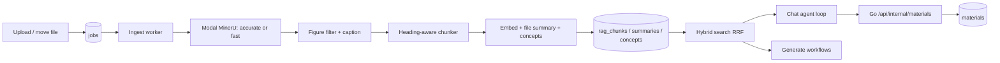

# Agentic retrieval

This page is the workflow contract for the in-house retrieval stack that replaced
LightRAG. Prefer it over guessing from code when changing ingest, search, chat,
or generate behaviour.

Testing setup lives in [pipeline-tests.md](pipeline-tests.md). Storage quota and
who may create materials live in
[authorization-permissions-lifecycles.md](authorization-permissions-lifecycles.md)
and [backend-storage-quota.md](backend-storage-quota.md).

## Architecture

Two Python processes share one Postgres schema owned by Go migrations
(`server/migrations/0001_init.sql`):

| Process | Entry | Role |
| --- | --- | --- |
| Ingest worker | `python -m pipeline.ingest.worker` | Claims jobs, parses, chunks, embeds, summarizes, extracts concepts, rolls up summaries |
| Retrieval service | `uvicorn pipeline.retrieve.service:app` | `/chat/stream`, `/generate` over the same index |

The Go gateway is the public face: it authenticates the user, proxies chat and
generate to the retrieval service, and owns material persistence (including the
internal materials endpoint the chat agent calls).



There is no dual-running period with LightRAG. Apache AGE is gone; the database
image is stock `pgvector/pgvector:pg16`.

## Schema ownership

The retrieval index is application schema, not pipeline-owned:

| Table | Purpose |
| --- | --- |
| `rag_contents` | Canonical parsed content per workspace, unique by parsed-text hash |
| `rag_file_contents` | Logical file → canonical content aliases |
| `rag_chunks` | Canonical passages: text, heading path, pages/regions, `tsvector`, `halfvec(2560)` |
| `rag_content_summaries` | Summary + outline shared by files with identical content |
| `rag_chapter_summaries` | Rolled up from file summaries; `dirty` flag |
| `rag_workspace_summaries` | Workspace overview; `dirty` flag |
| `rag_concepts` | Normalized concept names per workspace |
| `rag_concept_mentions` | Concept → chunk (and file) links |

All of these FK-cascade from `workspaces` / `files` / `chapters`. Deleting a
logical file removes its alias; a trigger removes canonical content only after
its last alias disappears. Deleting a workspace deletes its index; there is no
`rag_teardown` job.

`files.content_hash` is the sha256 of parsed chunk text. Two uploads of the same
document in one workspace stay as two independently selectable/deletable file
rows, both mapped to one canonical index. Search chooses one in-scope alias for
each content item, so duplicates do not repeat passages. Deleting either upload
leaves the other searchable and citable under its own file id and name.

`files.doc_id` is gone. Identity is always `files.id`.

Embedding width is part of the column type (`halfvec(2560)`). Changing
`EMBEDDING_DIM` without changing the migration and re-ingesting is rejected by
the pipeline at write time.

## Ingest workflow

### Job types

| Type | Enqueued by | Does |
| --- | --- | --- |
| Ingest (default) | Upload / re-parse paths in Go | Parse → chunk → embed → file summary → concepts → mark dirty |
| `summaries_rollup` | DB trigger on file chapter moves, and ingest after content change | Rebuild dirty chapter summaries, then workspace summary |

The rollup job is debounced with a unique pending index so reorganization does
not enqueue a storm.

Enqueue snapshots `{actorUserId, ingestModelKey, embeddingModelKey,
visionModelKey}` (and versions) onto the job. The worker bills that actor and
must embed with those pins even if the live default is retargeted mid-flight.
If the snapshot is missing the worker falls back to the live default — that is
a billing/index hole, not the intended contract; see
[observability-metering.md](observability-metering.md) §8.

### Parse routes

Controlled by `parseMode` on the job payload:

| Mode | Parser | Output | Page model |
| --- | --- | --- | --- |
| `fast` (default) | Modal MinerU, pipeline OCR backend | `content_list.json` (+ images) | Yes — `page_idx` + `bbox` |
| `accurate` | Modal MinerU, hybrid VLM backend | `content_list.json` (+ images) | Yes — `page_idx` + `bbox` |
| `none` | — | Blob stored, not indexed | — |
| txt / md / json kinds | Direct B2 read | Markdown | No |

Both parse modes are the same MinerU service on our own L4 GPUs and return the
same bundle, so both give page-accurate citations and both extract the figures
captioning needs. They differ in the backend that produced it: `accurate` runs
the hybrid VLM, which reads dense layouts, tables and formulas better and costs
more GPU seconds per page; `fast` runs pipeline OCR, several documents batched
into one container. Pipeline OCR uses the `ch` language pack, which covers
Chinese and English — Korean and Japanese documents should use `accurate`.

Artifacts are addressed by fingerprint over `(blob, etag, size, parse method,
route, parser version)` and cached in B2, so retries and clones reuse the GPU
result. The route is part of that identity: the same PDF parsed both ways must
not collide on one cached bundle.

The worker writes `files.parsed_blob_path` as soon as MinerU returns a zip,
**before** figure captioning. A later vision failure must not leave that object
untracked for the blob reaper. The worker may `blobstore.delete` only
**unrecorded** zips (corrupt cache recovery). Once the path is on the file row,
the reaper owns it.

`files.indexed` is true only after retrieval chunks are written, or reused from
identical canonical content. `parseMode=none` jobs for non-text kinds (audio,
store-only uploads) finish `ready` with `indexed=false`: the original blob stays,
the file is viewable and downloadable, and chat/generate cannot search it. A
failed ingest is the same shape — nothing is auto-deleted; the UI shows a banner
on the file rather than replacing the viewer.

Nothing calls the third-party MinerU cloud API any more. It could not return
bounding boxes or images, needed polling, and capped files at 10 MB / 20 pages.

### Figure captioning

Chosen per file at upload time (`captionImages` on the job payload;
`EVO_CAPTION_IMAGES` only covers jobs that carry no choice, such as cloud
imports). `pipeline/parse/figures.py` describes each surviving figure with the
vision model and writes it onto the image block **before chunking**, so the
caption is embedded, summarized, concept-extracted and cited as part of the
passage it belongs to. That ordering is the point of the feature: a slide deck
whose substance is in its diagrams is otherwise nearly invisible to search.

Every figure that survives filtering is captioned — the filters, not a count,
bound the cost. Filtering is deliberately asymmetric, because a dropped figure
is unreachable forever while a needless caption costs a fraction of a cent:

- Absolute bounds — pixel dimensions, pixel area, aspect ratio, and normalized
  page area from the bbox (which is what catches an icon rendered large by a
  300 DPI scan).
- Repetition — figures are clustered by perceptual hash (dHash, Hamming ≤ 6)
  and a cluster spanning many pages is dropped as page furniture. This is the
  load-bearing filter, and the only one that works regardless of language or
  subject matter.
- Flatness — near-uniform crops only. The naive "mostly one colour means logo"
  rule would drop line diagrams on white, which are the most valuable images
  there are, so the thresholds sit far below any real drawing.

Captions are cached in B2 under a **source-identity** key
(`captions/{sha256(blob_path + NUL + etag)}/{caption version}.json`), keyed
inside the JSON by image content hash. The parse fingerprint is not part of the
path: a re-parse (different MinerU route or parser version) must not recaption
unchanged figures. This is not only about money: `files.content_hash` is a digest
of chunk text and chunk text contains these captions, so without the cache the
same PDF uploaded twice would produce two digests and defeat canonical
de-duplication in `rag_contents`. The object path is stored on
`files.caption_blob_path` and refcounted with the other file blob columns. Failed
ingest keeps captions; only last-ref file delete reaps them.

### Chunking

`pipeline/retrieval/chunking.py`:

- Groups blocks under the heading hierarchy (`text_level` or markdown `#`).
- Packs by character budget (`EVO_CHUNK_CHARS`, overlap, min size) without
  splitting a block unless one block alone exceeds the target.
- Carries every source block's page + bbox into `regions`, with
  `space: mineru-1000-lefttop` so a future highlight overlay does not guess the
  coordinate system.
- Builds `indexed_text` = `file name › section path` + body. That prefix is what
  gets embedded and FTS-tokenized; `text` is what the model and citations show.

CJK runs are bigrammed in the application and indexed with Postgres `simple`
config. The same tokenizer must run on queries (`search_query_terms`), or the
lexical half of hybrid search silently returns nothing for Chinese/Japanese/
Korean.

### Indexing one file

`pipeline/retrieval/indexing.py` is idempotent per file:

1. Attach the logical file to canonical workspace content by parsed-text hash.
  If ready content already exists, reuse it without model calls.
2. Embed all canonical `indexed_text` values in provider-sized batches. These
  use heading breadcrumbs but not a mutable logical file name.
3. Replace that content's `rag_chunks` (delete-then-insert so a shorter
  re-ingest does not leave a stale tail).
4. One cheap-model call → content summary; upsert `rag_content_summaries`.
5. Concept extraction in groups of chunks (not per chunk) → upsert concepts and
   mentions. Relation-free by design: co-mention across files is recovered at
   query time.
6. Mark only the file's current chapter plus the workspace dirty and enqueue
  `summaries_rollup`.

Concurrent duplicate jobs coordinate on the canonical content row. The creator
indexes it; other workers wait for its ready marker. A failed creator removes
the processing claim so a waiting upload can retry.

### Summary tree maintenance

Content summaries are shared by identical files. Moving a file between chapters
does **not** re-summarize it; a trigger marks the source and destination chapters
(and the workspace) dirty and enqueues rollup. Rollup rebuilds chapter and
workspace prose from existing content summaries only, never from raw chunks —
that is what keeps reorganization cheap.

## Search workflow

`pipeline/retrieval/search.py` + `store.hybrid_search`:

1. Embed the query.
2. One SQL statement runs vector (cosine / HNSW) and lexical (`tsvector`)
   candidates, fused with reciprocal rank fusion (RRF). Ranks are fused rather
   than scores because cosine distance and `ts_rank_cd` share no unit.
3. Optional `file_ids` filter is applied **in SQL** and intersected with the
   request scope. The agent cannot widen a scope the user narrowed.
4. `_rerank` is a seam that currently returns identity. Contextual prefixes,
   per-file diversity cap, and neighbour expansion are the v1 quality levers;
   a hosted or local cross-encoder plugs in here later without changing callers.
5. Cap how many passages any one file may contribute (`EVO_SEARCH_PER_FILE_CAP`),
   then expand each survivor with ±1 neighbouring chunk so arguments that cross
   a packing boundary stay readable. Citations still point at the hit, not the
   neighbour.

`related_concepts` is a self-join on co-mentioned chunks: the relation-free
substitute for a knowledge-graph edge.

## Chat agent workflow

Streaming chat (`POST /chat/stream` via the Go gateway):

1. Go authenticates, reads `users.locale` and `users.chat_model_key`, resolves
   that key to a `model_configs` row (`ratesForSurface`), reserves credits from
   those rates, stamps `{modelKey, modelVersion}` on the assistant message, and
   relays that exact pair to the retrieval service with history and locale.
   Locale and model are server-owned (never browser fields). Settings changes
   apply to the next message. A missing preference or unresolvable pin fails
   the turn as `model_unavailable`. Ingest/index prompts stay English.
2. The agent **primes** with one retrieval before the model is asked anything —
   a question about the user's sources almost always needs them, and making the
   model ask wastes a round.
3. Capped tool loop (`EVO_AGENT_MAX_STEPS`, default 4). The final round drops
   tools entirely so the turn cannot end on another tool call with no answer.
4. SSE events: `tool` (progress), `citations` (once, before tokens), `token`,
   `done` (or `error`).

### Tools

| Tool | Side effects | Notes |
| --- | --- | --- |
| `search_workspace` | none | Hybrid search; scope-intersected |
| `list_sources` | none | Chapters, files, summaries |
| `read_document` | none | Sequential chunks by index |
| `related_concepts` | none | Co-mention bridge |
| `generate_material` | yes | POST to Go `/api/internal/materials` |

Read tools hit Postgres directly. Anything that creates a material goes through
the gateway with `X-Pipeline-Secret`, so authz, quota, and the materials model
stay in one place. The tool is omitted from the schema when the gateway URL or
user is unset, or when `userId` is missing.

Citation numbers are stable for the turn across tools: `[3]` means the same
passage whether it came from search or from reading a document.

## Generate workflow

`/generate` is **not** an agent loop. Scope is already known, the output shape
is fixed, and the gateway must persist a parseable artifact.

1. `gather_context` samples chunks evenly across every document in scope (equal
   share per file, not proportional to length). The gateway resolves the user's
   **Settings → LLM** generate preference (`ratesForSurface`) and forwards that
   exact pin; the browser `model` field is ignored. An unresolvable preference
   fails as `model_unavailable`.
2. If the context fits the budget, one `produce` call. If it overflows across
   multiple files, `produce_mapped` summarizes per document then combines.
   `produce` appends a language rule from the gateway's `locale` so quiz copy,
   flashcard text, and diagram labels match the user's Settings language.
   JSON keys and Mermaid syntax stay English.
3. Kind-specific normalizers (`extract_json`, `strip_fence`,
   `normalize_questions`) coerce the model reply into the shapes the Go
   persistence layer already expects: flashcards, quiz questions, mindmap /
   diagram mermaid, notes.

Response shapes are part of the contract with Go — do not change them lightly.

## Citations and the frontend

A citation is:

```json
{
  "fileId": "f_…",
  "fileName": "bio.pdf",
  "snippet": "…",
  "pageStart": 4,
  "pageEnd": 5,
  "regions": [{ "page": 4, "bbox": [x0, y0, x1, y1], "space": "mineru-1000-lefttop" }]
}
```

- `fileId` is a real `files.id` (not a LightRAG doc hash).
- Pages are 1-based and **absent** for sources with no page model (txt/md).
- `regions` are stored and shipped; the highlight overlay that would consume
  them is not built yet.

Chat citation chips show `p. N` / `pp. N–M` and open the file scrolled to that
page via `OpenItem.page` → `FileViewer` → `PdfView`.

## Clone and teardown

`CloneWorkspace` copies the retrieval index **in the same transaction** as the
content: canonical content, aliases, chunks, summaries, concepts, and mentions,
remapping file, content and chapter ids. Duplicate files remain aliases of one
content item inside the clone. There is no best-effort follow-up call and no
`ragCloned` flag — either the clone includes the index or the transaction rolls
back.

Teardown is the foreign key. Workspace delete cascades; the old `rag_teardown`
job and pipeline `/workspace/delete` endpoint are gone.

## Configuration surface

| Concern | Env | Default / note |
| --- | --- | --- |
| Gateway callback | `GATEWAY_URL`, `PIPELINE_SECRET` | Unset disables `generate_material` |
| Parse routes | `MODAL_PARSE_URL`, `MODAL_FAST_PARSE_URL` | One per mode; both from one Modal deploy |
| Chunk size | `EVO_CHUNK_*` | Character budgets, not tokens |
| Embedding | `EVO_MODEL_EMBEDDING`, `EMBEDDING_DIM` | Bootstrap / dim check; live default is `model_configs`. Dim must match `halfvec(N)` |
| Ingest / query models | `EVO_MODEL_EXTRACTION`, `EVO_QUERY_MODEL` | Bootstrap only when the registry has no row. Chat/generate pins come from Settings → LLM via the gateway |
| Search | `EVO_SEARCH_CANDIDATES`, `EVO_SEARCH_TOP_K`, `EVO_SEARCH_PER_FILE_CAP` | |
| Agent | `EVO_AGENT_MAX_STEPS` | Cap is the design, not a safety valve |
| Captions | `EVO_CAPTION_IMAGES`, `EVO_CAPTION_CONCURRENCY`, `EVO_CAPTION_MAX_EDGE`, `EVO_CAPTION_VERSION` | Per file at upload; the env flag is only a fallback |
| Caption safety valve | `EVO_CAPTION_MAX_PER_FILE` | `0` (uncapped); the filters bound the cost |

Windows note: psycopg's async driver refuses the Proactor event loop.
`pipeline.use_compatible_event_loop()` is called by both entrypoints and by the
test suite.

## Design choices worth not undoing casually

- **No extracted relations.** Entities + co-mention replace a knowledge graph.
  Relation extraction was most of LightRAG's ingest cost and most of its
  accuracy failures.
- **Summaries roll up from summaries.** Reorganization stays cheap; only content
  change rewrites file-level prose.
- **Scope is SQL, not a prompt hint.** The agent cannot search outside the
  user's chapter/file selection.
- **Generate is deterministic; chat is agentic.** Mixing them would make
  material JSON unreliable and chat latency unpredictable.
- **Materials persist in Go.** The retrieval service holds DB credentials but
  deliberately does not hold quota/authz rules.
- **Reranker is a seam, not a dependency.** Measure quality on real workspaces
  before adding a vendor or a GPU to the retrieval container.
