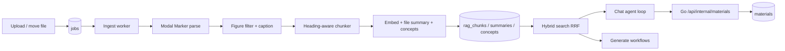

# Agentic retrieval

This page is the workflow contract for the in-house retrieval stack that replaced
LightRAG. Prefer it over guessing from code when changing ingest, search, chat,
or generate behaviour.

Testing setup lives in [pipeline-tests.md](pipeline-tests.md). Storage quota and
who may create materials live in
[authorization-permissions-lifecycles.md](authorization-permissions-lifecycles.md)
and [backend-storage-quota.md](backend-storage-quota.md).

## Architecture

Two Python processes share one Postgres schema owned by Go migrations
(`server/migrations/0001_init.sql`):

| Process | Entry | Role |
| --- | --- | --- |
| Ingest worker | `python -m pipeline.ingest.worker` | Claims jobs, parses, chunks, embeds, writes a two-tier file summary, extracts concepts. Horizontally scalable (`WORKER_REPLICAS`); each replica runs one job at a time |
| Retrieval service | `uvicorn pipeline.retrieve.service:app` | `/chat/stream`, `/generate` over the same index |

The Go gateway is the public face: it authenticates the user, proxies chat and
generate to the retrieval service, and owns material persistence (including the
internal materials endpoint the chat agent calls).



There is no dual-running period with LightRAG. Apache AGE is gone; the database
image is stock `pgvector/pgvector:pg16`.

## Schema ownership

The retrieval index is application schema, not pipeline-owned:

| Table | Purpose |
| --- | --- |
| `rag_contents` | Canonical parsed content per workspace, unique by parsed-text hash |
| `rag_file_contents` | Logical file → canonical content aliases |
| `rag_chunks` | Canonical passages: text, heading path, pages/regions, `tsvector`, `halfvec(2560)` |
| `rag_content_summaries` | Two-tier prose (`descriptor` + `summary`) plus `summary_version`; shared by files with identical content |
| `rag_concepts` | Normalized concept names per workspace |
| `rag_concept_mentions` | Concept → chunk (and file) links |

All of these FK-cascade from `workspaces` / `files` / `chapters`. Deleting a
logical file removes its alias; a trigger removes canonical content only after
its last alias disappears. Deleting a workspace deletes its index; there is no
`rag_teardown` job.

`files.content_hash` is the sha256 of parsed chunk text. Two uploads of the same
document in one workspace stay as two independently selectable/deletable file
rows, both mapped to one canonical index. Search chooses one in-scope alias for
each content item, so duplicates do not repeat passages. Deleting either upload
leaves the other searchable and citable under its own file id and name.

`files.doc_id` is gone. Identity is always `files.id`.

## The embedding model belongs to the workspace

Every chunk in a workspace lives in one model's vector space, and a query is
only meaningful against the space it was embedded in. A query embedded by a
different model than the chunks returns confidently ranked nonsense — no error,
no type mismatch, just worse answers. So the model is not a setting either
process resolves; it is a property of the workspace:

| Column | Meaning |
| --- | --- |
| `workspaces.embedding_model_key` / `_version` | the space this workspace is in, fixed at creation |
| `workspaces.embedding_dim` | its width, which selects the vector table |
| `rag_contents.embedding_model_key` / `_version` / `_dim` | the model that actually produced the vectors under this content |

The workspace columns are what ingest and query both read (`ingestJobPayload`
does *not* snapshot embedding onto the job; the worker installs the workspace's
pin into `JobPins` itself, and `retrieval.search` reads the same row). The
`rag_contents` columns are the observed value rather than the intended one:
they agree by construction, and recording both is what would make a
disagreement findable instead of leaving it to show up as poor retrieval.

Retargeting the registry's embedding default therefore applies **only to
workspaces created afterwards**. Existing workspaces keep resolving the row
they were pinned to, which is why an embedding row any workspace still points
at must never be deleted or lose its provider.

This replaced a process-start freeze of the embedding default in both the Go
and Python registries. The freeze stopped a 30-second poll from mixing spaces
mid-process, but it made the model a query was embedded with a function of when
each container last booted, so two replicas could legitimately disagree and a
redeploy could silently change the answer. Nothing is frozen at process start
now.

### Vectors are stored one table per width

`rag_chunks` holds the passage; the vector lives beside it in
`rag_chunk_vectors_<dim>` (`rag_chunk_vectors_2560` today), one HNSW index each.
The width is part of the `halfvec` column type and pgvector cannot index a
column whose dimension varies, so a second width needs a second table — but the
lexical half of hybrid search (`text`, `indexed_text`, `search`, `regions`,
pages) does not depend on the model and stays in one place. `store.vector_table`
in Python and `vectorTable` in Go both map a width to a table name from a fixed
allowlist, because that name is interpolated into SQL.

Note what this does and does not buy: it isolates **dimensions**, not spaces.
Two different 2560-dim models share the table and its index. What guarantees a
query only meets its own space is the workspace pin being immutable.

Adding a width means a new table in `0001_init.sql`, a new entry in both
allowlists, and the value added to the `workspaces.embedding_dim` and
`model_configs` check constraints. Removing one is not supported.

### Reindexing is not available

There is no job that re-embeds a workspace into a different model, and nothing
in the product changes a workspace's embedding pin after creation. That is a
real limitation, not an oversight: re-embedding is proportional to total corpus
size rather than to what changed, so it is the one operation whose cost is
unbounded by anything the user just did. Until it exists:

- a workspace stays in its original space for life;
- cloning inherits the source's pin (`CloneWorkspace`) because
  `cloneRetrievalIndex` copies vectors verbatim rather than re-embedding — a
  clone that took the current default would be querying one space against
  chunks in another;
- an embedding model in use has to stay reachable, which is an operator
  obligation. See [deployment-runbook.md](deployment-runbook.md).

## Ingest workflow

### Job types

| Type | Enqueued by | Does |
| --- | --- | --- |
| Ingest (default) | Upload / re-parse paths in Go | Hash source → reuse a donor index if one exists, else parse → chunk → embed → two-tier file summary → concepts |

Ingest retries: 3 attempts with exponential backoff (`not_before`), a
per-type wall-clock timeout, and a heartbeat lease so a dead worker does not
leave the row `running` forever. Unknown errors retry; `TerminalError`
(missing file, unresolvable pins, locked account) does not. Policy lives in
`pipeline/jobs.py`, not on the row.

A reclaimed lease does not stop the old worker: cancellation is cooperative and
a heartbeat can simply fail. So `attempts` doubles as a fencing token — it is
written only by a claim — and every heartbeat, requeue and terminal transition
requires the attempt it claimed (`db.claim_is_current`). A run whose claim moved
on logs and discards its outcome rather than overwriting its successor's row.

Enqueue snapshots `{actorUserId, ingestModelKey, visionModelKey}` (and versions)
onto the job: the actor who will be billed, and the two model surfaces whose
defaults are hot-reloadable and could move while the job is queued. Embedding is
not among them — the worker reads it from the workspace, as above.

Both sides fail closed. `ingestJobPayload` returns an error and its caller rolls
back the upload if the actor or either pin is missing, and a job that reaches the
worker without resolvable pins is failed rather than run on the worker's own
defaults. A transient database error while *reading* those pins retries with the
normal attempt budget; only a missing or invalid pin is terminal. See
[observability-metering.md](observability-metering.md) §8.

### Parse route

Controlled by `parseMode` on the job payload:

| Mode | Parser | Output | Page model |
| --- | --- | --- | --- |
| `fast` (default) | Modal Marker hybrid + RapidOCR on scanned pages | `content_list.json` (+ images) | Yes — `page_idx` + `bbox` |
| `none` | — | Blob stored, not indexed | — |
| txt / md / json kinds | Direct B2 read | Markdown | No |

`accurate` and `advanced` are retired names: the worker maps them onto `fast`
so already-queued jobs still parse.

The bundle carries page-accurate citations and the figures captioning needs.
Marker runs with RapidOCR only on pages the scan probe flags.

### Parse capacity

Modal will not open an unbounded pile of CPU boxes. Caps live in
`modal/parse_common.py` and must match `EVO_PARSE_FAST_SLOTS`:

| Route | Boxes | Jobs per box | Fleet cap | Idle window |
| --- | --- | --- | --- | --- |
| fast | 12 | 6 digital / 2 OCR | 72 HTTP, ~24 OCR | 30s |

A new upload lands `files.status=pending` with a `jobs` row still `pending`.
The worker only flips the file to `processing` once it is actually running
(and, for Modal parse, once it holds a Redis parse slot). If every slot is
taken, the job is put back to `pending` without spending an attempt, and the
UI keeps showing a wait. Redis down fails *open*: the call still goes to
Modal, and `max_containers` is the last brake.

Each ingest replica still runs one job at a time, so `WORKER_REPLICAS` is how
many jobs leave the pending queue at once. Do not set it above the parse cap
you actually want to pay for.

Parse zips are addressed by `(source_sha256, parse method, route, parser
version)` and cached in B2 for the **cold start** only: retries of a job that
has not yet produced a donor. After a
successful ingest the zip is dropped (15-minute grace so a concurrent download
can finish). A terminal failure keeps it so a manual retry stays cheap.

The worker records the zip on `artifact_cache` as soon as the parser returns,
**before** figure captioning. A later vision failure must not leave that object
untracked. The worker may `blobstore.delete` only **unrecorded** zips (corrupt
cache recovery).

`files.indexed` is true only after retrieval chunks are written, or reused from
identical canonical content. `parseMode=none` jobs for non-text kinds (audio,
store-only uploads) finish `ready` with `indexed=false`: the original blob stays,
the file is viewable and downloadable, and chat/generate cannot search it. A
failed ingest is the same shape — nothing is auto-deleted; the UI shows a banner
on the file rather than replacing the viewer.

Nothing calls the third-party MinerU cloud API any more. It could not return
bounding boxes or images, needed polling, and capped files at 10 MB / 20 pages.

### Figure captioning

Chosen per file at upload time (`captionImages` on the job payload;
`EVO_CAPTION_IMAGES` only covers jobs that carry no choice, such as cloud
imports). `pipeline/parse/figures.py` describes each surviving figure with the
vision model and writes it onto the image block **before chunking**, so the
caption is embedded, summarized, concept-extracted and cited as part of the
passage it belongs to. That ordering is the point of the feature: a slide deck
whose substance is in its diagrams is otherwise nearly invisible to search.

Every figure that survives filtering is captioned — the filters, not a count,
bound the cost. Filtering is deliberately asymmetric, because a dropped figure
is unreachable forever while a needless caption costs a fraction of a cent:

- Absolute bounds — pixel dimensions, pixel area, aspect ratio, and normalized
  page area from the bbox (which is what catches an icon rendered large by a
  300 DPI scan).
- Repetition — figures are clustered by perceptual hash (dHash, Hamming ≤ 6)
  and a cluster spanning many pages is dropped as page furniture. This is the
  load-bearing filter, and the only one that works regardless of language or
  subject matter.
- Flatness — near-uniform crops only. The naive "mostly one colour means logo"
  rule would drop line diagrams on white, which are the most valuable images
  there are, so the thresholds sit far below any real drawing.

Captions are cached in B2 under a **source-identity** key
(`captions/{source_sha256}/{caption version}.json`), keyed inside the JSON by
image content hash. The parse fingerprint is not part of the path: a re-parse
(different parser version) must not recaption unchanged
figures, and a delete-then-re-upload of the same bytes hits the same object.
Ownership lives on `artifact_cache` (TTL since last use), not on
`files.caption_blob_path`, so deleting the file does not reap the cache.

The caption prompt is built from the figure and its surrounding content only —
no file name. Everything a globally cached or donor-copied output is generated
from has to be inside its key, or the same bytes produce different text
depending on who uploaded them first, and one uploader's file name reaches
another workspace. The same rule applies to file summaries and concepts, which
are copied verbatim from donors.

### Chunking

`pipeline/retrieval/chunking.py`:

- Groups blocks under the heading hierarchy (`text_level` or markdown `#`).
- Packs by character budget (`EVO_CHUNK_CHARS`, overlap, min size) without
  splitting a block unless one block alone exceeds the target.
- Carries every source block's page + bbox into `regions`, with
  `space: mineru-1000-lefttop` so a future highlight overlay does not guess the
  coordinate system.
- Builds `indexed_text` = heading breadcrumb + body, never a logical file
  name. Renaming a file must not change `content_hash` or fork canonical
  content. `text` is what the model and citations show.

CJK runs are bigrammed in the application and indexed with Postgres `simple`
config. The same tokenizer must run on queries (`search_query_terms`), or the
lexical half of hybrid search silently returns nothing for Chinese/Japanese/
Korean.

### Donor reuse

Before parsing, the worker hashes the uploaded bytes (`files.source_sha256`) by
streaming the object and digesting it. The object's stored
`x-amz-checksum-sha256` is deliberately not trusted, however convenient: the
browser PUTs through a presigned URL that signs only host and content-type, so
that header is uploader-controlled, and a hash the uploader chooses would let
anyone claim the hash of a document they do not have and be handed its chunks,
summary and concepts. One GET per ingest is the price. It then looks for a
**ready** `rag_contents` row with the same
`(source_sha256, pipeline_identity)`. `pipeline_identity` covers parse method,
route, parser version, caption version, and chunker version — anything that
feeds chunk text.

A hit copies that donor's `rag_chunks` (and, when the embedding pin matches,
its vectors), plus summary and concepts, into a new per-workspace
`rag_contents` row. Isolation stays `workspace_id` on the chunks; user B is
not billed for user A's original ingest. If the pins differ, chunk text is
copied and re-embedded into the target workspace's space.

`pipeline_identity` covers only what feeds chunk *text*, so it is not an
invalidation lever for model prose: changing the ingest or vision default leaves
existing summaries, concepts and captions in place, and a later upload of
already-seen bytes is served the older model's output. Neither surface is user
selectable (the job snapshot exists to pin billing and to survive a hot reload
mid-queue), so nobody's choice is being overridden — but an operator who swaps
either model and wants the prose regenerated has only the blunt lever below.

A parser/caption/chunker version bump invalidates every donor and re-parses.
Captions surviving that bump means the re-parse pays GPU but not vision.
Delete-and-re-upload with identical parse params also re-parses: there is no
donor row left. That is the accepted trade for dropping parse zips on success.

### Indexing one file

`pipeline/retrieval/indexing.py` is idempotent per file:

1. Attach the logical file to canonical workspace content by parsed-text hash.
  If ready content already exists, reuse it without model calls.
2. Embed all canonical `indexed_text` values in provider-sized batches. These
  use heading breadcrumbs but not a mutable logical file name.
3. Replace that content's `rag_chunks` (delete-then-insert so a shorter
  re-ingest does not leave a stale tail).
4. One cheap-model call → two-tier content summary (`descriptor` ~50 words plus
  a size-tiered `summary` of ~150/300/500 words); upsert `rag_content_summaries`.
  Documents larger than `EVO_LLM_INPUT_BUDGET_TOKENS` are map-reduced in chunk
  groups rather than sampled. A provider failure here retries the job rather
  than storing a blank: an empty summary would be marked ready, copied to future
  donors, and never refilled. `summary_version` is **not** part of
  `pipeline_identity` — a prompt change must not invalidate a parse; it exists
  so a later backfill can find stale prose, including donor copies.
  Concept extraction stays best-effort per group, since a partial miss degrades
  recall instead of hiding the file from `list_sources`.
5. Concept extraction in groups of chunks (not per chunk) → upsert concepts and
   mentions. Relation-free by design: co-mention across files is recovered at
   query time. Group size is a mention-granularity knob (~12 chunks / 20k chars),
   not a context budget.
6. Stop. There is no chapter/workspace summary tree and no rollup job.
   Cross-document reasoning happens at query time, conditioned on the question.

Concurrent duplicate jobs coordinate on the canonical content row. The creator
indexes it; other workers wait for its ready marker. A failed creator removes
the processing claim so a waiting upload can retry.

The claim names its owner (`rag_contents.claim_job_id`, cleared on ready) and
that ownership is load-bearing, because a waiter's file points at the creator's
row: only the owner's heartbeat refreshes the claim, and only the owner's expired
lease drops it. A waiter that has waited `CONTENT_CLAIM_WAIT_S` may steal a
`processing` row, but only when `updated_at` is older than `CONTENT_CLAIM_STALE_S`
**and** the owning job is not `running` with a live lease — a missed heartbeat
write is not enough. `replace_content_chunks` takes that row `FOR UPDATE` and
raises `RetryableError` if the claim has moved, so a stolen creator discards its
write instead of failing on a foreign key. Refreshing or dropping by file instead
would let a live waiter mask a dead creator forever, and a dead waiter cascade a
live creator's chunks away mid-write. A waiter returns from the wait only once the
content is ready or it has taken the claim over itself.

### File summaries (no tree)

Content summaries are shared by identical files. Moving a file between chapters
does **not** re-summarize it. There is no chapter or workspace rollup: at a
100-file workspace cap, `list_sources` can put every name and ~50-word
descriptor into one tool result (~7k tokens), and the model has the question
that an embedding index would not. `describe_documents` returns the detailed
tier for up to eight files. Summaries are never embedded or cited — citations
always point at document passages.

## Search workflow

`pipeline/retrieval/search.py` + `store.hybrid_search`:

1. Embed the query.
2. One SQL statement runs vector (cosine / HNSW) and lexical (`tsvector`)
   candidates, fused with reciprocal rank fusion (RRF). Ranks are fused rather
   than scores because cosine distance and `ts_rank_cd` share no unit.
3. Optional `file_ids` filter is applied **in SQL** and intersected with the
   request scope. The agent cannot widen a scope the user narrowed.
4. `_rerank` is a seam that currently returns identity. Contextual prefixes,
   per-file diversity cap, and neighbour expansion are the v1 quality levers;
   a hosted or local cross-encoder plugs in here later without changing callers.
5. Cap how many passages any one file may contribute (`EVO_SEARCH_PER_FILE_CAP`),
   then expand each survivor with ±1 neighbouring chunk so arguments that cross
   a packing boundary stay readable. Citations still point at the hit, not the
   neighbour.

`related_concepts` is a self-join on co-mentioned chunks: the relation-free
substitute for a knowledge-graph edge.

## Chat agent workflow

Streaming chat (`POST /chat/stream` via the Go gateway):

1. Go authenticates, reads `users.locale` and `users.chat_model_key`, resolves
   that key to a `model_configs` row (`ratesForSurface`), reserves credits from
   those rates, stamps `{modelKey, modelVersion}` on the assistant message, and
   relays that exact pair to the retrieval service with history and locale.
   Locale and model are server-owned (never browser fields). Settings changes
   apply to the next message. A missing preference or unresolvable pin fails
   the turn as `model_unavailable`. Ingest/index prompts stay English.
2. The agent **primes** with one retrieval before the model is asked anything —
   a question about the user's sources almost always needs them, and making the
   model ask wastes a round.
3. Capped tool loop (`EVO_AGENT_MAX_STEPS`, default 12). The final round drops
   tools entirely so the turn cannot end on another tool call with no answer.
4. SSE events: `tool` (progress), `citations` (once, before tokens), `token`,
   `done` (or `error`).

### Tools

| Tool | Side effects | Notes |
| --- | --- | --- |
| `search_workspace` | none | Hybrid search; scope-intersected |
| `list_sources` | none | Chapters, file names, passage counts, and the short descriptor |
| `describe_documents` | none | Detailed summaries for up to eight files; scope-intersected |
| `read_document` | none | Sequential chunks by index |
| `related_concepts` | none | Co-mention bridge |
| `generate_material` | yes | POST to Go `/api/internal/materials` |

Read tools hit Postgres directly. Anything that creates a material goes through
the gateway with `X-Pipeline-Secret`, so authz, quota, and the materials model
stay in one place. The tool is omitted from the schema when the gateway URL or
user is unset, or when `userId` is missing.

Citation numbers are stable for the turn across tools: `[3]` means the same
passage whether it came from search or from reading a document.

## Generate workflow

`/generate` is **not** an agent loop. Scope is already known, the output shape
is fixed, and the gateway must persist a parseable artifact.

1. `gather_context` samples chunks evenly across every document in scope (equal
   share per file, not proportional to length). The gateway resolves the user's
   **Settings → LLM** generate preference (`ratesForSurface`) and forwards that
   exact pin; the browser `model` field is ignored. An unresolvable preference
   fails as `model_unavailable`.
2. If the context fits the budget, one `produce` call. If it overflows across
   multiple files, `produce_mapped` summarizes per document then combines.
   `produce` appends a language rule from the gateway's `locale` so quiz copy,
   flashcard text, and diagram labels match the user's Settings language.
   JSON keys and Mermaid syntax stay English.
3. Kind-specific normalizers (`extract_json`, `strip_fence`,
   `normalize_questions`) coerce the model reply into the shapes the Go
   persistence layer already expects: flashcards, quiz questions, mindmap /
   diagram mermaid, notes.

Response shapes are part of the contract with Go — do not change them lightly.

## Citations and the frontend

A citation is:

```json
{
  "fileId": "f_…",
  "fileName": "bio.pdf",
  "snippet": "…",
  "pageStart": 4,
  "pageEnd": 5,
  "regions": [{ "page": 4, "bbox": [x0, y0, x1, y1], "space": "mineru-1000-lefttop" }]
}
```

- `fileId` is a real `files.id` (not a LightRAG doc hash).
- Pages are 1-based and **absent** for sources with no page model (txt/md).
- `regions` are stored and shipped; the highlight overlay that would consume
  them is not built yet.

Chat citation chips show `p. N` / `pp. N–M` and open the file scrolled to that
page via `OpenItem.page` → `FileViewer` → `PdfView`.

## Clone and teardown

`CloneWorkspace` copies the retrieval index **in the same transaction** as the
content: canonical content, aliases, chunks, vectors, summaries, concepts, and
mentions, remapping file, content and chapter ids. Duplicate files remain
aliases of one content item inside the clone. There is no best-effort follow-up
call and no `ragCloned` flag — either the clone includes the index or the
transaction rolls back.

The clone inherits the source's embedding pin rather than taking the current
default, because the vectors are copied rather than recomputed. New chunk ids
are derived from `md5(newWorkspaceID || oldChunkID)` rather than `random()`, so
the vector copy can recompute each id and pair it with its passage.

Teardown is the foreign key. Workspace delete cascades; the old `rag_teardown`
job and pipeline `/workspace/delete` endpoint are gone.

## Configuration surface

| Concern | Env | Default / note |
| --- | --- | --- |
| Gateway callback | `GATEWAY_URL`, `PIPELINE_SECRET` | Unset disables `generate_material` |
| Parse | `MODAL_FAST_PARSE_URL` (or `MODAL_PARSE_URL`) | Marker app `evo-mineru-fast` |
| Chunk size | `EVO_CHUNK_*` | Character budgets, not tokens |
| Embedding | `EMBEDDING_DIM` | The shipped width, matching `halfvec(N)`. The *model* is never env: it is a `model_configs` row pinned per workspace |
| Query model | `EVO_QUERY_MODEL` | Last resort for a call handed a bare model string. Ingest and vision come from the job pin; chat/generate/editor from Settings → LLM via the gateway |
| Search | `EVO_SEARCH_CANDIDATES`, `EVO_SEARCH_TOP_K`, `EVO_SEARCH_PER_FILE_CAP` | |
| Agent | `EVO_AGENT_MAX_STEPS` | Default 12. Cap is the design, not a safety valve |
| LLM input budget | `EVO_LLM_INPUT_BUDGET_TOKENS` | Default 50000. One CJK-aware budget for file summaries, generate context, and map-reduce |
| Captions | `EVO_CAPTION_IMAGES`, `EVO_CAPTION_CONCURRENCY`, `EVO_CAPTION_MAX_EDGE`, `EVO_CAPTION_VERSION` | Per file at upload; the env flag is only a fallback |
| Caption safety valve | `EVO_CAPTION_MAX_PER_FILE` | `0` (uncapped); the filters bound the cost |

Windows note: psycopg's async driver refuses the Proactor event loop.
`pipeline.use_compatible_event_loop()` is called by both entrypoints and by the
test suite.

## Design choices worth not undoing casually

- **No extracted relations.** Entities + co-mention replace a knowledge graph.
  Relation extraction was most of LightRAG's ingest cost and most of its
  accuracy failures.
- **No summary tree.** File descriptors live in `list_sources`; detailed
  summaries are fetched on demand. Cross-document reasoning is query-time, not
  a precomputed rollup that cannot see the question.
- **Scope is SQL, not a prompt hint.** The agent cannot search outside the
  user's chapter/file selection.
- **Generate is deterministic; chat is agentic.** Mixing them would make
  material JSON unreliable and chat latency unpredictable.
- **Materials persist in Go.** The retrieval service holds DB credentials but
  deliberately does not hold quota/authz rules.
- **Reranker is a seam, not a dependency.** Measure quality on real workspaces
  before adding a vendor or a GPU to the retrieval container.
