# Agentic retrieval

This page is the workflow contract for the in-house retrieval stack that replaced
LightRAG. Prefer it over guessing from code when changing ingest, search, chat,
or generate behaviour.

The pipeline test inventory lives in [test-catalog.md](test-catalog.md). Storage
quota and who may create materials live in
[authorization-permissions-lifecycles.md](authorization-permissions-lifecycles.md)
and [backend-storage-quota.md](backend-storage-quota.md).

## Architecture

The Python services share one Postgres schema owned by Go migrations
(`server/migrations/0001_init.sql` plus the forward-only files after it):

| Process | Entry | Role |
| --- | --- | --- |
| Parse coordinator | `python -m pipeline.ingest.parse_worker` | Supervises four isolated one-job coordinator processes. They validate and hash document sources, reuse an exact donor when possible, wait for the parser, then atomically enqueue an immutable artifact handoff |
| Ingest worker | `python -m pipeline.ingest.worker` | Claims only post-parse and direct-route jobs, then chunks (with heading retention and extraction confidence), captions standalone images / transcribes audio, embeds, and writes a two-tier file summary. Each replica runs one job at a time |
| Retrieval service | `uvicorn pipeline.retrieve.service:app` | `/chat/stream`, `/generate`, `/quiz-grade`, `/plate-ai/*` over the same index |
| Parser service | `uvicorn parser/app.py` | OpenDataLoader 2.5.7 (Java) with the refined native repairs and selective RapidOCR (`parser/odl/`), one document at a time behind a depth-4 FIFO; normalizes Office through LibreOffice |
| Host sampler | `python -m pipeline.ingest.host_sampler` | Persists compact whole-host and parser admission/resource samples without document identity |

The Go gateway is the public face: it authenticates the user, proxies chat and
generate to the retrieval service, and owns material persistence (including the
internal materials endpoint the chat agent calls). Retrieval HTTP is
Go-only: every route except `/healthz` requires `X-Pipeline-Secret`. User
provider keys stay ciphertext on that hop; retrieval decrypts them with
`LLM_CREDENTIALS_KEY`.

Public workspace landing pages use a separate live metadata projection from Go
at `GET /api/public/workspaces/{id}/summary`. It returns workspace metadata and
chapter/file names for link/public workspaces, with `Cache-Control: no-store`.
It never calls retrieval or returns source text, material bodies, file-content
summaries or download URLs. Reading full workspace/study content requires a
session. There is no summary generation job, KV or R2 cache for this endpoint;
see [the authorization contract](authorization-permissions-lifecycles.md#anonymous-workspace-summaries).

```mermaid
flowchart LR
  Upload[Upload / move file] --> Plan[Go format policy builds processingPlan v1]
  Plan --> Route{Contract route}
  Route -->|PDF / modern Office| ParseJob[(parse job)]
  ParseJob --> Coordinator[Parse coordinator]
  Coordinator --> Download[One B2 download + trusted SHA]
  Download --> Parse[Netcup OpenDataLoader + RapidOCR]
  Parse --> Artifact[Immutable local artifact]
  Artifact -. verified best-effort cache .-> ParseCache[(B2 parse bundle)]
  Artifact --> IngestJob[(ingest continuation)]
  Route -->|direct route| IngestJob
  IngestJob --> Worker[Ingest worker]
  Worker -->|image| ImageCaption[ZAI GLM via Tencent TokenHub]
  Worker -->|audio| AudioTranscript[Synchronous ElevenLabs Scribe v2]
  Worker -->|CSV / TSV / text| DirectText[Direct normalization]
  Worker -->|parsed document| Chunk[Heading-aware chunker + heading retention + confidence]
  ImageCaption --> Chunk
  AudioTranscript --> Chunk
  DirectText --> Chunk
  Chunk --> Index[Embed + file summary]
  Index --> Store[(rag_chunks / summaries)]
  Store --> Search[Hybrid search RRF]
  Search --> Agent[Chat agent loop]
  Agent -->|capture_page| Capture[PyMuPDF page render from the source PDF]
  Search --> Workflows[Generate workflows]
  Agent --> Gateway[Go /api/internal/materials]
  Gateway --> Materials[(materials)]
```



There is no dual-running period with LightRAG. Apache AGE is gone; the database
image is stock `pgvector/pgvector:pg16`.

### Where prompts live

Every prompt this system sends sits in `pipeline/prompts/`, one module per model
slot. A function there takes the surrounding context and returns what goes into
the request — the message list for most calls, a bare string where the caller
owns the wrapping. Nothing in that package opens a connection, reads the
database, or resolves a model, so a prompt can be built in a test with no
network and no pin.

| Module | Slot | What it builds |
| --- | --- | --- |
| `chat.py` | `chat` | Agent system prompt and full message list; the checkpoint compaction prompt |
| `generate.py` | `generate` | Material grounding rules, plus the flashcards / mindmap / diagram / quiz instructions |
| `editor.py` | `editor` | Plate menu prompts: generate, edit, comment, table cells |
| `quiz.py` | `quiz` | Open-answer marking. Import-free: `bench/grading` loads it by path, and `src/features/quizzes/judge.ts` is its browser twin |
| `ingest.py` | `ingest` | File descriptor and summary, and `SUMMARY_VERSION` |
| `captioning.py` | `captioning` | Whole-image captions for standalone image uploads |
| `retrieval.py` | `retrieval` | The Qwen3 instruct prefix for embedding queries |
| `locale.py` | shared | The account-locale rule appended by chat, generate, and editor |

Two prompts have a twin outside this package. `quiz.py` and
`src/features/quizzes/judge.ts` must produce identical text — the browser BYOK
path builds its own request — and `prompts/quiz_grade.golden.json` is asserted
by both `pipeline/tests/test_quiz_grade.py` and
`src/features/quizzes/judge.test.ts`, so a change made to one implementation
and not the other fails. Agent tool descriptions stay in `retrieval/tools.py`
next to their handlers and schemas.

## Schema ownership

The retrieval index is application schema, not pipeline-owned:

| Table | Purpose |
| --- | --- |
| `rag_contents` | Canonical parsed content per workspace, unique by parsed-text hash |
| `rag_file_contents` | Logical file → canonical content aliases |
| `rag_chunks` | Canonical passages: text, heading path, pages/regions, `tsvector`, `halfvec(2560)` |
| `rag_content_summaries` | Two-tier prose (`descriptor` + `summary`) plus `summary_version`; shared by files with identical content |

All of these FK-cascade from `workspaces` / `files` / `chapters`. Deleting a
logical file removes its alias; a trigger removes canonical content only after
its last alias disappears. Deleting a workspace deletes its index; there is no
`rag_teardown` job.

`files.content_hash` is the sha256 of parsed chunk text plus page and bounding-box
geometry when the parser supplies it. Two uploads of the same document in one
workspace stay as two independently selectable/deletable file rows, both mapped
to one canonical index. Text-identical documents with different layouts remain
separate so one file cannot inherit another file's citation coordinates. Search
chooses one in-scope alias for each content item, so duplicates do not repeat
passages. Deleting either upload leaves the other searchable and citable under
its own file id and name.

`files.doc_id` is gone. Identity is always `files.id`.

## The embedding model belongs to the workspace

Every chunk in a workspace lives in one model's vector space, and a query is
only meaningful against the space it was embedded in. A query embedded by a
different model than the chunks returns confidently ranked nonsense — no error,
no type mismatch, just worse answers. So the model is not a setting either
process resolves; it is a property of the workspace:

| Column | Meaning |
| --- | --- |
| `workspaces.embedding_provider_slug` / `embedding_model_slug` / `_version` | the space this workspace is in, fixed at creation |
| `workspaces.embedding_dim` | its width, which selects the vector table |
| `rag_contents.embedding_provider_slug` / `embedding_model_slug` / `_version` / `_dim` | the model that actually produced the vectors under this content |

The workspace columns are what ingest and query both read (`ingestJobPayload`
does *not* snapshot embedding onto the job; the worker installs the workspace's
pin into `JobPins` itself, and `retrieval.search` reads the same row). The
`rag_contents` columns are the observed value rather than the intended one:
they agree by construction, and recording both is what would make a
disagreement findable instead of leaving it to show up as poor retrieval.

Retargeting the registry's embedding default therefore applies **only to
workspaces created afterwards**. Existing workspaces keep resolving the row
they were pinned to. Embedding rows cannot be disabled, deleted, stripped,
or rewritten onto a different `model_slug` / `params`
(`protect_embedding_model_configs`). A later model, including another
2560-d one, is a new catalog row and a new vector table. Changing the
upstream id means a new exact `model_slug` and a new immutable version.

This replaced a process-start freeze of the embedding default in both the Go
and Python registries. The freeze stopped a 30-second poll from mixing spaces
mid-process, but it made the model a query was embedded with a function of when
each container last booted, so two replicas could legitimately disagree and a
redeploy could silently change the answer. Nothing is frozen at process start
now.

New workspaces take the live default through `newWorkspaceEmbedding`
(`CreateWorkspace` always calls it). Clone copies the source pin.
Fixtures that `INSERT INTO workspaces` skip the helper and land on the
column default, which is kept equal to the seeded `qwen-embed` row.

### Vectors are stored one table per embedding pin

`rag_chunks` holds the passage. The vector lives beside it in that pin's
table (`rag_chunk_vectors_2560` for `qwen-embed` v1). The width is part of
the `halfvec` column type, so a second width needs a second table. A
second model at the same width also needs its own table. Two geometries
must not share an HNSW index.

The lexical half of hybrid search (`text`, `indexed_text`, `search`,
`regions`, pages) does not depend on the model and stays in `rag_chunks`.
`store.vector_table` in Python and `vectorTable` in Go map
`(provider_slug, model_slug, version)` to a table name from a fixed allowlist, because
that name is interpolated into SQL.

Adding a model means a new vector table (in `0001_init.sql` until the first
kept database exists, then a new numbered migration), a new allowlist
entry in both languages, and `params.vector_table` on the catalog row.
Removing a table is not supported.

### The workspace embedding model stays fixed

There is no job that re-embeds a workspace into a different model, and
nothing in the product changes a workspace's embedding pin after
creation. Source editing can reindex a complete file within that existing
pin, staging replacement chunks before publishing them. Donor copy may also
re-embed when the only ready donor uses another embedding space.

Re-embedding is proportional to total corpus size rather than to what
changed. Until a workspace model-migration job exists:

- a workspace stays in its original space for life;
- cloning inherits the source's pin (`CloneWorkspace`) because
  `cloneRetrievalIndex` copies vectors verbatim rather than re-embedding.
  A clone that took the current default would query one space against
  chunks in another;
- an embedding model in use has to stay reachable. The row itself cannot
  be disabled, deleted, or rewritten onto a different model. See
  [deployment-runbook.md](deployment-runbook.md). Prefer an open-weight
  model so the same weights can be self-hosted if a vendor drops them.

## Ingest workflow

### Job types

| Type | Enqueued by | Does |
| --- | --- | --- |
| Parse | Go upload finalization for `document_parse` plans | Validate → download/hash once → exact-vector donor reuse or parser artifact publication → atomic ingest handoff |
| Ingest | Go for direct routes; parse coordinator for documents | Extract a completed document artifact or normalize a direct source → chunk (heading retention, extraction confidence) / caption a standalone image / transcribe → embed → two-tier file summary |

Both stages get one retry (two total attempts), exponential backoff
(`not_before`), a per-type wall-clock timeout, and a heartbeat lease so a dead
process does not leave the row `running` forever. Unknown errors retry;
`TerminalError` (missing file, unresolvable pins, locked account, confirmed
parser quarantine) does not. Policy lives in `pipeline/jobs.py`, not on the row.

A reclaimed lease does not stop the old worker: cancellation is cooperative and
a heartbeat can simply fail. So `attempts` doubles as a fencing token — it is
written only by a claim — and every heartbeat, requeue and terminal transition
requires the attempt it claimed (`db.claim_is_current`). A run whose claim moved
on logs and discards its outcome rather than overwriting its successor's row.

An attempt is live only while its lease is non-null and later than database
time. Heartbeats and final-write fences reject an expired lease even if the
reaper has not changed the job from `running` yet. An expired worker cannot
renew that row or commit its outcome.

Enqueue snapshots `{actorUserId, ingestProviderSlug, ingestModelSlug,
captioningProviderSlug, captioningModelSlug}` (and versions)
onto the job: the actor who will be billed, and the two model slots whose
defaults are hot-reloadable and could move while the job is queued. Embedding is
not among them — the worker reads it from the workspace, as above.

Both sides fail closed. `ingestJobPayload` returns an error and its caller rolls
back the upload if the actor or either pin is missing, and a job that reaches the
worker without resolvable pins is failed rather than run on the worker's own
defaults. A transient database error while *reading* those pins retries with the
normal attempt budget; only a missing or invalid pin is terminal. See
[observability-metering.md](observability-metering.md) §8.

### Parse route

The Go gateway resolves every upload into a versioned `processingPlan` when it
enqueues the first stage. The plan names the exact format route, parser route, caption
mode (`none`, or `standalone` for image uploads), Office-preview requirement,
ordered stages, and required capabilities.
The Python worker rejects unknown versions and executes this plan; it does not
reconstruct orchestration from `kind`, `parseMode`, or the extension. Those
legacy top-level fields may describe the saved upload choice but are not worker
route selectors. Validation is exact: format/route, Office preview, caption
mode, stage order, and resource list must agree with the version-1 contract.
A malformed or manually fabricated combination fails terminally rather than
silently taking a nearby route.

| Source | Worker route | Searchable output | Page model |
| --- | --- | --- | --- |
| PDF / DOCX / XLSX / PPTX with `fast` | OpenDataLoader parser service on the ingest host, RapidOCR on text-less pages | `content_list.json` (+ images) | Yes — `page_idx` + `bbox` |
| txt / md / json and other accepted text/code formats | Raw text | original text | No |
| CSV / TSV | Delimiter/header normalization | explicit row/field text, including formulas | No |
| supported image | Pinned ZAI GLM-5.3-Flash call through Tencent TokenHub | faithful searchable caption | No |
| supported audio | Presigned B2 source URL + synchronous ElevenLabs Scribe v2 | transcript | No |
| unknown or legacy DOC/XLS/PPT | Store-only | none | No |

HTML, RTF, XML, and source-code extensions have no dedicated handlers. They use
the same raw-text chunking/indexing route as other text. CSV/TSV remain the one
format-specific text exception.

The parser is OpenDataLoader 2.5.7 (a Java jar, `--table-method cluster
--include-header-footer`, one thread) followed by the refined native repairs
ported from the `bench/parsers` lab into `parser/odl/`: font `ToUnicode`
repair, table-cell styles, column reading order, hidden-OCR-layer order, heading
and table context, footer ancestry, list geometry and text-overprint repair,
exponents, column continuations and source-geometry table recovery. Pages whose
text layer has fewer than 40 characters are routed to RapidOCR (PP-OCRv6 small,
2560 px long edge, score 0.5, models baked into the image). Fresh OCR uses
PP-DocLayoutV3 through rapid-layout 1.2.1 to order regions only when every line
overlaps exactly one detected region by at least half its area. A page with
unmapped or ambiguously mapped lines keeps the original row order. Lines inside each region keep that order too,
including table cells. This preserves every OCR line and its source box.
The model is hash-pinned in the image and loaded lazily. Partial ordering and
table-row clustering remain rejected experiments; the 17 earlier source
geometries are regression checks, not evidence of accuracy on unseen pages.
Mixed-text table recovery uses repeated source row geometry, ruled header
scope and source-character coverage. Wrapped cells require consecutive lines
in the same PDF text block with matching font/style and aligned, adjacent boxes;
an intervening rule or uncertain row ownership causes abstention. Its replacement area covers the body;
captions and units expand citation bounds without consuming adjacent prose.
Existing supported numeric/native tables are protected. Ambiguous headers,
partial emphasis and unsupported background scope leave the original text.
Font repair abstains for an encoding containing an unsupported glyph name. The parser identity is
`odl-2.5.7-refined-rapidocr-v3` plus the release SHA.
The lab corpus (`/opt/capy-odl-third-pass-20260909/refined-final-r1`) checks
port compatibility, with reviewed bug fixes checked separately. It does not
establish accuracy on unseen layouts or fresh selective OCR. Each successful
attempt reports total pages, OCR pages (`_ocr_page_count`), elapsed phases and
the parser implementation string. Billing uses the page counts, 1.0 credit per
digital page and 1.0 credit per OCR page. The receipt still carries
`_slice_count: 1` and zero slice health keys so Go and the ops dashboard keep
their shape; there are no slices.

### Parse capacity

The parser runs one document at a time. Requests enter a depth-4 FIFO
(`CAPY_PARSE_QUEUE_DEPTH`: one executing, three waiting); a fifth concurrent request is answered `429` and the
coordinator returns its job to `pending` as a capacity wait without spending an
attempt (`YIELD_BACKOFF_S`, 2 s). There is no Redis admission gate and no page
slicing: a 610-page textbook is one Java run plus the repairs, about 14 s of
which is table recovery. The four coordinator children are the outer cap.

| Route | Host | Parser admission | Per-document deadline | JVM heap |
| --- | --- | --- | --- | --- |
| fast | one 8-core / 16 GiB VM | FIFO depth 4, one worker | 600 s | `CAPY_PARSER_JVM_MAX_HEAP` (8g prod, 3g nonprod) |

A new document upload lands `files.status=pending` with a pending `parse` row.
Four coordinator children claim only parse rows and flip the file to
`processing` when the parser accepts the request. While the parser runs, no
ingest worker slot is occupied.

Each document has a 600-second hard deadline (`CAPY_PARSE_DOCUMENT_TIMEOUT`)
that starts when it leaves the queue, before LibreOffice normalisation of an
Office source and the Java run; queue wait does not spend it. The Java
subprocess itself runs under the same timeout. If a document crosses the
deadline, the parser atomically writes a quarantine marker keyed by source
fingerprint and exact parser implementation, returns `parse_hard_timeout` for
that file, and exits so Docker replaces the whole parser process. The exit is
scheduled before response delivery, so a client disconnect cannot leave the
failed parser running. The offending parse is terminal and later submissions of
that exact fingerprint fail immediately while that parser version is live. Other
in-flight and queued jobs interrupted by the restart follow their ordinary
retry policy. A parser-version change (`PARSER_IMPLEMENTATION` in
`parser/app.py`, mirrored by `PARSER_IMPLEMENTATIONS` in
`pipeline/parse/parser_client.py`) creates a new fingerprint and is the
deliberate automatic way to retry the file after parser code changes.

The whole-document parser request has a 2,520-second bound (`PARSER_TIMEOUT`:
the queue depth of four times the 600-second deadline, plus a margin, so the
request behind three deadline-length documents still gets its artifact) and
the parse job a 2,700-second bound (`CAPY_PARSE_JOB_TIMEOUT`); the
independent ingest continuation has a 1,200-second bound. A timed-out
coordinator or ingest process records its retry and exits; the supervisor or
Docker replaces only that process, so a cancelled blocking thread cannot
overlap a later job.

The API process owns the FIFO, deadline and cgroup `oom_kill` watcher. A single
persistent spawned child owns LibreOffice, Java, repairs and lazy OCR models.
Mode-0600 temporary files carry source and result data between them; small pipe
messages carry only status and paths. The child has its own process group and
sets Linux `oom_score_adj` to 1000, so memory pressure preferentially kills the
parse work while the API can classify the failure. Deadline and shutdown stop
the parse process group. Startup removes abandoned transfer and document files.
Cancelling an executing caller leaves the runtime-owned future, admission slot
and deadline active. Cancelling waiting work removes it from the queue. The
persistent loops release the previous document and result between executions.

Byte-identical extracted images share one bundle file, with every image block
and Markdown image destination referring to that canonical file. Occurrence
page/geometry and literal bytes are preserved; distinct images remain separate.
The existing bundle entry and byte limits still apply after deduplication.

If the cgroup records an OOM kill while a document is active, the API writes a `parse_oom` quarantine marker
for that fingerprint, marks `/healthz` failed, and exits. A completed artifact
takes precedence over a late marker. Files that were only queued when the OOM
happened follow the ordinary policy of one retry. The same one-retry policy
applies to connection errors. Hard timeout and OOM markers are terminal without
a retry.

After an artifact is published, OOM, timeout, worker death, and other
post-processing failures never create a parser quarantine. The ingest
continuation gets one retry from the same artifact. If that retry also fails,
that job becomes terminal, but a later re-ingest is allowed. If extraction
finds a missing, corrupt, or release-incompatible bundle, the worker deletes
that exact fingerprint-addressed file and returns it to parsing once; a second
invalid handoff fails instead of looping.

The parse coordinator downloads the raw B2 object once while calculating its
trusted SHA-256, writing a job-scoped source file into the shared volume.
The parser reads that local key and atomically writes
`artifacts/{parse_fingerprint}.zip` to the same volume. The worker extracts that
file directly. That local atomic ZIP is the required parser-to-ingest handoff
(`capy-parser-bundle-v3`: `manifest.json` with the receipt, `content_list.json`,
`document.md`, `refinement.json` with the frozen furniture texts, `preview.pdf`
for Office sources, `parsed.pdf` only when font repair changed the bytes the
parser read, and `images/`). A failed B2 cache write must never fail the
current parse or ingest.

After the coordinator verifies the local ZIP's size, checksum, archive bounds,
manifest identity, content list, refinement, and required Office preview, it tries to copy
the ZIP to `parse-bundles/{parse_fingerprint}.zip` in B2. The write gets exactly
three total attempts and is best effort. Cache-row registration is best effort
too. Only a confirmed write whose object still exists after registration stays
in `artifact_cache`; otherwise the continuation drops `durableKey` and uses the
required local ZIP. If the local fingerprint bundle is
absent for a later identical source, the coordinator may download that B2 copy,
verify the same contract, and atomically install it in the shared volume. A
missing, unavailable, or invalid B2 copy falls through to the parser. It does not
fail parsing.

The worker clears the file's diagnostic local parse-bundle reference after
successful ingest. A job stores its checksum-verified local source descriptor
in its payload and retains that file across parser-capacity, external-provider,
and retry requeues. This prevents another source-object download for the same
job. It is deleted only after committed success or terminal cleanup. An idle
sweep removes abandoned sources after two hours and local fingerprint bundles
after six hours. Durable parse-bundle reuse copies use the same last-use B2
cache TTL and deletion outbox as derived-text artifacts. If all
three upload attempts fail, another upload of the same source cannot reuse that
parse once the local bundle is gone and must run the parser again.

`files.indexed` is true only after retrieval chunks are written, or reused from
identical canonical content. Direct image/audio/CSV/TSV routes get an ingest job
even though they do not use the parser. Unknown and legacy store-only uploads finish
`ready` with `indexed=false`: the original blob stays viewable/downloadable, and
chat/generate cannot search it. A failed ingest keeps the original blob and
lands `failed`/unindexed; the UI shows a banner rather than replacing the
viewer.

### Provider source imports

Google Picker and OneDrive Picker accept multiple files and folders. OneDrive preserves selection across folders. Inspection recursively expands provider folders into a flat list of files, including subfolders, with pagination and deduplication; shortcuts are not followed. The workspace file limit bounds each folder selection's file count and total list requests. Empty, over-limit, unreadable or incompletely listed folder selections fail explicitly. The chooser deduplicates overlapping selections across inspection batches and applies the remaining workspace room before showing source details. Folder names do not create chapters. The subsequent import still submits file ids in batches of 20 through the existing quota/reservation gates. OneDrive expansion retains drive ids, deduplicates by drive and item id, and only follows pagination URLs on the same Graph children endpoint. Remote-item shortcuts are rejected. Its existing delegated `Files.Read` permission covers folders in the user's OneDrive. Google folder expansion requires an actual `drive.readonly` or `drive` token grant; per-file grants are asked to reconnect.

Google Drive and OneDrive imports keep one durable request row per actor and
client request id. The gateway establishes that row before reading provider
metadata, while no job exists. The accepted/rejected response then commits in
the same transaction as its upload sessions, byte reservations, import rows,
and pipeline `import` queue jobs. A committed request always replays that stored response
without querying provider metadata again. Replay still checks current
actor/workspace mutation authorization and the request fingerprint, but it does
not rerun mutable admission checks for import-worker availability, file room,
chapter membership, provider access, or credits. A failed response write rolls back
every job and reservation it would have named.

The same transaction enqueues an `import` job on the pipeline queue. The
ingest host's import worker acquires an attempt from the gateway, streams the
provider file into that attempt's incoming key with its own B2 credentials, and
completes through the gateway, which promotes the object to the stable source
key, finalizes the file, and enqueues the parse or ingest job. Concurrent
completion of the same attempt may lose that promotion race; the loser accepts
the winner only when the stable object has the expected size and a non-empty
matching content type. Provider 408/425/429/5xx, TLS/connect/timeouts, and
interrupted bodies retry against the import attempt budget; 401/403/404/410,
an oversize body, or a refused download host are terminal and fail the import.
A `too_many_ingest_leases` answer at completion returns the queue claim without
spending an attempt (the gateway lease is released and the row waits out
`Retry-After`), import upload sessions expire after one hour, and one request
carries at most 20 files.

The explicit binary-replacement upload endpoint replaces the source under the same logical
`files.id`. Completion uses an expected `files.revision` compare-and-swap,
increments the revision, removes the old `rag_file_contents` alias, clears
source/parse artifacts, and enqueues the correct first stage with the saved
parse policy. The orphan cleanup trigger removes canonical retrieval content only
when no other alias uses it. Store-only replacements return ready and unindexed.
Collaborative Office saves use the durable checkpoint path instead. Their
refresh candidate keeps the readable source/index until atomic publication,
as described under source editing below. Both routes process a complete source
through the normal donor/parse/index path.

The ingest payload carries the exact source revision and ETag that created it.
Every source-derived file mutation and retrieval attachment locks and verifies
that pair in the same transaction. Replacement also terminally supersedes older
pending/running parse or ingest rows and releases their credit reservations, so
an old parse cannot publish content, geometry, previews, status, or citations for the
new blob. A stale worker that merely lost its lease exits without closing the
shared reservation used by its successor attempt. Provider-call admission also
uses the durable ingest-attempt id to lock and verify the current source plus
the exact live claim before a request may leave the worker. This closes the
interval where deletion or replacement committed after skipping a locked job
but before the heartbeat thread delivered cancellation to the coroutine.
Lifecycle and authorization cancellation fail a file only when that same
revision and ETag remain current. On the final attempt, lease reaping fails the
exact file revision, removes the processing retrieval claim, closes the credit
reservation, and marks the job and attempt terminal in one database transaction.
A delayed reaper cannot overwrite a newer replacement. Its post-commit progress
event and local-spool cleanup are best effort. Neither is a correctness step.

The legacy multipart upload route has no provider ETag. It stores and carries
the empty string as its source fence. Heartbeat cancellation, final lease
reaping, and account-deletion cancellation compare that normalized value rather
than treating a missing SQL value as an unfenced wildcard.

Nothing calls a third-party parsing API. The former service could not return
bounding boxes or images, needed polling, and capped files at 10 MB / 20 pages.

### Direct image, audio, and delimited-text ingest

The Go gateway never processes source media. It enforces the plan byte limit,
stores the object, resolves the processing plan, snapshots the model pins, and
enqueues the job. The Netcup ingest worker downloads the B2 object once and
performs the planned work:

- images are normalized under a decoded-pixel cap, with bounded representative
  frames for animated images, then captioned with the pinned vision model. The
  prompt asks for every visible label, table cell, number, unit, formula,
  diagram relationship, and uncertainty rather than a short visual summary;
- audio duration is measured with `ffprobe`, capped at 10 hours, and submitted
  to ElevenLabs Scribe v2 as multipart form fields containing the presigned B2
  URL and model, without webhook fields. The same
  ingest attempt waits under one absolute wall-clock provider timeout, settles
  measured seconds, writes the reusable derived-text artifact, and continues
  indexing. HTTP 408, 425, 429, and 5xx responses use the bounded ingest retry;
  other 4xx responses fail the ingest as provider refusals;
- CSV/TSV is decoded as text, detects a likely header, and emits deterministic
  row text with explicit field names. Formulas remain literal source values.

Audio derived text is stored under
`derived-text/{source_sha256}/...` and registered as `derived_text` in
`artifact_cache`. A Postgres advisory lock on source hash ensures concurrent
uploads perform at most one provider call. Deleting
the last logical file drops its association, not the shared artifact; the same
last-use TTL/reaper policy handles eventual cleanup. Image captions instead use the containing-resource associations described below.
Cancellation during advisory-lock acquisition waits for the thread result and
returns any late session lock before propagating cancellation.

These B2 objects are reuse caches, not ingest success conditions. Each cache
write makes three `put_object` attempts. If all three fail, the worker logs the
failure and continues indexing from the provider result already in memory. It
does not register an artifact key. Database registration has the same
best-effort rule. For audio artifacts, after registration the worker verifies the deterministic B2
key still exists, which closes the race with a cache deletion already in
progress. A vanished object loses its cache row and the current ingest keeps its
in-memory result. Updating `files.caption_blob_path` is diagnostic and follows
the same best-effort rule; a failed pointer write cannot fail chunking or
indexing. Caption association ownership and live reuse authorization are
described below. The
document parse ZIP follows the same best-effort B2 reuse rule after verification,
but its required parser-to-ingest handoff remains the atomic local file.
Derived-cache reads and donor `HEAD` checks are optional too: a B2 read failure
is a cache miss and the worker runs the transformation from the required source
instead. Source-object downloads and required Office previews remain strict.
For DOCX, PPTX, and XLSX, the worker reads an existing deterministic preview
object and verifies its bounded length, `application/pdf` content type, PDF
header, and equality with the parser bundle's validated `preview.pdf`. It
replaces a bad object from that local preview. The file cannot become ready if
the required preview publication fails. This strict preview write is separate
from the three-attempt best-effort policy for optional reuse caches.
If full validation rejects a fingerprint-addressed local parse bundle before
handoff, only that exact bundle is discarded; the existing second parse attempt
then asks the parser to rebuild it instead of failing on the same sticky cache file.

An ordinary ingest actor must remain the owner or an explicit workspace editor
through claim, heartbeat, provider admission, handoff, and final writes. Those
checks lock workspace, ordered account rows, membership, file, job, then the
exact attempt when one exists. Go file, workspace, ownership, and membership
mutations take the same prefix. Claim transitions lock job before attempt.
Revocation, provider admission, and lease reclamation therefore serialize
without a job-to-workspace, file-to-user, or job-to-attempt deadlock. Cleanup
of a donor-installed Office preview uses the same exact job-attempt fence, so
an expired worker cannot clear a successor's preview for an unchanged source.

Audio has no special provider-state machine. There is no transcription row,
polling loop, webhook route, provider transcript id, or provider DELETE worker.
`provider_capacity_leases` only enforces ElevenLabs' weighted Starter
concurrency across workers. A live request renews its five-minute lease every
minute. If renewal cannot be confirmed before the locally tracked expiry, the
worker cancels and closes the active HTTP request before releasing capacity; a
killed worker still releases capacity within five minutes. On a completed
request, the lease is released before receipt settlement or cache persistence;
even an unusable successful response settles the already-known audio seconds.
Capacity shutdown, exact settlement, and successful artifact persistence form
one cancellation-shielded post-response continuation. Cancellation while the
provider request is still uncertain continues to close the request, release the
lease, and leave the call open for its receipt deadline. The worker's exact-claim
heartbeat triggers that cancellation when deletion, replacement, or another
terminal transition closes the durable job; a zero-row heartbeat does not leave
the provider coroutine running.
The audio job timer
adds the ordinary ingest budget, the full 12-hour provider window, and the
five-minute receipt grace rather than spending the provider window on download
or indexing. Attempts, calls, credit sessions, reusable artifacts, and
cancellation otherwise follow the same synchronous ingest bookkeeping used by
other provider-backed steps.

The Plate live-dictation feature and its temporary-audio route have been removed.

The upload dialog reads local audio metadata and uses the active per-second
rate returned by `GET /api/source-upload-policy`. An unreadable duration is
shown as unavailable, never as zero. The worker's measured duration and the
job's snapshotted rate remain authoritative for settlement.

### Figures are read at question time, not captioned

Embedded figure captioning was removed (decision 2026-09-12, `human/agentic-retrieval.md`):
no caption stage in the document plan, no upload toggle, no `caption_images`
column, no `figure_caption_call` rate. Image and chart blocks index their
parser caption and footnote text only. The chat agent reaches figures through
`capture_page` (below), which renders the cited page for the model when the
passage text is not enough.

Standalone image uploads (`captionMode: standalone`, route `image_caption`) are
still described once with the pinned vision model so the file is searchable.
That path keeps `parse/caption_cache.py`: the lookup identity is the exact
image SHA, the payload lives under `image-captions/<imageSHA>/<payloadSHA>.json`,
and reuse follows containing-resource privacy (private workspaces reuse within
that workspace, private standalone materials within their owner, link or public
resources globally). The provider receives only image bytes and the caption
prompt, never a source name or nearby text. Those calls bill their tokens only.

Caption calls never inherit a user's chat reasoning level. The pinned catalog
identity is `zai/glm-5.3-flash`, served from Tencent TokenHub as wire model
`glm-5.3-flash` (`TENCENT_API_KEY`). Captioning always sends
`reasoning_effort: low`. The catalog default is `low` for chat, and users may
raise it to `high` or `max`.

### Chunking

`pipeline/retrieval/chunking.py`:

- Groups blocks under the heading hierarchy (`text_level` or markdown `#`).
- Packs by estimated-token budget (`CAPY_CHUNK_TOKENS` 400, overlap 50, min 40;
  `estimate_tokens` counts ~4 Latin characters or 1 CJK character per token)
  without splitting a block unless one block alone exceeds the target. Packing
  by characters made a Chinese chunk carry ~4x the tokens of an English one,
  so five CJK hits alone filled the tool-output cap.
- Flattens parser table HTML to one pipe-separated line per row
  (`flatten_table`): cell text and order survive, `rowspan`/`colspan`
  attributes and embedded `` tags do not. On the lab corpus that markup
  was a fifth of a textbook chapter's indexed characters.
- Strips `<sub>`/`<sup>` tags but keeps their content (`H<sub>2</sub>O` →
  `H2O`, which is also how a student types it) and collapses the parser's
  spacing inside inline LaTeX (`clean_inline`). Formulas are otherwise left as
  written. The exception is a numeric superscript glued to a word of three or
  more letters or to a CJK run (`Mayor-Rocher<sup>1</sup>`, the affiliation
  and footnote markers of a paper's author line): that marker is dropped,
  because kept it indexes `rocher1`, a token no query contains. Units and
  variables are one or two letters, so `m<sup>2</sup>` and `10<sup>15</sup>`
  keep their exponent.
- Drops running page furniture (`_repeated_across_pages`): a non-heading text
  block whose text recurs on three or more pages is a running header, footer
  or licence line whatever label the layout model gave it, and every copy is
  dropped. The real title is a heading (`text_level`) and lives on in the
  section path. Measured motivation: a journal's title-and-authors line
  opened 28 of that paper's 75 chunks, so every question near its topic came
  back as copies of it. Keeping the first copy was tried and measured
  neutral on the lab sets.
- Marks a reference list (`Chunk.reference`): a `list` block in which at
  least 80% of five or more items are citation-shaped (`_CITATION_RE`: a
  `[n]` marker, a year, "et al.", pages, a DOI or arXiv id). On the lab
  corpus real bibliographies arrive as one such block (14/14, 22/21, 18/18
  items) and body lists that cite something do not (10/3). A reference chunk
  is embedded, cited and readable like any other, but indexing gives it an
  empty lexical vector, and the donor re-embed path keeps it empty. Citation
  titles repeat a topic's exact vocabulary, so on a Chinese paper an English
  question lexically matched the English-tagged bibliography ahead of the
  Chinese body that answers it; with the list out of the lexical leg the
  English-on-Chinese set went 5 to 7 of 9 and no other set moved.
- Carries every source block's page + bbox into `regions`, with
  `space: page-1000-topleft` so a future highlight overlay does not guess the
  coordinate system.
- Builds `indexed_text` = heading breadcrumb + body, never a logical file
  name. Renaming a file must not change `content_hash` or fork canonical
  content. `text` is what the model and citations show.
- Includes page and region geometry, extraction confidence and its reasons in
  `content_hash` when present. Documents with identical words cannot inherit
  another upload's citation coordinates or higher extraction confidence.
- Indexes image and chart blocks by their parser caption and footnote only;
  there is no model-written description.

Document bundles are packed by `retrieval/packing.py`, the lab's `pack_odl`
folded into production (`CHUNKER_VERSION` v9; `tests/test_packing.py` preserves
198 of the 200 historical `hongkong-figures` chunks exactly, removes stale
overlap across oversized tables from two page-45 chunks, and separately checks
the short bilingual heading on page 13 and exclusion note on page 45):

- Unique short prose survives section boundaries and final tails. A tail
  containing only carried overlap is omitted. `CAPY_CHUNK_MIN_TOKENS` is removed.
  Source-matched isolated decimal/Roman folios are classified as page numbers
  only after font, location and page offset agree across at least three pages.

- **Frozen furniture.** The parser decides the running headers and footers on
  the block list *before* source-geometry table recovery and ships the texts
  in the bundle's `refinement.json`; the packer drops exactly those and never
  infers recurrence again on the replaced list. Otherwise a header that sat
  inside one recovered region falls below the three-page threshold on the
  remaining pages and is indexed as body text. The parser's copy of the rule
  (`parser/odl/furniture.py`) is pinned equal to the chunker's by test.
- **Native tables.** A table with explicit native column headers
  (`_native_table_supported`) becomes its own chunk(s): the title and header
  row repeat per row group under the token budget, merged source cells are
  noted from `_table_spans` ("[one merged source cell, rows 1-2; columns
  Plot]"), and the adjacent caption (`_native_table_title`) is the section
  path. If the context consumes the chunk budget, context and annotated rows
  pack once in source order through the ordinary bounded splitter. This keeps
  all text but cannot repeat oversized headers on each fragment. Prose between
  tables packs normally under the heading stack.
  Source-proven bold and gray cell styles travel as checked row/column metadata;
  packing adds literal `[bold in source]` / `[gray background in source]` notes
  to those values. Captions, units and footnotes remain source text. The notes
  describe appearance and do not infer that a highlighted value is best.

Two post-passes then run in the ingest worker against the PDF the parser read
(the bundle's `parsed.pdf` when font repair changed the bytes, otherwise the
`preview.pdf` for Office files, otherwise the spooled upload), which is why
they live there rather than in the parser:

- **Heading retention** (`retrieval/headings.py`): a `text_level` block only
  survives as the section path of the body after it, so a heading with no body
  on its page (a figure title, a heading whose body starts on the next page)
  vanished from the index. Each such heading becomes its own small chunk when
  the page's glyphs prove it is real visible text, including short English and
  CJK labels. Numeric-only labels, invisible text and repeated margin furniture
  remain excluded. Existing chunks are not changed. Ported from
  `bench/parsers/scripts/experiment_odl_heading_retention.py`.
- **Extraction confidence** (`retrieval/confidence.py`, stored as
  `rag_chunks.confidence` / `confidence_reasons`): agreement of the chunk's
  tokens (words for spaced scripts, characters for CJK) with the cited pages'
  text layer, a 0.35 floor for pages with no text layer, a penalty for
  pipe-table rows with uneven column counts. Pages RapidOCR handled score a
  fixed 0.5 with the reason "page text came from OCR", because an OCR text
  layer would only agree with itself. Passage headers show the score and
  reasons below `CAPY_CONFIDENCE_NOTE_BELOW` (0.9); the chat prompt ties
  `capture_page` to that note. Ported from the playground's `chunk_quality.py`.

Each chunk carries a language tag (`rag_chunks.lang`, one of
`en fr de es zh ja ko und`) from `lang.detect_lang`: script counts pick the
CJK language (kana share → `ja`, hangul → `ko`, else `zh`), a function-word
tally picks the Latin one, and a chunk with neither signal (a table, a
formula block, a language outside the list) is `und`. The tag selects the
Postgres text-search configuration the chunk's `search` tsvector is built with
(`lang.TS_CONFIG`: `english`/`french`/`german`/`spanish`, `simple` for CJK and
`und`). Detection is per chunk, not per file, because a bilingual textbook
switches language between passages and the stemmer has to follow. The
`english` configuration on French text was measured actively harmful: `les`,
`des`, `du` became index terms and `plante` never matched `plantes`.

CJK runs are bigrammed in the application (`tokenize_for_search`) and indexed
under `simple`, which keeps every bigram as written. Non-CJK text is carried
through as whole segments: an earlier version emitted it character by
character whenever the chunk held any CJK, so one OCR'd table dash read as
`一` removed every English word of that chunk from the lexical index. The same
tokenizer must run on queries (`search_query_terms`), or the lexical half of
hybrid search silently returns nothing for Chinese/Japanese/Korean. Changing
a configuration or the detector is a `CHUNKER_VERSION` bump: rows indexed
under another config do not match stemmed queries.

### Donor reuse

Before parsing, the worker hashes the uploaded bytes (`files.source_sha256`) by
streaming the object and digesting it. The object's stored
`x-amz-checksum-sha256` is deliberately not trusted, however convenient: the
browser PUTs through a presigned URL that signs only host and content-type, so
that header is uploader-controlled, and a hash the uploader chooses would let
anyone claim the hash of a document they do not have and be handed its chunks
and summary. One GET per ingest is the price. It then looks for a
**ready** `rag_contents` row with the same
`(source_sha256, pipeline_identity)`. `pipeline_identity` is
`plan-v{version}:{route}:{parser implementation}:{CHUNKER_VERSION}` — anything
that feeds chunk text. The parser implementation string changed with
OpenDataLoader, so every MinerU-era artifact stopped being a donor and existing
sources re-parse on their next refresh.

A hit copies that donor's `rag_chunks` (and, when the embedding pin matches,
its vectors), plus its summary, into a new per-workspace
`rag_contents` row. Isolation stays `workspace_id` on the chunks; user B is
not billed for user A's original ingest. If the pins differ, chunk text is
copied and re-embedded into the target workspace's space.

Office donor reuse also requires an exact cached PDF preview from a file alias
whose `source_sha256` matches the donor content. The worker verifies that object
in blob storage, copies or re-embeds the donor, attaches the preview, and only
then marks the destination ready. A missing preview forces a normal parse.

`pipeline_identity` covers only what feeds chunk *text*, so it is not an
invalidation lever for model prose: changing the ingest or captioning default leaves
existing summaries and standalone image captions in place, and a later upload of
already-seen bytes is served the older model's output. Neither slot is user
selectable (the job snapshot exists to pin billing and to survive a hot reload
mid-queue), so nobody's choice is being overridden — but an operator who swaps
either model and wants the prose regenerated has only the blunt lever below.

A parser or chunker version bump invalidates every donor and re-parses.
Delete-and-re-upload with identical parse params can reuse a local bundle while
its short TTL remains; after that it re-parses if there is no donor row.

### Indexing one file

`pipeline/retrieval/indexing.py` is idempotent per file:

1. Attach the logical file to canonical workspace content by parsed-text hash.
  If ready content already exists, reuse it without model calls.
2. Embed all canonical `indexed_text` values in provider-sized batches. These
  use heading breadcrumbs but not a mutable logical file name.
3. Replace that content's `rag_chunks` (delete-then-insert so a shorter
  re-ingest does not leave a stale tail).
4. One cheap-model call → two-tier content summary (`descriptor` ~50 words plus
  a size-tiered `summary` of ~150/300/500 words); upsert `rag_content_summaries`.
  Documents larger than the pinned ingest model's catalog context window are
  map-reduced in chunk groups rather than sampled. A provider failure here
  retries the job rather than storing a blank: an empty summary would be marked ready, copied to future
  donors, and never refilled. `summary_version` is **not** part of
  `pipeline_identity` — a prompt change must not invalidate a parse; it exists
  so a later backfill can find stale prose, including donor copies.
  A final receipt settlement rejection is not an ordinary provider failure: the
  summary helper propagates `SettlementError` unchanged so the ingest worker
  closes the attempt without retrying a provider response that was already
  charged.
5. Stop. There is no concept or entity index, no chapter/workspace content-summary
   tree and no rollup job. The public metadata outline described above is read
   directly from workspace/chapter/file rows and is separate from this pipeline. Cross-document reasoning happens at query time,
   conditioned on the question: the agent reads the first hits and searches
   again for the names it finds there. Concept extraction (one LLM call per
   ~12 chunks, names only, rendered as a footer on every search result) was
   removed on 2026-09-04: on the lab corpus 910 of 1,663 concepts were named
   in a single chunk and could only point back at the passage already shown,
   and no chat trace showed the model following a footer name into another
   document. A 13-question two-document set (`bench/rag/fixtures/questions-*-bridge.json`)
   run twice against each build reached and cited the target passage in 24
   of 26 turns with the footer and 23 of 26 without, with every turn on both
   builds answering across the documents. See `human/agentic-retrieval.md`
   for the decision and the telemetry that would reopen it.

Concurrent duplicate jobs coordinate on the canonical content row. The creator
indexes it; other workers wait for its ready marker. A failed creator removes
the processing claim so a waiting upload can retry.

The claim names its owner (`rag_contents.claim_job_id`, cleared on ready) and
that ownership is load-bearing, because a waiter's file points at the creator's
row: only the owner's heartbeat refreshes the claim, and only the owner's expired
lease drops it. A waiter that has waited `CONTENT_CLAIM_WAIT_S` may steal a
`processing` row, but only when `updated_at` is older than `CONTENT_CLAIM_STALE_S`
**and** the owning job is not `running` with a live lease — a missed heartbeat
write is not enough. `replace_content_chunks` takes that row `FOR UPDATE` and
raises `RetryableError` if the claim has moved, so a stolen creator discards its
write instead of failing on a foreign key. Refreshing or dropping by file instead
would let a live waiter mask a dead creator forever, and a dead waiter cascade a
live creator's chunks away mid-write. A waiter returns from the wait only once the
content is ready or it has taken the claim over itself.

### File summaries (no tree)

Content summaries are shared by identical files. Moving a file between chapters
does **not** re-summarize it. There is no chapter or workspace rollup: at a
100-file workspace cap, `list_sources` can put every name and ~50-word
descriptor into one tool result (~7k tokens), and the model has the question
that an embedding index would not. `describe_documents` returns the detailed
tier for up to eight files. Summaries are never embedded or cited — citations
always point at document passages.

## Search workflow

`pipeline/retrieval/search.py` + `store.hybrid_search`:

1. Embed the query. Search reads the workspace embedding pin (the same
   row ingest used). When that pin is Qwen3-Embedding, the query is sent as
   `Instruct: …\nQuery:…`; documents stay raw. Lexical terms use the
   unprefixed query. Other embedding pins get the query unchanged.
2. One SQL statement runs vector (cosine / HNSW) and lexical (`tsvector`)
   candidates, fused with reciprocal rank fusion (RRF). Ranks are fused rather
   than scores because cosine distance and `ts_rank_cd` share no unit. The
   lexical query is parsed once per language configuration
   (`unnest` over `lang.TS_CONFIG`) and each parse is matched only against
   chunks of that language, so nothing guesses the language of a three-word
   query; a French question against English chunks is parsed by the English
   stemmer and misses, and the vector leg carries the cross-language case.
   Lexical ranks carry half the weight of vector ranks (`store._LEX_WEIGHT`):
   on the lab corpus equal weights let stopword-dense passages outvote the
   embedding's clear first choice; at 0.5 hybrid matched vector-only recall
   while keeping exact-term matches for names and identifiers. Lexical
   candidates match any query term, but those matching **every** term rank
   first, then by `ts_rank_cd`: for `Figure 3.20`, frequency alone ranked each
   passage that repeats "figure" above the one that says "3.20". At half
   weight a lexical-only candidate can never enter the top five (0.5/61 is
   below any vector candidate's 1/(60+n)), so an all-terms match of a two- or
   three-term query counts at full weight: those are lookups, and the passage
   that contains "Figure" and "3.20" is the answer. Terms are counted as
   typed, before any stopword list and independent of language, with each
   CJK run counting once however many bigrams it became (`光合作用` is one
   term, not three; `标准差 计算` is two; `图1 CIL` is two), and the query
   must carry no function word of the chunk's language (the configuration
   leaves as many lexemes as `simple` does). A lookup is content only;
   a question has function words. Counting after stopword removal instead
   let `What is CamemBERT trained on?` shrink to two terms under the
   `english` configuration and promote English bibliography rows on a
   French corpus. Longer all-terms matches stay at
   half weight — a passage that repeats every word of a question is echoing
   its phrasing (measured: "What is convergent evolution? Give an example" at
   full weight pulled up a cladogram passage over the definition). On the lab
   identifier set this took answerable questions from 13 to 14 of 14 with no
   change on the semantic set. Rows come back with per-leg evidence
   (`vec_rank`, `vec_dist`, `lex_rank`) and `flat_score`, the fusion with no
   exact tier, so `search()` can flag hits the tier alone put in the result
   (`Passage.tier_only`) for telemetry.
3. Optional `file_ids` filter is applied **in SQL** and intersected with the
   request scope. The agent cannot widen a scope the user narrowed.
4. `_rerank` is a seam that currently returns identity. Heading prefixes and
   the per-file diversity cap are the v1 quality levers; a hosted or local
   cross-encoder plugs in here later without changing callers.
5. Cap how many passages any one file may contribute (`CAPY_SEARCH_PER_FILE_CAP`,
   default 4 of `CAPY_SEARCH_TOP_K` 5). A tighter cap measured worse: with 3 the
   file holding the answer lost correct passages to other files' noise.
   The hit chunk is what the model sees. A packing cut is a `read_document`
   follow-up, not automatic neighbour expansion.

Tool results with passages include each citation's `file_id` and starting chunk
index, so the model can call `read_document` directly from a hit. Filenames are
display labels, not valid file IDs. Paged reads retain their next-start marker.

When at least half of a search's hits were already shown earlier in the same
turn (any prior search or read), the result also carries an overlap line
(`tools._overlap_footer`): how many were repeats, and that the workspace has
nothing closer for this wording, so the model should say what the sources do
not cover rather than search again. Measured motivation: a plausible topic the
corpus never mentions (Hardy-Weinberg in a workspace without it) drew three or
four rewordings per turn, each returning the same passages, before the model
gave up on its own.

### Search telemetry

Every `search_workspace` call records one `rag_search_events` row when the turn
reaches `done` (`agent._record_searches` → `store.record_search_events`).
Features and ids only — no query text, no passage text: the majority language
of the hits (`hits_lang` — detected from the question instead, 30 of 42 short
French/German/Spanish questions came back `und`, blind exactly where language
support was added), term counts, scope size, embed and SQL latency, and
position-aligned arrays over the
hits for chunk/file ids, chunk language, vector rank/distance, lexical rank,
`tier_only`, `prior_overlap`, and `cited` (whether the final answer referenced
the hit's `[n]`). The `cited` column is the label that makes ranking changes
measurable without a graded set: the cited rate of tier-only hits says whether
the exact tier surfaces answers or noise, and `lex_ranks` all null for a
language says the lexical leg is dead there. Rows are pruned after 90 days by
the writer itself; a failed write is logged and never fails the turn. Turns
that error out or lose their client are not recorded.

## Chat agent workflow

Streaming chat (`POST /chat/stream` via the Go gateway):

One user send creates one assistant row. `messages.content` is the final answer
only. Completed narration and tool-display blocks live in `messages.metadata`
and are not sent back as LLM history.

1. Go authenticates, reads `users.locale` and the
   `users.chat_model_provider_slug` / `users.chat_model_slug` pair, resolves
   that key to a `model_configs` row (`ratesForSlot`), opens one turn-scoped
   spend session, stamps `{providerSlug, modelSlug, modelVersion}` on the assistant message, and
   loads the checkpoint plus all completed history after it **before** inserting the current user
   row. Python receives `query` once, plus `assistantMessageId` and the optional
   rolling checkpoint. Locale and model are server-owned. A missing preference
   or unresolvable pin fails the turn as `model_unavailable`. Go rejects the
   query before persistence when it exceeds 8,192 estimated tokens or 65,536
   UTF-8 bytes. The current query is never clipped or summarized.
2. The first model call has no retrieval yet. The agent searches with
   `search_workspace` when the question needs sources. At most one
   `search_workspace` per model response; a later response in the same turn may
   search again. Other independent reads in that response still run concurrently.
   The prompt instructs the agent to follow relevant identifiers and source
   references before deciding an answer is unavailable; a missing answer in one
   passage does not establish absence from the workspace. In the
   [2026-09-05 curated lab comparison](../bench/rag/curated/reports/2026-09-05-curated.md),
   this instruction plus readable file locations raised complete-evidence answers
   from 14/20 to 19/20 held-out turns; missing-evidence wording remained imperfect.
   The subsequent [public-data comparison](../bench/rag/broad/reports/2026-09-05-broad.md)
   used seven native source languages and scientific/argument retrieval. Both chat
   conditions matched the expected core answer on 60/60 positive turns; supporting
   every added claim and citing it remained weaker. The location change removed
   rejected document reads. Its separate 360-query diagnostic favored dense over
   current hybrid ranking overall, with task-specific tradeoffs; no ranking change
   was selected from those evaluation scores.
   The [2026-09-06 embedding comparison](../bench/rag/embedding/reports/2026-09-06-embedding.md)
   reused those 360 retrieval cases across Qwen3 4B, Qwen3 8B at two dimensions,
   Perplexity and Voyage. Every paired nDCG improvement interval included zero.
   Qwen3 8B at 4,000 dimensions doubled the measured HNSW allocation without a
   relevance gain. The report separates exact relevance, filtered ANN behavior,
   route latency and source-checked agent answers; it does not change model pins.
3. Every tool-capable model response is streamed. Text that arrives with tool
   calls is a narration block. The first completed response with text and no
   tools is the persisted answer. There is no unconditional second answer
   completion. Workload caps are 8 planning responses, 2 tools per response,
   and 16 tools per turn (`retrieval/limits.py`, the playground's measured
   caps). Completion, compaction, query-embedding, and cumulative input counts
   remain telemetry. They do not stop a turn.
4. Independent reads in one response run concurrently (max 4, at most 1
   `search_workspace`). Any mutating call keeps that whole response serial.
   Citation numbers are assigned after the batch, in original call order, and
   are answer-local. No `citations` event follows a tool batch: retrieved but
   unused passages never reach the browser; the list is sent with the answer.
   `capture_page` adds no citation: its result names the numbers already
   covering that page and the JPEG rides in a user message placed after the
   step's tool results (an Anthropic `image` block on that route), held on the
   turn's `ToolContext` and never persisted.
5. The final answer is structured (`retrieval/structured.py`): the prompt asks
   a tool-less response to be `{"answer": [{"text", "passages": [n, ...]}]}`,
   one claim or short paragraph per item naming the shown passage numbers that
   support it. The agent renders the prose itself and renumbers citations
   `[1..k]` in order of first appearance, so the user never sees a gap and the
   persisted citation list (the `final` citations event) holds only the
   passages the answer used, in that order. Rendering is incremental
   (`StreamRenderer`): claim text streams as it arrives and the markers follow
   when the claim's `passages` array closes; the raw JSON never reaches the
   browser, and the concatenated deltas equal the persisted answer. Text whose
   shape is not yet known is held back. A tool-less call requests
   `response_format: json_object`; with tools offered it does not, because on
   GLM that made the model skip the search and invent an answer. A plain-prose
   answer or completed object rejected by the strict parser gets one repair
   call (`REPAIR_PROMPT`, JSON mode), including a scalar, null or object in
   `passages`. An unfinished object keeps the prose already streamed. If repair also fails
   the raw prose is the answer with no citations, and the failure is logged.
6. Rolling conversation checkpoints (`conversation_compactions`) are separate
   from live request compaction. A checkpoint folds old cross-message history
   through the latest completed historical message and persists in Go with
   compare-and-set so a pin cannot move backwards. The summarizer receives the previous
   checkpoint and every completed historical message after it. The latest six
   messages are separated as `recent_messages` so the prompt gives recent user
   intent and corrections more fidelity without retaining them verbatim. The
   exact current query may resolve references, but it must not narrow the durable
   memory, appear in it, or be answered by the summarizer. Large
   histories fold in chronological batches with no message-count cap or prefix
   clipping. The target is 4,000 to 10,000 tokens with a hard 12,000-token output
   limit. Empty or oversized output does not advance the checkpoint.

   Before every agent model call, live admission measures the provider-shaped
   request against the selected model's input budget. The system prompt, tool
   schemas, current query, tool arguments and results, and
   provider continuity items remain exact. Compaction starts only when the
   request would exceed the smaller of the selected model's input budget and the
   250,000-token effective-context cap, after the output reserve and safety
   margin. There is no percentage trigger and no deterministic clipping
   fallback. Tool output is capped at 8,192 estimated tokens with a visible
   truncation marker. If protected context still cannot fit, the turn fails with
   `context_too_large`.
7. Python settles every provider call through
   `POST /api/internal/provider-calls` before the agent chooses its next action.
   The turn spend session remains open, so this does not take another
   concurrency slot. `(sessionId, callId)` makes callback retries idempotent.
   Query embeddings use the same protocol at zero actor credits. BYOK LLM calls
   also write zero-credit rows. If an LLM call exhausts platform credits and
   emitted tools, the agent runs every accepted emitted tool, then makes one
   tools-disabled terminal call. That call may overspend and closes the loop.
   Internal material creation does not recheck inference credits, because that
   would reject an accepted tool emitted by the call that caused exhaustion;
   editor authorization and storage quota checks still apply.
8. OpenAI planning uses `POST /v1/responses` with `store=false` and replays
   encrypted reasoning items inside the current tool loop. DeepSeek,
   Anthropic, and ZAI GLM (served from Tencent TokenHub,
   `tokenhub.tencentcloudmaas.com/v1/chat/completions`, wire model
   `glm-5.3-flash`, `TENCENT_API_KEY`, no fallback route) use Chat
   Completions-compatible paths. The GLM
   adapter preserves `reasoning_content` on the assistant message immediately
   before the matching tool result in the next request. Raw chain-of-thought
   is never streamed to the browser. The user's reasoning policy applies to
   every agent model response. A provider failure before the first response
   byte is retried once on a new call id inside a three-second budget, waiting
   for the provider's `Retry-After` when it is busy; the failed attempt is
   `abandoned` (absorbed, no charge). A busy provider or a full per-model gate
   past that budget ends the turn with a retryable `provider_busy` error
   carrying `retryAfterSeconds`. Any later provider or SSE failure is not
   retried and the client gets the same generic `agent_failed` error. If the browser
   disconnects, Python stops writing SSE but finishes the in-flight provider
   call, settles usage when it arrives, and does not start another planning
   step.
9. SSE events: `phase` (`planning` | `running_tools` | `answering`),
   `block_start` / `block_delta` / `block_end` (`narration` | `answer`),
   `tool_start` / `tool_end`, versioned `citations` (`final: true` on the
   answer's own list), `done` | `error`. A `capture_page` activity block carries
   `capture: {page, bbox, bytes}` so the frontend can show "Looked at page 4".
   Checkpoint events stay on the Python→Go hop. The browser may show
   "Planning next step" after ~400ms when waiting on the next provider
   response with no active text or tool.

`generate_material` mints a deterministic `mat_` id from
`sha256(assistantMessageId + "\\n" + toolCallId)`, looks up that id before
quota, retries POST, then GET. Same-id replay returns the original row. A
confirmed 404 is a normal tool failure. An uncertain GET fails the turn
without appending a failed tool result. Its optional `scope` contains
`file_ids` and `chapter_ids`. Missing or empty scope means the current chat
scope. The tool resolves and persists source provenance, cannot widen the chat
scope, rejects the whole call if any id is invalid or unavailable, and rejects
a valid scope with no indexed content.

### Tools

| Tool | Side effects | Notes |
| --- | --- | --- |
| `search_workspace` | none | Hybrid search; one call per assistant message; omitted `file_ids` uses the chat scope; any invalid supplied id rejects the call |
| `list_sources` | none | Chapters, file names, passage counts, and the short descriptor |
| `describe_documents` | none | Detailed summaries for one to eight required file ids; atomic scope validation |
| `read_document` | none | Sequential chunks by required file id; workspace and chat scope checked before reading |
| `capture_page` | none | Renders a cited page (or a 0-1000 `bbox` on it) of a parsed PDF or Office source as a JPEG for the model; refused unless a shown passage cites that page, past 8 per turn, and for text or store-only sources (`unsupported_format`); adds no citation |
| `create_material` | yes | Scoped POST/GET Go `/api/internal/materials` with a deterministic operation id; notes, quizzes and flashcard sets |
| `list_documents` | none | Editable materials and source files in the workspace with an editability reason (`/api/internal/documents/list`) |
| `inspect_document` | none | Plate blocks with stable ids, text-source lines, or Office paragraphs/cells with target ids, paged by `start`/`count` |
| `edit_document` | yes | Bounded commands against one material or source (`/api/internal/documents/edit`); returns a receipt with an Undo ref |
| `trash_file` | yes | Moves one source file or material into the 30-day trash (`/api/internal/trash`) |
| `list_trashed_files` | none | Trash of the workspace, owner only |
| `restore_file` | yes | Restores one trashed resource, owner only |

Read tools hit Postgres directly. Every mutation goes through the gateway with
`X-Pipeline-Secret`, so authz, quota, and the materials model stay in one place.

`capture_page` (`retrieval/capture.py`) keeps a size-bounded copy of each
source PDF on the retrieval host, keyed by the stored object's path so a
re-parsed Office preview is fetched afresh
(`CAPY_CAPTURE_CACHE_DIR`, LRU by size, `CAPY_CAPTURE_CACHE_MAX_BYTES` 2 GiB):
the PDF itself for PDF sources, the parser's `preview.pdf` for Office. One B2
GET per object, then PyMuPDF renders the page or box at `CAPY_CAPTURE_MAX_EDGE`
(1568 px) to JPEG q80, about 2,400 input tokens per capture on GLM, billed
through the ordinary LLM usage path. Context telemetry and the compaction
budget count each attached image by its 28-px patch estimate
(`capture.patch_tokens`), not by its base64; the captures ride outside the
compacted history, so their estimate is passed to compaction as extra weight. The model is told to capture when a
passage header carries a low extraction-confidence note or the answer depends
on a figure, table layout or formula, and to read the image directly. The
render lives server-side because the pixels must be inside the provider request
the Python agent builds mid-turn.

**One contract.** `server/internal/agenttools` owns tool names, argument
schemas, the operations table and the error codes (contract version 2 added
`capture_page`). `cmd/openapi -agent-tools`
exports it to `pipeline/pipeline/generated/agent_tools.json`; Python validates
every call against that JSON (`retrieval/contract.py`) and refuses unknown
tools, while the same Go types reach TypeScript through the OpenAPI schema. Go
computes the caller's operations from the effective role
(`source.read, material.read, material.create, document.edit, resource.trash,
trash.read, trash.restore`) and sends them with the chat request; Python offers
only the tools those operations allow and rechecks on dispatch. A
`contractVersion` mismatch fails the turn with `contract_mismatch`.

**Receipts.** Every mutation is an `agent_operations` row keyed by
`op_ + sha256(assistantMessageId + "\n" + toolCallId)[:24]`, holding the
request hash, outcome, effect and error. A retry with the same identity replays
the receipt; a different payload under the same id is a 409. Materials created
by chat use `mat_ + sha256(...)[:16]` so a duplicate call cannot create twice.
Finalizing the assistant message merges receipts into the persisted activity
blocks (`outcome`, `effects`, `error`), and `AbortOrphanedStreams` rebuilds the
activity of an interrupted turn from its receipts. Tool blocks persisted
before this contract map their legacy `status` onto an outcome on hydration,
anything unrecognised becoming `outcome_unknown`. Tool errors carry a stable
code (`unsupported_format`, `unsupported_operation`, `invalid_input`,
`unavailable_target`, `stale_target`, `quota_rejected`, `lifecycle_rejected`,
`outcome_unknown`, `limit_reached`) that the frontend localizes.

**Direct edits.** `edit_document` commands are normalized by Go
(`replace_text`, `insert_block`, `remove_block`, `replace_card`, `add_card`,
`remove_card`, `replace_question`, `add_question`, `remove_question`,
`set_mermaid` for Plate materials; `replace_text` for text, DOCX and PPTX
sources; `set_cell` for XLSX) and applied by the collaboration service on an
isolated Y.Doc loaded from durable state under the material or source lock,
merged with this replica's open live room so unsaved typing on a target also
counts as drift; the durable copy drops the room's server-owned contributor
markers while the delta sent back to the room keeps them, so the room's own
store still asserts each contributor's access. A source edit reads state and
checkpoint from one session and commits with that checkpoint's CAS, so a
commit landing in between conflicts and the edit retries from fresh state. There is no revision precondition: expected content compared under
the lock catches target drift, the lock and the source checkpoint CAS serialize
concurrent commits, and the server-resolved room incarnation fences trash,
restore and rebase. Each edit stores an inverse command list and target guards
in `agent_edit_inverses`; guards are the Yjs item-run signatures of the edited
target only (`collaboration/src/guards.ts`): a block, a card or question node,
a gap with its two neighbours by identity only, a text span re-found by its
text when earlier edits moved it, or an Office paragraph or cell re-located by
its stable id at Undo time. A gap whose anchor the same call also removed is
guarded after the nearest surviving block, a node the same call inserted and
removed needs no guard of its own, and no guard reaches past its neighbours,
so a deletion two blocks away or a keystroke beside a span keeps the Undo. Undo refuses with `stale_target`
when its target changed, and stays valid when nearby content changed. A material
inverse plus guards above 256 KB refuses the edit as `quota_rejected`. Office
edits run in the BetterOffice headless runtime (`inspectOffice`,
`applyOfficeCommands`, `locateOfficeTargets` in
`vendor/betteroffice/shared/office-checkpoint.ts`), which returns the new
checkpoint state, the inverse and Yrs locators of the targets; Capy derives the
guards from those locators. PDFs and store-only files refuse with
`unsupported_format`. Undo is `POST /api/chat/edit-operations/{id}/undo`, only
for the original chat actor with current edit access; a trash, source rebase or
material compaction invalidates outstanding Undo entries. Browser idempotency
keys for trash, restore, purge and Undo are scoped to the acting user
(`req_<user>:<key>`, at most 64 characters).

Citation numbers belong to the current answer. Structured citations still map
the answer to file, page, region, and chunk data for the UI. Checkpoints do not
persist source references or stable historical citation numbers. A later answer
retrieves again and emits a new answer-local citation list.

## Generate workflow

`/generate` is **not** an agent loop. Scope is already known, the output shape
is fixed, and the gateway must persist a parseable artifact.

1. The gateway resolves file and chapter ids atomically. Omitted file and
   chapter ids expand to every file in the workspace. One invalid id rejects
   the request, and a valid scope with no indexed content fails before a model
   call. `gather_context` samples chunks evenly across every document in scope (equal
   share per file, not proportional to length). The gateway resolves the user's
   **Settings → LLM** generate preference (`ratesForSlot`) and forwards that
   exact pin; the browser `model` field is ignored. An unresolvable preference
   fails as `model_unavailable`.
2. One `produce` call receives the bounded, evenly sampled context. There is no
   unused map-reduce branch. `produce` appends a language rule from the gateway's `locale` so quiz copy,
   flashcard text, and diagram labels match the user's Settings language.
   JSON keys and Mermaid syntax stay English.
3. Kind-specific normalizers (`extract_json`, `strip_fence`,
   `normalize_questions`) coerce the model reply into the shapes the Go
   persistence layer already expects: flashcards, quiz questions, mindmap /
   diagram mermaid, notes. An empty or unparseable reply is
   `generate_empty` (502), not a canned stub. Go refuses to persist an
   empty quiz, flashcards, or mermaid document for the same reason.

Response shapes are part of the contract with Go — do not change them lightly.

## Citations and the frontend

A citation is:

```json
{
  "fileId": "f_…",
  "fileName": "bio.pdf",
  "snippet": "…",
  "pageStart": 4,
  "pageEnd": 5,
  "regions": [{ "page": 4, "bbox": [x0, y0, x1, y1], "space": "page-1000-topleft" }]
}
```

- `fileId` is a real `files.id` (not a LightRAG doc hash).
- Pages are 1-based and **absent** for sources with no page model (txt/md).
- `regions` are stored, shipped, validated at the viewer boundary, and drawn as
  a read-only overlay in `page-1000-topleft` coordinates.

Chat citation chips show `p. N` / `pp. N–M` and open the file scrolled to that
page and centered on the first valid region. Native PDFs render their source.
DOCX/XLSX/PPTX citations render the exact LibreOffice PDF preserved in parser
bundle v3 because that is the coordinate surface the parser measured. Ordinary
Office viewing and editing still use the native browser viewer; entering edit
mode removes the citation overlay. Store-only and legacy Office files have no
parser preview, so citation navigation falls back to the native viewer without
an overlay instead of requesting a nonexistent derived PDF.

## Clone and teardown

`CloneWorkspace` copies the retrieval index **in the same transaction** as the
content: canonical content, aliases, chunks, vectors, and summaries,
remapping file, content and chapter ids. Duplicate files remain
aliases of one content item inside the clone. There is no best-effort follow-up
call and no `ragCloned` flag — either the clone includes the index or the
transaction rolls back.

That transaction uses one repeatable-read source snapshot. Only ready source
files are copied; pending, processing, and failed rows are omitted. Ready editor
assets are copied with new logical ids, and material nodes that reference any
uncopied editor asset are removed rather than becoming dangling references.
Materials have no snapshot history to copy. Relational comment threads are
not copied.

The clone inherits the source's embedding pin rather than taking the current
default, because the vectors are copied rather than recomputed. New chunk ids
are derived from `md5(newWorkspaceID || oldChunkID)` rather than `random()`, so
the vector copy can recompute each id and pair it with its passage.

Teardown is the foreign key. Workspace delete first releases every open
provider session scoped to that workspace and returns its reserved credits,
while leaving already-open provider calls eligible for their exact late
receipt. The delete then cascades; the old `rag_teardown` job and pipeline
`/workspace/delete` endpoint are gone.

## Editable source refresh and pending evidence

`source_documents` separates the live durable editing checkpoint from the
published source/index checkpoint. The internal checkpoint request uses
`initialize` and `baseSourceSHA256` only for the initial seed; ordinary saves
omit them. Seed hashes remain validated by the store when `initialize` is true. The collaboration service captures a fixed
candidate and exports full source bytes to B2. `source_refresh_candidates`
holds its source, seed, parse artifacts, preview, canonical index and consumed
caption digests until publication. Existing parser/ingest workers process that
candidate without changing the readable `files` row or `rag_file_contents` alias.

The workspace owner funds automatic refresh. `auto_reparse` and `auto_reindex`
default to true. Office requires a successful prior parse, 5,000 estimated net
tokens and 60 seconds idle, with no forced deadline. Text batches every 15
seconds without a minimum or indefinite typing delay. A file has one running
candidate and one coalesced desired checkpoint. Turning a switch off prevents
new automatic admission; current leased work can finish. Failed processing
leaves authored state intact and exposes manual processing.

Publication rechecks source epoch/base, current attempt/lease and candidate
identity under the source lock. Office requires the exact current checkpoint,
coordinates connected clients, publishes a fresh seed and clears Undo/Redo.
Text can publish the captured older checkpoint while retaining exact residual
changes and its Y.Text lineage. Durable job publication receipts survive lost
HTTP acknowledgments and allow credit settlement after a crash. Stale or failed
candidates release their own references; delayed source deletion covers a still
valid candidate PUT URL. Clones use the last published snapshot.

`retrieval/pending.py` captures all scoped durable changes once per answer,
including sources with no index or search hit. Complete exact changes form a
protected provider message outside tool-output clipping, live-history
compaction and persisted conversation summaries. Replacements and removals
supersede old indexed facts. Typed image placeholders can be resolved through
`resolve_source_change`; the gateway verifies source access/checkpoint and the
headless runtime extracts the exact image before image-only caption reuse.
The same read captures published identities for every scoped file, including
files without an index. Before each source-dependent model request, the pipeline
checks that those published identities still match. Publication, replacement or
deletion during gathering returns `source_changed` and asks the user to retry.
New authored edits alone leave the captured evidence valid. This check prevents
combining an old pending delta with a newer index without retaining old indexes
or keeping database transactions open during model calls.

The full provider request reserves this pending evidence within the selected
model's window and the 250k effective ceiling, including output and safety
allowances. If complete pending evidence cannot fit, chat omits that evidence,
keeps it durably and explicitly tells both the model and user; the UI offers
Process file changes. Generation uses the same evidence and returns
`context_too_large` with that action when it cannot include it.

Text refresh uses normal full-file normalization and chunking with parsing
skipped. A small lookup reuses embeddings only for exact indexed input and the
same immutable model pin. Canonical content hashes include heading context,
reference classification and citation geometry. Short and detailed summaries
regenerate from every current chunk, with full coverage in the large-document
reduction path.

## Configuration surface

| Concern | Env | Default / note |
| --- | --- | --- |
| Gateway callback | `GATEWAY_URL`, `PIPELINE_SECRET` | Unset disables `generate_material`. The same secret is required on every inbound retrieval request except `/healthz`. |
| User provider keys | `LLM_CREDENTIALS_KEY` | Same 32-byte hex/base64 value as Go. Retrieval decrypts `user_llm_credentials`. Platform keys use the `platformEnv` name in `elitellm_providers.json`; user keys are request-scoped and never written to process env. |
| Parse | `PARSER_URL`, `PARSER_TOKEN`, `PARSER_TIMEOUT`, `CAPY_PARSE_COORDINATOR_CONCURRENCY`, `CAPY_PARSE_JOB_TIMEOUT`, `CAPY_OFFICE_PREVIEW_MAX_BYTES`; parser container `CAPY_PARSE_QUEUE_DEPTH`, `CAPY_PARSE_DOCUMENT_TIMEOUT`, `CAPY_PARSER_JVM_MAX_HEAP`, `CAPY_RAPIDOCR_MODEL_DIR`, `RELEASE_SHA` | OpenDataLoader parser service on the Netcup host. Production defaults to four coordinator processes, a depth-4 parser FIFO with one worker, 600 s per document, 2,520 s per request (the queue depth times the deadline plus a margin), 2,700 s per parse job. Route, parser implementation string and artifact schema form the artifact identity; there is no parse method knob. |
| Post-parse ingest | `WORKER_REPLICAS`, `CAPY_INGEST_TIMEOUT` | Dedicated-host defaults are four isolated one-job containers and 20 minutes per attempt. Model stages are sequential within each job. A provider busy past the in-call retry budget (four attempts, two minutes) re-pends the job without spending an attempt, at most five times per job (`jobs.provider_waits`), then fails the file as `provider_busy`. Ops-managed `model_capacities` caps outbound calls per transport model across catalog versions, ingest using total minus interactive reserve. Every admission reads current DB limits; missing capacity fails explicitly. |
| Shared nonproduction capacity | `CAPY_SHARED_CAPACITY_LOCK_DIR` | Unset in production. The shared local/UAT Compose project sets one spool directory for both environments. A queue consumer takes the `parse` or `ingest` file lock before claiming a row, which leaves the other environment's job pending and caps active work at one job per role. |
| Chunk size | `CAPY_CHUNK_*` | Estimated-token budgets (`estimate_tokens`), not a real tokenizer |
| Embedding | `EMBEDDING_DIM` | The shipped width, matching `halfvec(N)`. The *model* is never env: it is a `model_configs` row pinned per workspace |
| Search | `CAPY_SEARCH_CANDIDATES`, `CAPY_SEARCH_TOP_K`, `CAPY_SEARCH_PER_FILE_CAP` | |
| Agent | `CAPY_AGENT_MAX_STEPS` | Default 8 planning responses, 2 tool calls per response, 16 per turn (`retrieval/limits.py`). Cap is the design, not a safety valve |
| Extraction confidence | `CAPY_CONFIDENCE_NOTE_BELOW` | Default 0.9. A passage whose chunk confidence is below this carries `[extraction confidence 0.72: reasons]` in its header, which the capture rule keys on |
| capture_page | `CAPY_CAPTURE_CACHE_DIR`, `CAPY_CAPTURE_CACHE_MAX_BYTES`, `CAPY_CAPTURE_MAX_EDGE`, `CAPY_CAPTURES_PER_TURN` | Retrieval-host PDF cache (LRU by size, 2 GiB), 1568 px long edge JPEG q80, 8 captures per turn |
| LLM input budget | required catalog `context_window_tokens`; optional catalog param `context_safety_margin_tokens`; `CAPY_LLM_INPUT_BUDGET_TOKENS` only before model selection | Chat admission uses the smaller of 250k and the selected model window minus 8k for output, then subtracts the greater of the 512-token protocol minimum and the model's calibrated safety margin. The env value only bounds initial multi-file gathering before a catalog model is selected. |
| Standalone image captions | `CAPY_CAPTION_MAX_EDGE` | Only image uploads are captioned (plan `captionMode: standalone`). The ZAI GLM-5.3-Flash catalog row is served from Tencent TokenHub. Captions always use `reasoning_effort: low`, which is also the catalog default for chat. |
| Direct media | `CAPY_IMAGE_MAX_PIXELS`, `ELEVENLABS_API_KEY`, `ELEVENLABS_BASE_URL`, `CAPY_ELEVENLABS_CONCURRENCY_UNITS`, `CAPY_ELEVENLABS_SYNC_TIMEOUT_S`, `CAPY_AUDIO_MAX_DURATION_SECONDS`, `CAPY_TABULAR_TEXT_VERSION` | Image decoding is capped at 100M pixels. Scribe v2 is synchronous, has an absolute 12-hour request timeout, and defaults to 12 weighted Starter units, with each file consuming `min(4, ceil(duration_seconds / 480))`; audio is capped at 10 hours. |

Windows note: psycopg's async driver refuses the Proactor event loop.
`pipeline.use_compatible_event_loop()` is called by both entrypoints and by the
test suite.

## Design choices worth not undoing casually

- **No extracted relations.** Entities + co-mention replace a knowledge graph.
  Relation extraction was most of LightRAG's ingest cost and most of its
  accuracy failures.
- **No summary tree.** File descriptors live in `list_sources`; detailed
  summaries are fetched on demand. Cross-document reasoning is query-time, not
  a precomputed rollup that cannot see the question.
- **Scope is SQL, not a prompt hint.** The agent cannot search outside the
  user's chapter/file selection.
- **Generate is deterministic; chat is agentic.** Mixing them would make
  material JSON unreliable and chat latency unpredictable.
- **Materials persist in Go.** The retrieval service holds DB credentials but
  deliberately does not hold quota/authz rules.
- **Chat searches on purpose.** There is no prime retrieval before the first
  model call. At most one `search_workspace` per response; a later step may
  search again. The hit chunk is the context, packing overlap plus
  `read_document` cover a cut.
- **Reranker is a seam, not a dependency.** Measure quality on real workspaces
  before adding a vendor or a GPU to the retrieval container.
