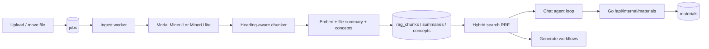

# Agentic retrieval

This page is the workflow contract for the in-house retrieval stack that replaced
LightRAG. Prefer it over guessing from code when changing ingest, search, chat,
or generate behaviour.

Testing setup lives in [pipeline-tests.md](pipeline-tests.md). Storage quota and
who may create materials live in
[authorization-permissions-lifecycles.md](authorization-permissions-lifecycles.md)
and [backend-storage-quota.md](backend-storage-quota.md).

## Architecture

Two Python processes share one Postgres schema owned by Go migrations
(`server/migrations/0001_init.sql`):

| Process | Entry | Role |
| --- | --- | --- |
| Ingest worker | `python -m pipeline.ingest.worker` | Claims jobs, parses, chunks, embeds, summarizes, extracts concepts, rolls up summaries |
| Retrieval service | `uvicorn pipeline.retrieve.service:app` | `/chat`, `/chat/stream`, `/generate` over the same index |

The Go gateway is the public face: it authenticates the user, proxies chat and
generate to the retrieval service, and owns material persistence (including the
internal materials endpoint the chat agent calls).



There is no dual-running period with LightRAG. Apache AGE is gone; the database
image is stock `pgvector/pgvector:pg16`.

## Schema ownership

The retrieval index is application schema, not pipeline-owned:

| Table | Purpose |
| --- | --- |
| `rag_chunks` | Passages: text, heading path, pages/regions, `tsvector`, `halfvec(2560)` |
| `rag_file_summaries` | Per-file summary + outline, keyed by content fingerprint |
| `rag_chapter_summaries` | Rolled up from file summaries; `dirty` flag |
| `rag_workspace_summaries` | Workspace overview; `dirty` flag |
| `rag_concepts` | Normalized concept names per workspace |
| `rag_concept_mentions` | Concept → chunk (and file) links |

All of these FK-cascade from `workspaces` / `files` / `chapters`. Deleting a
workspace deletes its index; there is no `rag_teardown` job.

`files.content_hash` is the sha256 of parsed chunk text. Two uploads of the same
document in one workspace stay as two file rows the user can see, but only the
first is indexed.

`files.doc_id` is gone. Identity is always `files.id`.

Embedding width is part of the column type (`halfvec(2560)`). Changing
`EMBEDDING_DIM` without changing the migration and re-ingesting is rejected by
the pipeline at write time.

## Ingest workflow

### Job types

| Type | Enqueued by | Does |
| --- | --- | --- |
| Ingest (default) | Upload / re-parse paths in Go | Parse → chunk → embed → file summary → concepts → mark dirty |
| `summaries_rollup` | DB trigger on file chapter moves, and ingest after content change | Rebuild dirty chapter summaries, then workspace summary |

The rollup job is debounced with a unique pending index so reorganization does
not enqueue a storm.

### Parse routes

Controlled by `parseMode` on the job payload:

| Mode | Parser | Output | Page model |
| --- | --- | --- | --- |
| `advanced` (default) | Modal GPU MinerU | `content_list.json` (+ images) | Yes — `page_idx` + `bbox` |
| `normal` | MinerU lite cloud API | Markdown only | No |
| `none` | — | Blob stored, not indexed | — |
| txt / md kinds | Direct B2 read | Markdown | No |

`advanced` is the only route that can produce page-accurate citations. Artifacts
are addressed by fingerprint over `(blob, etag, size, parse method, parser
version)` and cached in B2 so retries and clones reuse the GPU result.

Optional VLM figure captioning (`EVO_CAPTION_IMAGES`) writes a description onto
image blocks before chunking so figures become searchable. Off by default —
scanned books would otherwise turn into hundreds of vision calls.

### Chunking

`pipeline/retrieval/chunking.py`:

- Groups blocks under the heading hierarchy (`text_level` or markdown `#`).
- Packs by character budget (`EVO_CHUNK_CHARS`, overlap, min size) without
  splitting a block unless one block alone exceeds the target.
- Carries every source block's page + bbox into `regions`, with
  `space: mineru-1000-lefttop` so a future highlight overlay does not guess the
  coordinate system.
- Builds `indexed_text` = `file name › section path` + body. That prefix is what
  gets embedded and FTS-tokenized; `text` is what the model and citations show.

CJK runs are bigrammed in the application and indexed with Postgres `simple`
config. The same tokenizer must run on queries (`search_query_terms`), or the
lexical half of hybrid search silently returns nothing for Chinese/Japanese/
Korean.

### Indexing one file

`pipeline/retrieval/indexing.py` is idempotent per file:

1. Embed all `indexed_text` values in provider-sized batches.
2. Replace that file's `rag_chunks` (delete-then-insert so a shorter re-ingest
   does not leave a stale tail).
3. One cheap-model call → file summary; upsert `rag_file_summaries`.
4. Concept extraction in groups of chunks (not per chunk) → upsert concepts and
   mentions. Relation-free by design: co-mention across files is recovered at
   query time.
5. Mark chapter/workspace summaries dirty and enqueue `summaries_rollup`.

If another ready file in the same workspace already has the same
`content_hash`, ingest finishes the duplicate as ready without writing a second
index.

### Summary tree maintenance

File summaries are content-keyed. Moving a file between chapters does **not**
re-summarize the file; a trigger marks the source and destination chapters (and
the workspace) dirty and enqueues rollup. Rollup rebuilds chapter and workspace
prose from existing file summaries only, never from raw chunks — that is what
keeps reorganization cheap.

## Search workflow

`pipeline/retrieval/search.py` + `store.hybrid_search`:

1. Embed the query.
2. One SQL statement runs vector (cosine / HNSW) and lexical (`tsvector`)
   candidates, fused with reciprocal rank fusion (RRF). Ranks are fused rather
   than scores because cosine distance and `ts_rank_cd` share no unit.
3. Optional `file_ids` filter is applied **in SQL** and intersected with the
   request scope. The agent cannot widen a scope the user narrowed.
4. `_rerank` is a seam that currently returns identity. Contextual prefixes,
   per-file diversity cap, and neighbour expansion are the v1 quality levers;
   a hosted or local cross-encoder plugs in here later without changing callers.
5. Cap how many passages any one file may contribute (`EVO_SEARCH_PER_FILE_CAP`),
   then expand each survivor with ±1 neighbouring chunk so arguments that cross
   a packing boundary stay readable. Citations still point at the hit, not the
   neighbour.

`related_concepts` is a self-join on co-mentioned chunks: the relation-free
substitute for a knowledge-graph edge.

## Chat agent workflow

Streaming chat (`POST /chat/stream` via the Go gateway):

1. Go authenticates, relays `workspaceId`, `userId`, optional `fileIds`, history,
   and model choice to the retrieval service.
2. The agent **primes** with one retrieval before the model is asked anything —
   a question about the user's sources almost always needs them, and making the
   model ask wastes a round.
3. Capped tool loop (`EVO_AGENT_MAX_STEPS`, default 4). The final round drops
   tools entirely so the turn cannot end on another tool call with no answer.
4. SSE events: `tool` (progress), `citations` (once, before tokens), `token`,
   `done` (or `error`).
5. Non-streaming `/chat` is a single primed completion with no tool loop — for
   callers that cannot stream.

### Tools

| Tool | Side effects | Notes |
| --- | --- | --- |
| `search_workspace` | none | Hybrid search; scope-intersected |
| `list_sources` | none | Chapters, files, summaries |
| `read_document` | none | Sequential chunks by index |
| `related_concepts` | none | Co-mention bridge |
| `generate_material` | yes | POST to Go `/api/internal/materials` |

Read tools hit Postgres directly. Anything that creates a material goes through
the gateway with `X-Pipeline-Secret`, so authz, quota, and the materials model
stay in one place. The tool is omitted from the schema when the gateway URL or
user is unset, or when `userId` is missing.

Citation numbers are stable for the turn across tools: `[3]` means the same
passage whether it came from search or from reading a document.

## Generate workflow

`/generate` is **not** an agent loop. Scope is already known, the output shape
is fixed, and the gateway must persist a parseable artifact.

1. `gather_context` samples chunks evenly across every document in scope (equal
   share per file, not proportional to length).
2. If the context fits the budget, one `produce` call. If it overflows across
   multiple files, `produce_mapped` summarizes per document then combines.
3. Kind-specific normalizers (`extract_json`, `strip_fence`,
   `normalize_questions`) coerce the model reply into the shapes the Go
   persistence layer already expects: flashcards, quiz questions, mindmap /
   diagram mermaid, notes.

Response shapes are part of the contract with Go — do not change them lightly.

## Citations and the frontend

A citation is:

```json
{
  "fileId": "f_…",
  "fileName": "bio.pdf",
  "snippet": "…",
  "pageStart": 4,
  "pageEnd": 5,
  "regions": [{ "page": 4, "bbox": [x0, y0, x1, y1], "space": "mineru-1000-lefttop" }]
}
```

- `fileId` is a real `files.id` (not a LightRAG doc hash).
- Pages are 1-based and **absent** for sources with no page model (txt/md,
  `parseMode=normal`).
- `regions` are stored and shipped; the highlight overlay that would consume
  them is not built yet.

Chat citation chips show `p. N` / `pp. N–M` and open the file scrolled to that
page via `OpenItem.page` → `FileViewer` → `PdfView`.

## Clone and teardown

`CloneWorkspace` copies the retrieval index **in the same transaction** as the
content: chunks, summaries, concepts, and mentions, remapping file and chapter
ids. There is no best-effort follow-up call and no `ragCloned` flag — either the
clone includes the index or the transaction rolls back.

Teardown is the foreign key. Workspace delete cascades; the old `rag_teardown`
job and pipeline `/workspace/delete` endpoint are gone.

## Configuration surface

| Concern | Env | Default / note |
| --- | --- | --- |
| Gateway callback | `GATEWAY_URL`, `PIPELINE_SECRET` | Unset disables `generate_material` |
| Chunk size | `EVO_CHUNK_*` | Character budgets, not tokens |
| Embedding | `EVO_MODEL_EMBEDDING`, `EMBEDDING_DIM` | Dim must match `halfvec(N)` |
| Ingest / query models | `EVO_MODEL_EXTRACTION`, `EVO_QUERY_MODEL*` | Flash for ingest, pro by default for chat |
| Search | `EVO_SEARCH_CANDIDATES`, `EVO_SEARCH_TOP_K`, `EVO_SEARCH_PER_FILE_CAP` | |
| Agent | `EVO_AGENT_MAX_STEPS` | Cap is the design, not a safety valve |
| Captions | `EVO_CAPTION_IMAGES`, `EVO_CAPTION_MAX_PER_FILE` | Off by default |

Windows note: psycopg's async driver refuses the Proactor event loop.
`pipeline.use_compatible_event_loop()` is called by both entrypoints and by the
test suite.

## Design choices worth not undoing casually

- **No extracted relations.** Entities + co-mention replace a knowledge graph.
  Relation extraction was most of LightRAG's ingest cost and most of its
  accuracy failures.
- **Summaries roll up from summaries.** Reorganization stays cheap; only content
  change rewrites file-level prose.
- **Scope is SQL, not a prompt hint.** The agent cannot search outside the
  user's chapter/file selection.
- **Generate is deterministic; chat is agentic.** Mixing them would make
  material JSON unreliable and chat latency unpredictable.
- **Materials persist in Go.** The retrieval service holds DB credentials but
  deliberately does not hold quota/authz rules.
- **Reranker is a seam, not a dependency.** Measure quality on real workspaces
  before adding a vendor or a GPU to the retrieval container.
